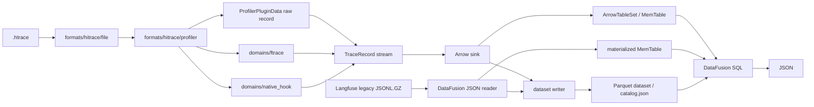

# kat-rs

`kat-rs` 是一个用 SQL 查询 trace 与日志文件的 Rust 本地数据引擎。

项目当前把异构输入解码或读取为 Arrow/Parquet 列式数据，注册到 DataFusion，并通过只监听本机回环地址的 server REST API 返回查询结果。CLI 只负责本机 server 生命周期和 OpenAPI 输出。

```text
trace / log files
  -> format adapter / domain decoder
  -> Arrow RecordBatch / MemTable or local Parquet dataset
  -> DataFusion SQL
  -> JSON
```

项目仍处于早期演进阶段，当前版本为 `0.1.0`，公共 API、表结构、dataset layout 和内部边界尚未承诺稳定。本地 dataset 是可重新生成的早期列式产物；跨版本不承诺兼容，server 启动后也不会自动把历史 dataset 当作可信运行状态。

## 项目定位

`kat-rs` 当前关注的是**可验证的数据事实层**，而不是把某一种诊断流程硬编码进核心：

- datasource 尽量保持薄，优先保存原始 envelope 和 direct/raw 字段；
- 输入格式、领域语义、列式物化、查询与诊断策略分层；
- 确定性程序负责产出可查询事实，人或 LLM 基于事实做分析；
- 派生语义尽量表现为可继续查询的表，而不是过早转换成不可组合的 JSON blob；
- 只实现当前可验证的最小切片，优先复用 Rust、Arrow、DataFusion、Axum 等成熟基础设施。

当前已交付 datasource、SQL 查询、本地列式 dataset 内核和本机 REST API。Pack、typed transform DAG、analysis runtime 等能力仍属于 RFC 方向，不是现有命令或稳定接口。

## 当前能力

| Source | 输入 | 当前查询面 | 加载方式 |
| --- | --- | --- | --- |
| `hitrace` | OpenHarmony `.htrace` profiler container | `profiler_plugin_data` raw table、ftrace sched direct tables、native hook direct/raw tables | REST datasource 直接解码为 Arrow `MemTable`；REST dataset materialize 可写入本地 Parquet 后从 catalog 注册查询 |
| `langfuse` | 一份 legacy `observations.jsonl.gz` 和一份 `traces.jsonl.gz` | `langfuse_observations`、`langfuse_traces` 两张原始表 | REST datasource 读取 gzip JSONL 后物化为 `MemTable`；REST dataset materialize 可写入本地 Parquet 后从 catalog 注册查询 |

所有 SQL 由 DataFusion 执行。业务功能通过本机 REST API 暴露；CLI 不承载 datasource 或 SQL 查询参数。

## 构建

需要支持 Rust 2024 edition 的工具链。

```bash
cargo build --release -p kat-rs-cli
```

生成的二进制位于：

```text
target/release/kat-rs
```

开发时也可以直接通过 Cargo 运行：

```bash
cargo run -p kat-rs-cli -- --help
```

默认日志级别为 `warn`。需要查看更多诊断信息时设置 `RUST_LOG`：

```bash
RUST_LOG=debug cargo run -p kat-rs-cli -- --help
```

## 本机 server

server 用于把 datasource 生命周期提升到常驻进程中，避免连续查询时反复加载同一批文件。REST/OpenAPI 是唯一业务功能面；CLI 只负责启动、停止、输出 OpenAPI 和版本信息。

### 启动与停止

```bash
cargo run --release -p kat-rs-cli -- serve \
  --host 127.0.0.1 \
  --port 3030
```

`serve` 在前台运行。server 强制要求 loopback IP，不接受公网或局域网监听地址。

停止 server：

```bash
cargo run --release -p kat-rs-cli -- stop \
  --host 127.0.0.1 \
  --port 3030
```

输出 OpenAPI：

```bash
cargo run --release -p kat-rs-cli -- openapi
curl -sS http://127.0.0.1:3030/openapi.json
```

### REST API

健康检查：

```bash
curl -sS http://127.0.0.1:3030/v1/health
```

创建或复用 `.htrace` datasource：

```bash
curl -sS -X POST http://127.0.0.1:3030/v1/datasources \
  -H 'content-type: application/json' \
  -d '{
    "source": "HITRACE",
    "file": "/absolute/path/to/app.htrace"
  }'
```

`.htrace` 输入必须包含 `OHOSPROF` header。当前只解码已注册的 profiler protobuf section；不支持的 section data type 会被跳过。所有 profiler envelope，包括 config 和未知 plugin，仍保留在 `profiler_plugin_data` 中。

创建或复用 Langfuse legacy datasource：

```bash
curl -sS -X POST http://127.0.0.1:3030/v1/datasources \
  -H 'content-type: application/json' \
  -d '{
    "source": "LANGFUSE_LEGACY",
    "observationsFile": "/absolute/path/to/observations.jsonl.gz",
    "tracesFile": "/absolute/path/to/traces.jsonl.gz"
  }'
```

Langfuse legacy 第一版要求显式提供单个 observations 文件和单个 traces 文件，不扫描目录，也不展开 glob。字段类型由 DataFusion JSON reader 从输入推断；`input`、`output` 等内容保持原始值，不截断、不摘要、不脱敏。

输入不是合法 gzip/JSONL 或 schema 推断失败时，datasource 创建直接失败。项目不提供 `langfuse_parse_errors` 清洗表。

服务端会 canonicalize 文件路径并读取文件 metadata，以 source、路径、大小和修改时间计算 datasource identity。相同且未变化的输入再次创建时会复用同一个 datasource；首次创建返回 `201 Created`，复用时返回 `200 OK`。

把 Langfuse legacy 输入物化为本地 dataset：

```bash
curl -sS -X POST http://127.0.0.1:3030/v1/datasets \
  -H 'content-type: application/json' \
  -d '{
    "dataset": {
      "name": "my-dataset",
      "directory": "/absolute/path/to/datasets"
    },
    "input": {
      "source": "LANGFUSE_LEGACY",
      "observationsFile": "/absolute/path/to/observations.jsonl.gz",
      "tracesFile": "/absolute/path/to/traces.jsonl.gz"
    }
  }'
```

`dataset.directory` 可省略，省略时使用平台默认 dataset 根目录；传入时必须是绝对路径，最终目录为 `<directory>/<name>`。同步请求会等待 materialize 完成，成功返回 `201 Created` 和 `data.dataset.name`、`data.dataset.directory`、`data.dataset.path`。目标 dataset 已存在时返回 `409 CONFLICT`；当前不支持替换、删除、list 或 inspect dataset。删除 server datasource 只释放进程内查询句柄，不删除已经写出的 dataset。

`.htrace` 使用同一个 endpoint，把 `input` 换成 `{ "source": "HITRACE", "file": "/absolute/path/to/app.htrace" }`。

直接查询已有 dataset：

```bash
curl -sS -X POST http://127.0.0.1:3030/v1/datasets/queries \
  -H 'content-type: application/json' \
  -d '{
    "dataset": {
      "name": "my-dataset",
      "directory": "/absolute/path/to/datasets"
    },
    "sql": "select count(*) as count from langfuse_traces"
  }'
```

dataset query 不创建 datasource id，不修改或删除 dataset；每次请求按 `dataset` 定位 catalog/Parquet 并执行 SQL。

使用响应中的 datasource id 查询：

```bash
curl -sS -X POST \
  http://127.0.0.1:3030/v1/datasources/DATASOURCE_ID/queries \
  -H 'content-type: application/json' \
  -d '{
    "sql": "select count(*) as count from langfuse_traces"
  }'
```

查询响应先给出 meta 和 row count，再返回 rows：

```json
{
  "meta": {
    "elapsedMs": 12,
    "datasourceId": "DATASOURCE_ID"
  },
  "rowCount": 1,
  "data": [
    { "count": 42 }
  ]
}
```

其他接口：

```text
GET    /openapi.json
POST   /v1/datasets
POST   /v1/datasets/queries
GET    /v1/datasources?limit=100&offset=0
GET    /v1/datasources/{datasourceId}
DELETE /v1/datasources/{datasourceId}
POST   /v1/datasources/{datasourceId}/queries
DELETE /v1/server
```

## SQL 表

### `.htrace` raw table

`profiler_plugin_data` 保存 profiler envelope，字段来自 `ProfilerPluginData`：

| 字段 | 含义 |
| --- | --- |
| `name` | plugin 或 config envelope 名称 |
| `status` | profiler 状态 |
| `data` | payload bytes；JSON 输出时表示为十六进制字符串 |
| `clock_id` | clock id |
| `tv_sec` / `tv_nsec` | envelope 时间 |
| `version` | plugin version |
| `sample_interval` | sample interval |

### ftrace sched direct tables

每张 sched direct table 都包含以下公共列，并追加对应 protobuf event 的原始字段：

```text
event_timestamp
event_cpu
event_tgid
event_comm
```

<details>
<summary>当前 sched direct tables</summary>

```text
sched_blocked_reason
sched_kthread_stop
sched_kthread_stop_ret
sched_migrate_task
sched_move_numa
sched_pi_setprio
sched_process_exec
sched_process_exit
sched_process_fork
sched_process_free
sched_process_wait
sched_stat_blocked
sched_stat_iowait
sched_stat_runtime
sched_stat_sleep
sched_stat_wait
sched_stick_numa
sched_swap_numa
sched_switch
sched_wait_task
sched_wake_idle_without_ipi
sched_wakeup
sched_wakeup_new
sched_waking
```

</details>

这些表是 direct event projection，不是 `thread_state`、`sched_slice`、关键路径或其他跨事件派生结果。

### native hook direct/raw tables

native hook event 表保留 `tv_sec`、`tv_nsec` 和对应 payload 字段，不额外制造 `event_ts`、`event_index` 等派生列。

<details>
<summary>当前 native hook tables</summary>

```text
native_hook_config
native_hook_alloc
native_hook_free
native_hook_mmap
native_hook_munmap
native_hook_mem_tag
native_hook_file_path_map
native_hook_symbol_map
native_hook_thread_name_map
native_hook_maps_info
native_hook_symbol_table
native_hook_frame_map
native_hook_stack_map
native_hook_statistics
native_hook_trace_alloc
native_hook_trace_free
```

</details>

当前这些表只承诺 config、event、map、symbol、stack、frame 等 direct/raw 查询面，不承诺 allocation 生命周期配对、符号化、调用栈还原或跨事件归一化。

### Langfuse legacy tables

```text
langfuse_observations
langfuse_traces
```

两张表均为输入 JSONL 的原始查询面。legacy observation 的 trace-level 信息需要通过 `langfuse_observations.trace_id = langfuse_traces.id` 关联。

## 架构



### Workspace

| Crate | 职责 |
| --- | --- |
| `kat-rs-cli` | Clap runtime 入口、日志初始化、server 启停、OpenAPI 输出 |
| `kat-rs-daemon` | loopback Axum server、REST DTO、datasource registry、identity 与并发加载协调 |
| `kat-rs-datasource` | 输入适配、领域解码、Arrow 物化、DataFusion catalog/query |

### `.htrace` 分层边界

`formats/hitrace/file` 只读取 `.htrace` container、header、section 和 body range，不理解 ftrace、native hook 或 Arrow。

`formats/hitrace/profiler` 只处理该格式内部的 profiler envelope framing、config/data 分类、decoder registry 和错误上下文。它不是全项目通用 plugin framework。

`domains/ftrace` 与 `domains/native_hook` 拥有各自 payload 语义，负责从 protobuf payload 产出粗粒度 domain record；domain 不创建 Arrow array，也不注册 SQL 表。

`TraceRecord` 是 format/domain decoder 与 sink 之间的粗粒度边界。它不会把 `SchedSwitch`、`Alloc`、`Free` 等所有内部事件展开成全局中心枚举。

Arrow sink 负责把 record 投影为内存态 `ArrowTableSet`；dataset writer 只消费 Arrow `RecordBatch` 并写出 Parquet，catalog/query 不理解输入文件和 domain payload。

新增 profiler plugin 时，应把改动限制在对应 proto、domain decoder、必要的 build-time codegen、Arrow projection 和测试中，不应污染 `.htrace` file reader、profiler mechanism、已有 domain 或 query 层。

## 数据生命周期与资源边界

server 创建 `.htrace` datasource 时使用 mmap 读取 `.htrace` 文件，完成 Arrow 物化后不再持有源文件句柄。

server 创建 Langfuse legacy datasource 时会完整读取、解压并物化两个 gzip JSONL 文件；READY 后查询不再访问源文件。

本地 dataset 查询从 catalog 注册 Parquet 文件，不要求源文件在 materialize 后继续存在。第一版 catalog 只保存 SQL 逻辑表名到 Parquet 相对路径的映射；打开已有 dataset 时只做基础结构、路径和 Parquet metadata 校验。`.htrace` dataset materialize 当前可能仍会先构建内存表再写 Parquet；Langfuse dataset materialize 会把 RecordBatch batches 写入 Parquet。

server datasource 目前仍是内存态 registry，将物化后的 datasource 保留在内存中，直到显式删除 datasource 或关闭 server。同一 identity 的并发创建会协调为一次实际加载。server 可以通过 REST 触发本地 dataset materialize，也可以直接给定 dataset 执行 SQL；直接 dataset query 不会把 dataset 注册成 server datasource。

SQL 查询目前会 collect 全部 DataFusion batches，再一次性转换成 JSON。应通过 `WHERE`、投影、聚合和 `LIMIT` 控制结果规模。

## 当前限制

- ftrace 当前只建模 `TracePluginResult.ftrace_cpu_detail` 和 sched event family；尚未覆盖完整 upstream ftrace schema、common fields、CPU stats、clock/symbol/comm metadata、irq、binder、power 等 family。
- native hook 当前只提供 direct/raw 表，不做 alloc/free 或 mmap/munmap 生命周期、符号化、栈还原和高级内存分析。
- Langfuse 只支持 legacy observations/traces 单文件输入；不支持 API、S3/COS、目录扫描、glob、`observations_v2`、scores 或派生分析表。
- Langfuse dataset materialize 中，DataFusion 推断出的顶层空对象列会以 JSON 字符串保存，例如 `{}`；server 直接创建 Langfuse datasource 时仍保持 DataFusion JSON reader 的原始推断行为。
- Langfuse 的 `input`、`output` 等敏感内容不会自动脱敏。不要向不可信 SQL、终端记录或 HTTP 客户端暴露生产数据。
- 本地 dataset 第一版只支持创建新的完整 dataset；目标路径已存在时失败，替换和删除留给后续 dataset 生命周期接口。
- 本地 dataset catalog 只接受当前最小表映射字段；不写 dataset manifest，旧 metadata 字段会被拒绝，跨版本数据应重新 materialize。
- server datasource 当前仍以内存 `MemTable` 为主。server 没有把已有 dataset 打开为 datasource 的接口，也没有磁盘 columnar cache、spill、LRU、idle timeout 或内存水位控制，大型压缩数据可能产生显著内存放大。
- server 仅适用于本机单用户场景，没有鉴权、TLS、远程访问或多租户隔离，也不会自动拉起。
- `query_json` 仍会 collect 查询结果后生成 JSON；SQL 结果没有流式 HTTP 输出或服务端分页，大结果集会增加内存占用。
- 项目尚未提供稳定的 public library API 或 crates.io 发布承诺。

## 演进方向

当前 RFC 方向是把项目逐步定位为：

```text
trace columnar data engine + semantic transform pack runtime
```

目标数据流是：

```text
trace files
  -> 可验证的格式与领域解码
  -> Arrow / Parquet / DataFusion dataset
  -> typed semantic transform DAG
  -> 可组合的派生表与查询
  -> 小而可追溯的 evidence
  -> 人或 LLM 分析
```

计划中的关键原则包括：

- transform 输入和输出保持 typed columnar table，尽可能保留谓词下推、投影下推、流式执行和物化缓存空间；
- Rust core 只实现跨场景的通用时间与区间 primitive，不硬编码关键路径、首帧、卡顿、IO、Binder 或锁诊断策略；
- pack 作为 schema、derived table、SQL、rules 和 analysis plan 的扩展单位；
- `plan.json`、`state.json` 和 `evidence.jsonl` 作为机器状态事实源，Markdown checklist 只作为可读视图；
- 报告明确区分 Facts、Inferences 与 Uncertainty。

该方向仍在 [RFC #45](https://github.com/maokelong/kat-rs/issues/45) 讨论中。`probe`、`workflow`、`pack`、`ingest`、`derive`、`analyze` 等业务能力应优先表现为 REST/OpenAPI 资源，不属于当前 CLI 功能面。

## 开发与贡献

非平凡变更应先建立 issue 和轻量 SDD，至少说明问题、非目标、考虑过的方案、最小切片和验证计划。交付 PR 应保持可 review，不混入临时 probe、AI 中间产物、未验证 parser 或未经批准的交付面。

通用能力优先使用 Rust 标准库和成熟社区 crate；项目代码只保留领域逻辑和必要胶水。提交的 author 与 committer 必须是可追溯的人类身份，AI 可以辅助开发但不能作为提交责任主体。

提交前执行：

```bash
cargo fmt --all -- --check
cargo test --workspace
cargo clippy --workspace --all-targets -- -D warnings
python .github/scripts/test_pr_guard.py
git diff --check
```

issue、PR、设计文档和非显然 review 说明中文优先；代码标识符、公共 API、命令、crate 和模块名保持英文。
