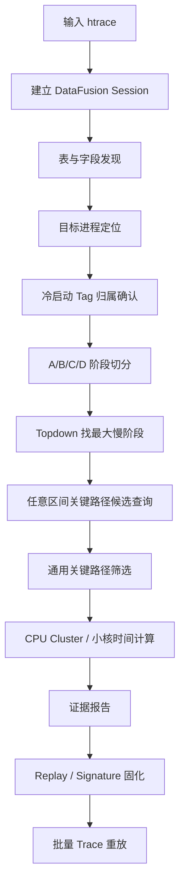

# 鸿蒙 Trace 分析系统工作流程设计

本文沉淀当前会话中形成的鸿蒙 trace 分析流程，用于指导后续建设一个可交互探索、可确定性重放、可批量分析的 HarmonyOS trace 分析系统。

## 1. 设计目标

系统需要回答三类问题:

1. 单条 trace 中，目标 App 冷启动链路是否完整，总耗时和阶段耗时是多少。
2. 慢阶段的关键路径是什么，是执行耗时、调度等待、阻塞等待、IO wait，还是小核运行导致。
3. 一次人工确认过的问题模式，能否固化成脚本，对大批量 trace 执行相同判定。

核心原则:

- DataFusion 是唯一查询执行环境，脚本直接查询 DataFusion 表。
- Atomic 只产出事实，不写根因结论。
- Composite 负责编排 atomic，形成结构化中间结果。
- Strategy 负责选择下钻方向、阈值和报告口径。
- Replay/Signature 固化已验证流程，服务批量 trace。
- Web UI 用于探索，CLI/脚本用于重放和批处理。

## 2. 总体流程



## 3. 阶段流程

### S0. Trace 接入与 DataFusion Session

输入:

- `.htrace` 文件。
- 目标 App 包名或进程名。
- 可选的粗略时间范围。

系统动作:

- 加载 trace。
- 建立 DataFusion 查询环境。
- 保持 session 可复用，支持一次加载、多次 SQL 查询。

输出:

- `dataset_id` 或 active session。
- trace 起止时间。
- DataFusion 查询服务地址或本地执行句柄。

系统要求:

- 不要每条 SQL 重新解析 trace。
- 不要把 Web UI 作为唯一入口。
- 后续 replay 脚本应能复用同一个 DataFusion session。

### S1. 表与字段发现

目的: 判断当前 trace 支持哪些 atomic。

核心表:

- `process`
- `thread`
- `raw_event`
- `thread_state`
- `sched_slice`
- `callstack`

输出:

- 可用表列表。
- 每张表的字段列表。
- trace 时间范围。
- 数据完整性检查结果。

使用场景:

- 如果缺少 `sched_slice`，不能做小核真实 running 时间。
- 如果缺少 `thread_state`，不能做 runnable/blocking/io_wait 判断。
- 如果缺少 `callstack`，函数热点只能降级。

### S2. 目标进程定位

目的: 找到目标 App 进程和主线程。

输入:

- `target_package`
- `target_process`
- `start_hint_ts`
- `end_hint_ts`

输出:

- `selected_upid`
- `selected_pid`
- `selected_process_name`
- `selected_main_utid`
- `selected_main_tid`
- `confidence`

规则:

- 多进程 App 可以保留多个候选，但后续 tag 必须显示进程归属。
- 如果无法定位目标进程，应停止后续冷启动分析，要求补充包名、进程名或时间范围。

### S3. 冷启动 Tag 链路还原

鸿蒙 App 冷启动 tag:

- `touchEventDispatch`
- `HandleLaunchApplication`
- `HandleLaunchAbility`
- `HandleAbilityTransaction`
- `OnVsyncEvent now`

进程归属规则:

- `touchEventDispatch` 可以不强制归属目标进程。
- 除 `touchEventDispatch` 外，其他 tag 必须区分进程。
- `HandleLaunchApplication`、`HandleLaunchAbility`、`HandleAbilityTransaction` 优先选择目标 App 进程内的事件。
- `OnVsyncEvent now` 需要结合目标窗口或目标进程上下文，避免误选系统进程或其他 App 的首帧事件。

输出:

- tag 候选表。
- 选定 anchors。
- 每个 anchor 的 `ts`、`upid`、`pid`、`process_name`、`thread_name`、`confidence`。

### S4. 阶段切分与 Topdown 判断

阶段定义:

| 阶段 | 范围 | 关注点 |
| --- | --- | --- |
| A | `touchEventDispatch/IconStart -> HandleLaunchApplication` | 输入分发、系统调度、进程创建 |
| B | `HandleLaunchApplication -> HandleLaunchAbility` | Application 初始化、主线程等待 |
| C | `HandleLaunchAbility -> HandleAbilityTransaction` | Ability 初始化、JS/模块加载、同步等待 |
| D | `HandleAbilityTransaction -> OnVsyncEvent now` | UI 构建、生命周期回调、首帧前等待 |

Topdown 规则:

- 先计算阶段耗时，再选择最大阶段下钻。
- 如果某阶段占总耗时超过 40%，优先分析该阶段。
- 如果没有单一最大阶段，按阶段耗时从高到低依次下钻。
- 不要一开始就直接看 callstack，以免遗漏调度等待或阻塞等待。

输出:

- 阶段耗时表。
- 最大阶段。
- 下钻窗口 `start_ts/end_ts`。

### S5. 任意区间关键路径候选查询

对应 atomic:

```text
harmony_process_critical_path_in_range
```

目的: 在目标进程和目标时间段内，宽口径拉出关键路径候选。

候选来源:

- `callstack`: 长函数 span。
- `thread_state`: running、runnable、blocking、io_wait、sleeping。
- `sched_slice`: 真实 CPU running slice。

注意:

- 这一步只产出候选，不等于最终关键路径。
- 长 callstack 只说明函数 span 覆盖窗口，不能单独证明线程一直在执行。
- `runnable_wait`、`blocked_function`、`waker_utid` 是后续判断等待链的重要证据。

输出:

- `path_candidates`
- 候选线程集合。
- 候选片段的 `source/path_kind/dur_ms/utid/tid/thread_name`。

### S6. 通用关键路径筛选

对应 atomic:

```text
harmony_critical_path_filter_in_range
```

目的: 对候选路径做确定性筛选，回答“哪些片段最像关键路径”。

筛选信号:

- 是否目标主线程或显式种子线程。
- 是否覆盖慢阶段窗口。
- 是否处于 `runnable`、`blocking`、`io_wait` 等等待状态。
- 是否存在 `waker_utid`。
- 是否有 `blocked_function`。
- 是否有真实 `sched_slice` 支撑。
- 是否可以形成跨线程等待/唤醒边。

输出:

- `critical_path`
- `filter_rank`
- `score`
- `confidence`
- `dependency_kind`
- `selected_utids_csv`
- `selected_reason`

依赖类型:

| 类型 | 含义 | 下一步 |
| --- | --- | --- |
| `self_running` | 当前线程自身执行 | 查 callstack 热点 |
| `sched_wait` | runnable 但没上 CPU | 查调度、优先级、绑核、CPU 竞争 |
| `waker_edge` | 有明确唤醒方 | 沿 `waker_utid` 追跨线程关键路径 |
| `blocking_wait` | 阻塞等待 | 查锁、Binder、内核阻塞 |
| `io_wait` | IO wait | 查文件、存储、IO 延迟 |
| `unknown_wait` | 等待证据不足 | 降级为待人工确认 |
| `supporting_cpu` | CPU running 支撑证据 | 用于小核时间计算 |

重要边界:

- 该 atomic 是“筛选”，不是“因果闭环证明”。
- 如果 trace 缺少 Binder、锁、futex 细节，只能输出有限等待证据。
- 批量重放时，应固定 `filter_rank`、`confidence`、`coverage_ratio` 和 `dependency_kind` 阈值。

### S7. 小核时间计算

对应能力:

```text
harmony_cpu_cluster_mapping
harmony_critical_path_cpu_cluster_time
```

输入:

- `critical_path.selected_utids_csv`
- 阶段窗口。
- CPU cluster 映射。

规则:

- 小核时间必须来自 `sched_slice` 的真实 CPU running slice。
- 不允许用目标进程总 CPU 时间代替关键路径 CPU 时间。
- 不允许用 `thread_state.running` 代替小核 running 时间，因为它没有 CPU id。

输出:

- `small_ms`
- `middle_ms`
- `big_ms`
- `total_running_ms`
- `small_ratio`
- `cluster_mapping_confidence`

判定口径:

| 指标 | 结论 |
| --- | --- |
| `small_ratio < 5%` | 不支持小核是主因 |
| `5% <= small_ratio < 20%` | 小核可能有贡献，需要结合最大阶段和热点 |
| `small_ratio >= 20%` 且集中在最大阶段 | 支持小核归因，继续查调度策略、绑核或优先级 |

### S8. 报告生成

报告必须区分三层:

- 事实: atomic 输出的字段和值。
- 推断: 基于事实做出的判断。
- 不确定性: tag 缺失、进程归属不稳、CPU 拓扑未确认、等待链不闭合等。

报告结构:

1. Trace 与目标进程。
2. 冷启动 tag 链路。
3. 阶段耗时。
4. 最大阶段。
5. 关键路径筛选结果。
6. 小核时间与占比。
7. 是否支持当前假设。
8. 下一步建议。

### S9. Replay / Signature 固化

目的: 把一次分析确认过的流程变成确定性脚本，用于批量 trace。

固化内容:

- 固定 SQL atomic。
- 固定参数。
- 固定阈值。
- 固定输出字段。
- 固定判定规则。
- 固定报告模板。

不固化的内容:

- 临场解释。
- 手动挑选证据。
- 随 trace 改变的口径。

批量输出:

- `signature_result.json`
- `signature_result.md`
- 每条 trace 的关键指标。
- 是否命中同类问题。

## 4. 系统模块设计

### 4.1 Trace Session Manager

职责:

- 管理 trace 加载。
- 管理 DataFusion session。
- 提供 dataset 生命周期。
- 支持 Web UI 和 CLI 共享 session。

输入:

- trace 文件路径。
- 上传请求。
- active dataset 请求。

输出:

- `dataset_id`
- session handle。
- trace metadata。

### 4.2 Schema Explorer

职责:

- 发现 DataFusion 表。
- 查询字段。
- 检查关键表是否存在。
- 输出 atomic 可用性。

典型能力:

- `list_tables`
- `describe_table`
- `trace_time_range`
- `atomic_support_check`

### 4.3 Atomic Registry

职责:

- 管理所有原子能力。
- 保存 SQL 模板、输入参数、输出 schema、判定规则。
- 支持版本化。

示例 atomic:

- `harmony_process_candidates`
- `harmony_cold_start_tag_by_process`
- `harmony_cold_start_anchor_select`
- `harmony_cold_start_phase_breakdown`
- `harmony_process_critical_path_in_range`
- `harmony_critical_path_filter_in_range`
- `harmony_cpu_cluster_mapping`
- `harmony_critical_path_cpu_cluster_time`

### 4.4 Query Executor

职责:

- 渲染 SQL 模板。
- 执行 DataFusion 查询。
- 保存 JSON/CSV evidence。
- 记录执行耗时、错误、参数。

要求:

- 不在业务代码里拼接大量临时 SQL。
- 参数为空时，移除对应 SQL 条件，避免生成非法 SQL。
- 每次执行都保留可复现参数。

### 4.5 Composite Orchestrator

职责:

- 把多个 atomic 串成分析任务。
- 做质量门禁。
- 把输出组织成结构化上下文。

示例 composite:

- 冷启动链路还原。
- 冷启动瓶颈诊断。
- 任意区间关键路径分析。
- 小核归因。
- 批量对比。

### 4.6 Strategy Engine

职责:

- 根据 Topdown 结果决定下一步。
- 选择 running、runnable、blocking、IO 或小核分支。
- 维护阈值和判定口径。

Strategy 不直接查数据，只决定调用哪些 composite/atomic。

### 4.7 Replay / Signature Runner

职责:

- 执行已确认流程。
- 支持单 trace 和批量 trace。
- 输出稳定指标。
- 判断是否命中问题模式。

输入:

- replay 配置。
- trace 列表。
- 目标包名/进程名。
- CPU cluster 映射。

输出:

- JSON 证据。
- Markdown 报告。
- 批量对比表。

### 4.8 Report Generator

职责:

- 把 evidence 转成中文报告。
- 保留证据字段引用。
- 显式写出不确定性。
- 区分“支持”“不支持”“证据不足”。

### 4.9 Web UI / CLI

Web UI:

- 用于探索。
- 查看表、SQL、候选路径、时间线、报告。

CLI:

- 用于确定性执行。
- 用于 CI 或批量 trace。
- 用于 replay/signature。

二者共享 Atomic Registry 和 Query Executor。

## 5. LLM 参与边界

LLM 可以参与:

- 根据 overview evidence 写 Topdown Brief。
- 帮助选择分析策略。
- 解释报告。
- 在证据不足时提出下一步查询建议。

LLM 不应该参与:

- 直接替代 SQL 查询结果。
- 临场修改批量判定阈值。
- 把没有证据的推断写成结论。
- 在 replay 中人工挑选关键路径。

最终目标:

- 探索阶段允许 LLM 少量参与。
- 重放阶段尽量不依赖 LLM。
- 批量判断必须由确定性脚本完成。

## 6. 推荐数据产物目录

```text
cases/<case-name>/
  docs/
    capabilities/
    strategies/
    replay/
    analysis/
    design/
  tools/
  evidence/
    overview/
    deep/
  signature-output/
    <trace-name>/
      signature_result.json
      signature_result.md
```

## 7. MVP 建设顺序

第一阶段: 单 trace 可跑通。

- Trace 加载到 DataFusion。
- 表发现。
- 目标进程定位。
- 冷启动 tag 查询。
- 阶段切分。
- 任意区间关键路径候选查询。
- 关键路径筛选。
- 小核时间计算。
- Markdown 报告。

第二阶段: 可重放。

- 把一次确认过的流程写成 replay/signature。
- 固化阈值。
- 输出 JSON 和 Markdown。
- 支持同一 DataFusion session 多次查询。

第三阶段: 可批量。

- 支持多 trace 输入。
- 生成横向对比表。
- 统计问题命中率。
- 输出趋势指标。

第四阶段: 可扩展。

- 增加调度延迟 atomic。
- 增加 Binder/锁等待 atomic。
- 增加 IO wait atomic。
- 增加内存、GC、存储、渲染等领域策略。

## 8. 关键设计结论

1. 系统不要把“分析策略”写死在 Web UI。
2. 系统应把 SQL atomic 作为稳定能力单元。
3. 关键路径必须分两步: 先宽口径候选，再通用筛选。
4. 小核归因必须基于 `sched_slice`。
5. 冷启动 tag 除 `touchEventDispatch` 外必须区分进程。
6. 一次分析完成后，要把确定性步骤固化成 replay/signature。
7. 批量分析阶段应减少 LLM 参与，只保留确定性规则。

