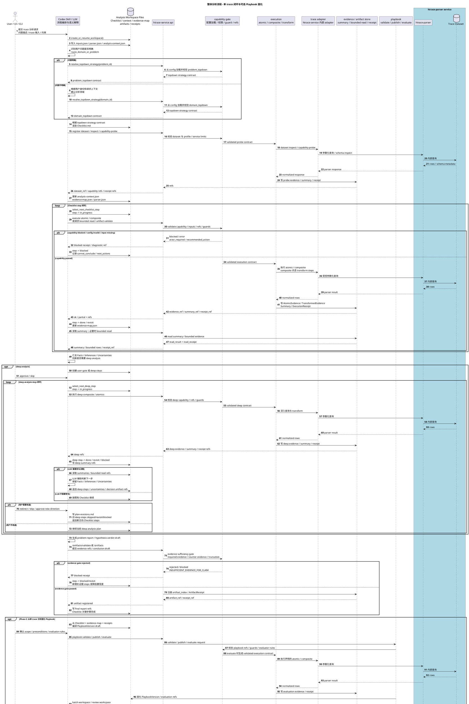
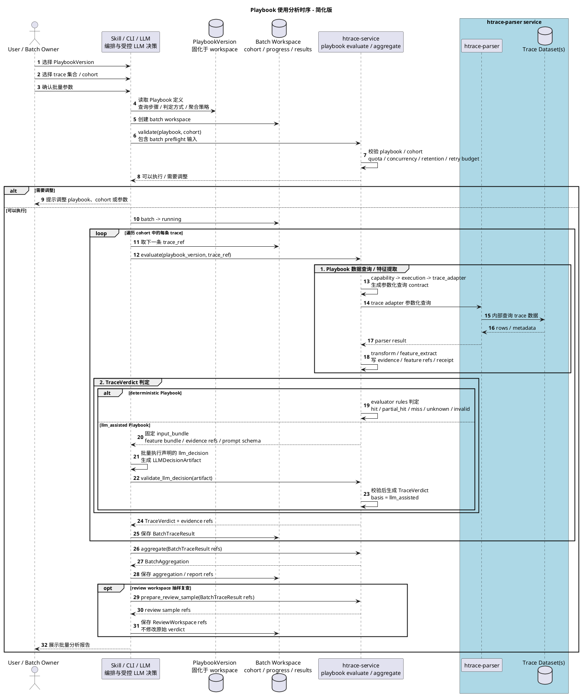
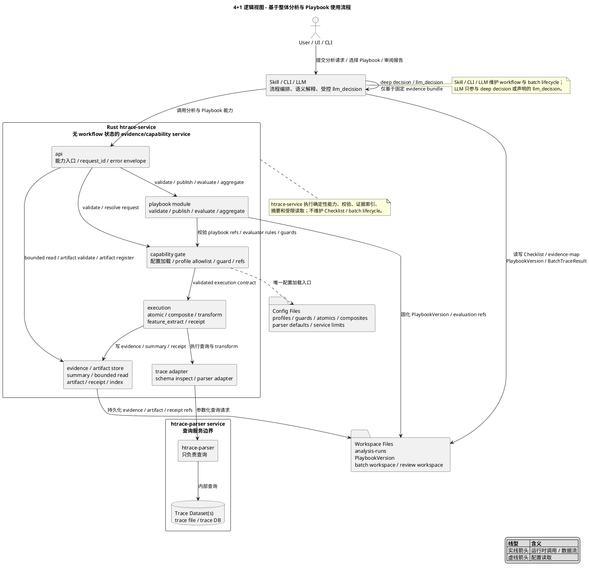
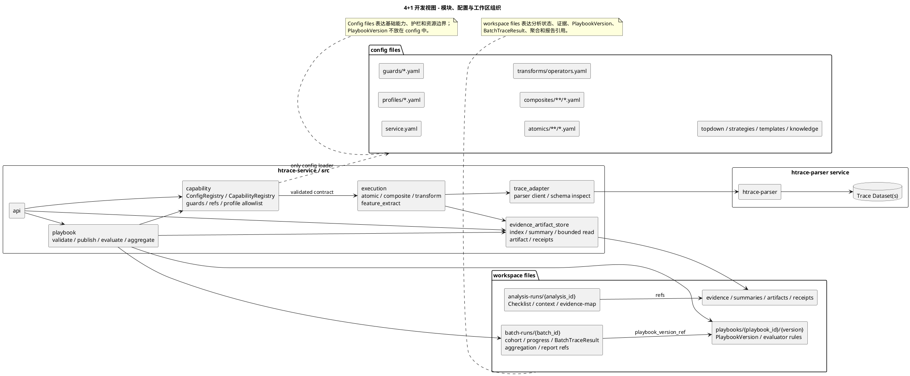
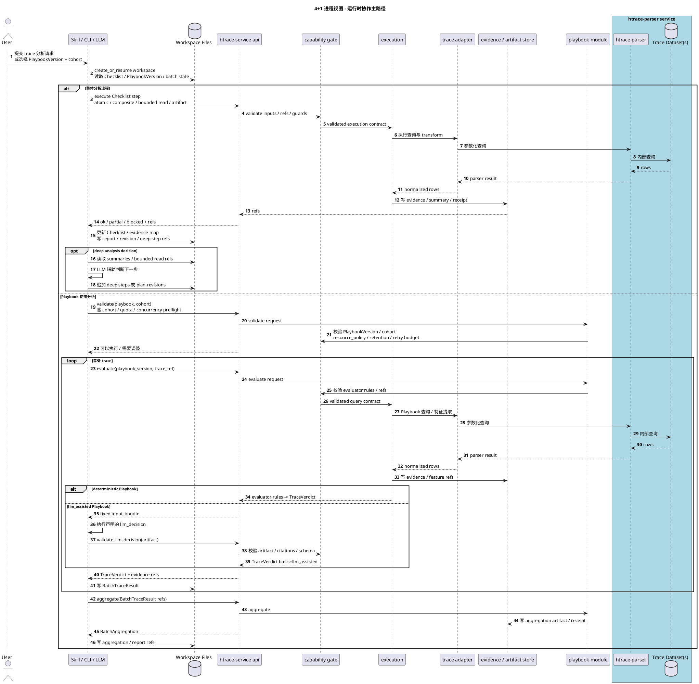
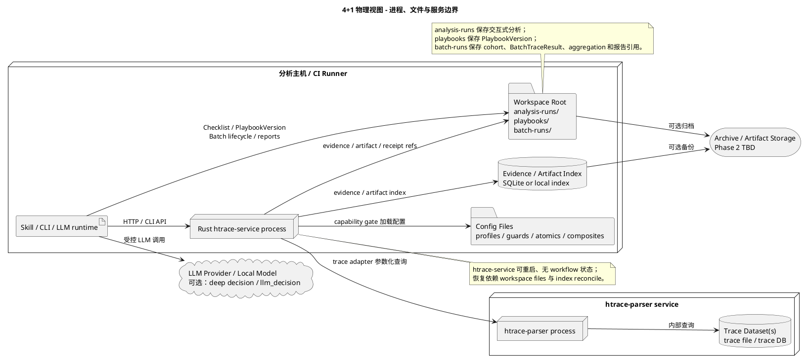

# Harmony Trace Analysis System 4+1 架构视图

日期：2026-06-05

来源：`doc/architecture/2026-06-05-harmony-trace-analysis-system-design.md`

用途：

- 为开发、评审、沟通和验收提供可渲染的架构图输入。
- 与 compact 规格保持一致；如有冲突，以 compact 规格中的“硬约束 / 禁止 / 必须”为准。

## 1. 整体分析流程图

说明：

- 这张图表达端到端时序，不替代前面的 4+1 视图。主线仍然是 Skill 编排，service 提供受控能力，htrace-parser service 负责 trace 查询。
- Checklist.md 来自 htrace-service capability gate 返回的 topdown strategy contract：问题明确时解析对应问题的 `problem_topdown`；问题不明确时 Skill 根据用户身份和请求上下文确定分析领域，再请求解析对应领域的 `domain_topdown`。htrace-service 参与 config 加载与策略契约校验，但不负责渲染 Checklist.md 或推进 workflow。
- 每个 Checklist step 都必须经历 `in_progress -> service 调用 -> evidence/summary/receipt 落盘 -> Checklist/evidence-map 更新` 的闭环。
- blocked、deep analysis 和证据充分性 gate 都是流程内的一等分支，不是异常旁路。
- deep analysis 是主要改道点；所有 decision point 都必须支持 redirect / skip / revisit。用户改道必须写 plan-revisions 并追加新方向 Checklist steps，历史 evidence、artifact、receipt 保留。
- deep analysis 本身是循环；每个 deep step 结束后都显式判断 LLM 是否需要参与决策，以及用户是否需要改道。
- Phase 2 的 Playbook 固化从 workspace 中的 Checklist、evidence-map、receipts 和 artifacts 产生；发布和评估仍需 capability gate 校验，evaluate 时由 capability 生成 execution contract。

## 2. Playbook 使用分析时序图

说明：

- 这张图把 Playbook 应用到 trace 的过程简化成两步：先按 Playbook 查询并提取特征，再生成 `TraceVerdict`。
- 简化图中的 Service 内部执行仍必须经过 capability / execution / trace adapter，不能由 playbook 模块直接调用 htrace-parser。
- 批量进入 running 前必须完成 cohort / quota / concurrency / retention / retry budget preflight；该步骤只校验前置，不创建或推进 batch lifecycle。
- deterministic Playbook 的第二步由 evaluator rules 直接判定，不调用 LLM。
- llm_assisted Playbook 的第二步由 `Skill / CLI / LLM` 基于固定 input bundle 批量执行声明的 `llm_decision`，输出仍需回到 htrace-service 校验后才能形成 `TraceVerdict`。
- 批量分析只是把同一个单 trace evaluation 对 cohort 中多条 trace 循环执行，最后聚合 `BatchTraceResult` 并生成报告；可选 ReviewWorkspace 只能引用原始 batch result 和新证据，不修改原始 `TraceVerdict`。

## 3. 逻辑视图

说明：

- 逻辑视图以第 7、8 节的两条已确认流程为主线：交互式整体分析闭环，以及 Playbook 的“查询/特征提取 -> TraceVerdict 判定”。
- Config Files 位于 service 外部，只有 capability gate 加载和解析；execution、trace adapter、playbook 不直接读取 config。
- PlaybookVersion、BatchTraceResult、review findings 都固化在 Workspace Files 中，不挂在 Config Files 下。
- htrace-parser service 包含 htrace-parser 和 Trace Dataset，htrace-service 只通过 trace adapter 发送参数化查询。

## 4. 开发视图

说明：

- 开发视图把代码模块、配置文件和 workspace 文件分开，避免把 workflow/batch lifecycle 放进 service 代码或 config。
- `capability` 是唯一配置加载入口；它向 execution、playbook 提供已校验契约。
- PlaybookVersion 是工作区产物；批量分析引用 PlaybookVersion 并写入 BatchTraceResult 与 aggregation。

## 5. 进程视图

说明：

- 进程视图把第 7 节整体分析流程和第 8 节 Playbook 使用时序合并为两条运行时主路径。
- 整体分析路径以 Checklist step 为基本循环；Playbook 路径以单 trace evaluation 为基本循环。
- llm_assisted 的 LLM 调用发生在 Skill / CLI / LLM 内部，htrace-service 只校验 LLMDecisionArtifact 并生成可审计 verdict。

## 6. 物理视图

说明：

- 物理视图保持最小部署：Skill / CLI / LLM runtime、workspace、config、htrace-service 可以同机；htrace-parser service 与 Trace Dataset 作为查询服务边界。
- htrace-service 只通过 capability gate 加载 Config Files；PlaybookVersion 和 batch lifecycle 位于 Workspace Root。
- LLM Provider / Local Model 只由 Skill / CLI / LLM runtime 调用，不进入 htrace-service 的确定性执行链路。
