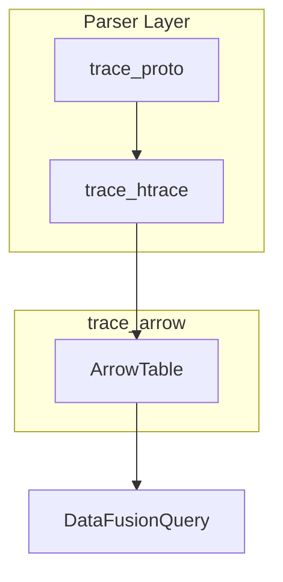
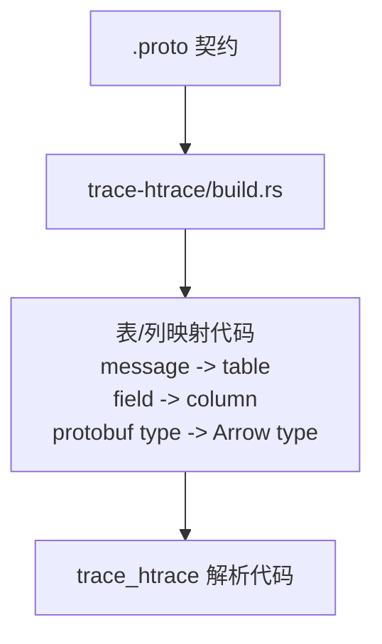
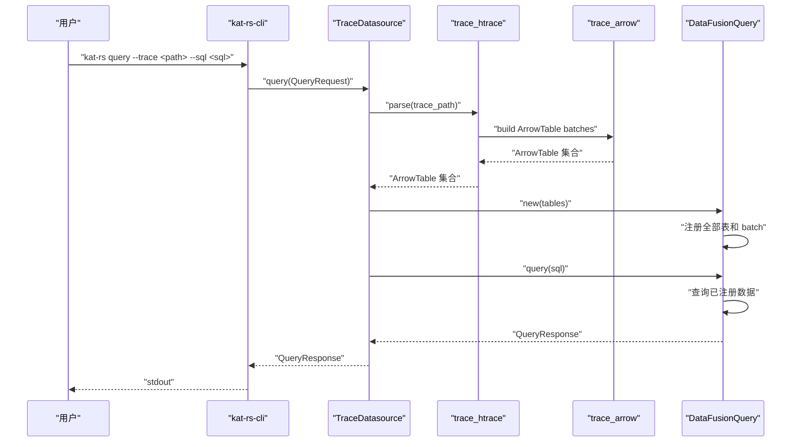

# kat-rs datasource protobuf -> Arrow -> DataFusion 架构

## 结论

当前 PR01 提交的是 datasource 的库侧查询主链路：使用 `trace-proto` 持有 protobuf 契约，使用 `trace-htrace` 解析 htrace 文件并产出 `trace-arrow` 的 `ArrowTable`，最后由 datasource 内部的 `DataFusionQuery` 注册表并执行 SQL。

```text
trace_htrace -> trace_proto
trace_htrace -> trace_arrow
DataFusionQuery -> trace_arrow
```

上面的箭头表示代码依赖方向。`DataFusionQuery` 不依赖 `trace_htrace`；它只依赖 `trace_arrow` 暴露的 `ArrowTable` 数据契约。

运行时目标是先由 datasource 根据 trace 路径调用 `trace_htrace` 完成 `.htrace` 解析、protobuf 解码和 `ArrowTable` 构建，再用这些 `ArrowTable` 构建 `DataFusionQuery` 查询实体。之后同一个 `DataFusionQuery` 的 `query(sql)` 只查询已经注册的数据，不重新解析 trace。

## 设计原则

1. `ArrowTable` 是 parser 和 query 之间的核心数据契约。
2. `trace-proto` 只负责 htrace protobuf 契约和生成类型。
3. `trace-htrace` 只负责读取 `.htrace`、解码 protobuf payload、产出 `ArrowTable`。
4. `trace-arrow` 只负责 Arrow 数据契约和通用 Arrow 构建代码，不理解 htrace 业务。
5. `DataFusionQuery` 只负责查询生命周期：构建时注册 `ArrowTable`，查询时执行 SQL。
6. htrace 专用的表结构由 `trace-htrace/build.rs` 根据 `.proto` 生成；protobuf 字段值到 `ArrowTable` 的转换由通用逻辑完成。

## 总体架构



图中箭头表示产出、包含、输入或消费关系，不表示 Rust crate 的依赖方向。

## 核心实体

| 实体 | 职责 |
| --- | --- |
| `trace_proto` | 拥有 htrace `.proto`，并生成 htrace protobuf 类型或 descriptor。 |
| `trace_htrace` | htrace 解析入口，负责读取 `.htrace` 文件，使用 `trace_proto` 解码 protobuf 数据，并将解析结果转换为 `ArrowTable`。 |
| `trace_arrow::ArrowTable` | 单张 SQL 表的数据契约，包含固定的表结构和一组 Arrow `RecordBatch`；这些 batch 是同一张表的数据分片，schema 必须一致。 |
| `DataFusionQuery` | 查询实体，构建时接收并注册 `ArrowTable`；`query(sql)` 只执行 SQL 并返回查询结果。 |

## `.proto` 契约

当前阶段只使用 `.proto` 作为业务契约。`.proto` 描述 trace 中有哪些 protobuf message，以及这些 message 的字段类型。

示例：

```proto
message HtraceTrace {
  repeated ProcessEvent process_events = 1;
}

message ProcessEvent {
  uint64 timestamp_ns = 1;
  uint32 pid = 2;
  string process_name = 3;
}
```

这个契约表达了：

1. `process_events` 是 `HtraceTrace` 下的 repeated message 字段。
2. `ProcessEvent` 可以被映射为一张基础表，例如 `process_event`。
3. `timestamp_ns`、`pid`、`process_name` 可以被映射为表字段。
4. `uint64`、`uint32`、`string` 可以被映射为对应的 Arrow 类型。

`trace_proto` 拥有 `.proto` 契约，并在构建期生成 protobuf 类型或 descriptor。`trace_htrace` 不读取额外配置契约；需要的结构信息来自 `trace_proto` 暴露的生成类型或 descriptor。

## `ArrowTable` 契约

`ArrowTable` 是 parser 与 query 之间的单表数据契约。parser 产出一组 `ArrowTable`，查询层注册这些表并执行 SQL。

一张表不是一个 batch。一张表是一个稳定 schema 下的一组 Arrow `RecordBatch`；当前可以只有一个 batch，未来可以按文件块、时间段或并行分片产生多个 batch。

```rust
pub struct ArrowTable {
    pub name: String,
    pub schema: arrow_schema::SchemaRef,
    pub batches: Vec<arrow_array::RecordBatch>,
}
```

约束：

1. `schema` 是表级 schema。
2. `batches` 保存同一张表的全部数据分片。
3. 同一张表内所有 `RecordBatch` 必须使用同一个 `schema`。
4. 当前不生成无数据表；如果一张表没有数据，parser 不产出对应 `ArrowTable`。

## `trace_arrow` 边界

`trace_arrow` 是 Arrow 数据转换层。它不解析 htrace，不读取 `.proto`，不执行 SQL；它只负责把已经解码出的 protobuf 字段值转换成可被 DataFusion 注册查询的 `ArrowTable`。

输入：

1. 构建期生成的表/列映射：message -> table、field -> column、protobuf type -> Arrow type。
2. `trace_htrace` 已经解码出的 protobuf 字段值。

输出：

1. `ArrowTable`：包含 SQL 表名、Arrow schema 和一组 Arrow `RecordBatch`。

它负责：

1. 定义 `ArrowTable` 数据契约。
2. 根据表/列映射构建 Arrow schema。
3. 根据表/列映射，将已解码的 protobuf 字段值写入 Arrow 库提供的列构建器。
4. 生成 Arrow `RecordBatch`，并组装成 `ArrowTable`。
5. 校验同一张 `ArrowTable` 内的 batch schema 一致。

它不负责：

1. 读取 `.htrace` 文件。
2. 解码 htrace protobuf payload。
3. 从 `.proto` 生成表/列映射。
4. 维护 htrace 专用解析规则。
5. 执行 SQL。

## 构建期生成

构建期生成负责把 `.proto` 契约转换成 htrace 专用的表/列映射代码。生成发生在 `trace-htrace/build.rs`，生成结果由 `trace_htrace` 解析代码使用。



生成内容：

1. 哪些 protobuf 记录集合会成为基础表。
   例如：`HtraceTrace.process_events` 对应 `ProcessEvent` 记录集合。
2. protobuf message 如何成为 SQL 表名。
   例如：`ProcessEvent` 转换为 `process_event`。
3. protobuf field 如何成为 SQL 列名。
   例如：`process_name` 转换为 `process_name`；如果字段名是 `processName`，则转换为 `process_name`。
4. protobuf 字段类型如何成为 Arrow 列类型。
   例如：`uint64` 转换为 Arrow `UInt64`，`string` 转换为 Arrow `Utf8`。
5. 字段读取路径和 nullable / repeated 等基础属性。

生成边界：

1. 构建期只生成表/列映射代码。
2. 构建期不读取真实 `.htrace` 文件。
3. 构建期不解码 protobuf payload。
4. 构建期不生成字段写入或 `RecordBatch` 组装逻辑。
5. 如果某类记录在 trace 中没有数据，运行时不会生成对应的 `ArrowTable`。

## datasource 生命周期

datasource 负责把一次 trace 查询串起来：先解析 trace，得到 `ArrowTable`；再构建 `DataFusionQuery`；最后执行 SQL。

```rust
impl TraceDatasource {
    pub fn new() -> Self;

    pub async fn query(&self, request: QueryRequest) -> Result<QueryResponse>;
}
```

生命周期分成三个阶段：

| 阶段 | 入口 | 主要动作 | 是否解析 trace |
| --- | --- | --- | --- |
| 解析阶段 | `trace_htrace::parse(trace_path)` | 读取 trace、解码 protobuf、构建 `ArrowTable`。 | 是 |
| 查询构建阶段 | `DataFusionQuery::new(...)` | 注册全部 `ArrowTable` 和 batch。 | 否 |
| SQL 查询阶段 | `DataFusionQuery::query(sql)` | 对已注册数据执行 SQL。 | 否 |

同一个 `DataFusionQuery` 实体可以执行多次 `query(sql)`，不会重复解析 trace；重新解析只发生在上层重新执行解析阶段时。

## 运行时

运行时解析转换发生在用户发起查询时，不属于构建期生成。

1. `trace_htrace` 解码 `.htrace` 和 protobuf payload。
2. `trace_htrace` 把已解码的 protobuf 字段值交给 `trace_arrow`。
3. `trace_arrow` 根据表/列映射，将已解码的 protobuf 字段值写入 Arrow 库提供的列构建器。
4. `trace_arrow` 生成 Arrow `RecordBatch`，并组装成 `ArrowTable`。



## 代码结构

```text
crates/
  kat-rs-cli/
    src/
      main.rs              # CLI 入口
      logging.rs           # 初始化日志
      output.rs            # CLI 输出格式化
      commands/mod.rs      # 命令解析和分发

  kat-rs-datasource/
    src/
      lib.rs               # datasource 对外导出入口，屏蔽内部子 crate
      query.rs             # DataFusionQuery：注册 ArrowTable 并执行 SQL
      result.rs            # QueryRequest、QueryResponse、QueryMetrics
    tests/
      query.rs             # datasource 查询集成测试

    crates/
      trace-proto/
        build.rs           # 编译 proto descriptor / 生成 protobuf 类型
        proto/htrace.proto  # 当前唯一业务 proto 契约
        src/lib.rs          # trace_proto 对外导出入口

      trace-htrace/
        build.rs            # 生成 htrace 表/列映射代码
        src/lib.rs          # parse(trace_path) -> ArrowTable 集合
        src/parser.rs       # htrace 文件读取和 protobuf payload 解码
        src/table_specs.rs  # include!(OUT_DIR/htrace_table_specs_generated.rs)
        tests/parse.rs      # htrace 解析测试

      trace-arrow/
        src/lib.rs          # trace_arrow 对外导出入口
        src/common.rs       # build 阶段和运行时共享的 Arrow 数据结构
        src/contract.rs     # 构建期生成代码引用的表/字段契约
        src/runtime.rs      # 运行时 protobuf 字段值 -> ArrowTable
        tests/              # Arrow schema、batch、table 契约测试

      trace-model/
        src/lib.rs          # 当前保留的 model 边界壳

      trace-parser/
        src/lib.rs          # 当前保留的 parser 边界壳

      trace-query/
        src/lib.rs          # 当前保留的 query 边界壳
```

结构约束：

1. `kat-rs-cli` 只依赖 `kat-rs-datasource`，不依赖 parser 或 Arrow 子 crate。
2. `TraceDatasource` 负责串联解析阶段和查询阶段。
3. `DataFusionQuery` 只把 `ArrowTable` 注册进 DataFusion，不调用 `trace_htrace` 内部模块。
4. `trace-htrace` 依赖 `trace-proto` 和 `trace-arrow`，负责产出 `ArrowTable`。
5. `trace-htrace/build.rs` 只生成 htrace 表/列映射代码。
6. `trace-arrow` 没有 `build.rs`，不依赖 `trace-proto`、`trace-htrace` 或 DataFusion。

## 验证标准

1. `trace_htrace::parse(trace_path)` 可以完成 htrace 解析并产出 `ArrowTable`。
2. `DataFusionQuery::new(...)` 可以注册基础表及其全部 batch。
3. 同一个 `DataFusionQuery` 实体连续执行多个 SQL，不重复解析 trace。
4. `query(sql)` 可以查询已注册的基础 `ArrowTable`。
5. `ArrowTable` 的 schema 来自 `trace_proto` 的 `.proto` 契约。
6. 同一 `ArrowTable` 中所有 batch 使用同一个 schema。
7. htrace 专用表结构由 `trace-htrace/build.rs` 根据 `.proto` 生成。
8. `trace-arrow` 不包含 htrace 专用表、字段或 message 逻辑。
9. protobuf 字段值到 `ArrowTable` 的转换通过 `trace-arrow` 通用逻辑完成。
10. 代码主流程只依赖 `.proto` 契约。
