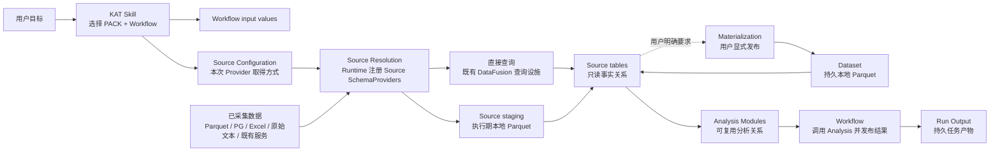

# PACK 数据底座架构总览

本文向 KAT 的 PACK 作者、平台维护者和数据供应方解释数据底座及协作边界。它是团队沟通入口，不替代 [`CONTEXT.md`](../CONTEXT.md) 的领域词汇、[`ADR-0062`](adr/0062-pack-sources-provide-source-tables.md) 的正式决定或 [PACK Sources 实现 SDD](sdd/2026-08-24-pack-sources.md) 的机械合同。文中明确列入“暂不提供”的能力不属于当前接口。

## 一句话目标

KAT 要让团队在不迁移全部历史数据、不重建既有查询和解析生态的前提下，把已采集数据组织为可查询事实，再像组合乐高一样复用稳定分析能力并回答具体问题。

## 为什么不再围绕 IMPORT 建模

旧模型把数据接入理解为：平台内置一种 Datasource，把一个外部来源完整导入本地 Dataset。这个模型适合少量已知格式，但不能同时覆盖以下现实：

- 数据可能已经以本地或远端 Parquet 保存；
- PG 等数据库通常位于远端，只应执行当前任务需要的查询；
- Excel 可以在本地直接解析，但没有必要为它建立平台内置类型；
- TB 级来源无法先整体搬入本机；
- 普通日志文件也可能由大量带元数据的 chunks 组成，单个 chunk 又展开为大量事实；原始 SMAPS 只是这类来源的一个例子；
- 团队已有自己的解析器、数据库驱动、服务和依赖环境。

因此，KAT 不再发明一套封闭 Datasource、通用 Provider 协议或依赖系统。平台只统一 Workflow 看到的表查询面和执行生命周期，来源读取、认证、查询下推、Schema 与一致性继续以成熟设施的行为为准；公开来源操作只有建立 Binding 的 `kat bind` 和把 Source 持久发布到 Dataset 的 `kat materialize`。

## PACK 的三个能力区

PACK 是所有权与发布边界，而不是一种文件格式的容器。Sources、Analysis 与 Workflows 是可以按 PACK 实际能力缺席的三个能力区，不是每份数据都必须逐层持久化的三层架构。Sources 可以独立物化；不拥有 Sources 的 Analysis 可以通过完整 `<pack>.<source>.<table>` 名称使用其他 PACK 的 External 或 Materialized Sources，也不存在匿名 `dataset` namespace。Workflow 只封装 Analysis，不直接拥有或查询 Source tables。

### Sources：让来源成为可查询事实

Sources 拥有 Source Documentation、必要的 Source Entry 与 Parser、机械解码、provenance 以及来源语义规范化。它回答“数据是什么、字段是什么意思、如何取得”，但不提前计算具体分析结论。

PACK 只要拥有并对外发布自己的逻辑 Source namespace，就在根目录提供 `SOURCES.md` 作为 Source Guide。它面向人和 AI，可以只包含说明文字与数据供应方文档链接；KAT 不强迫团队提交结构化 Schema、本地结构化数据或 Source Entry。它帮助 Skill 选择适用 Workflow，也帮助作者理解和复用 PACK 内部 Sources，但不声明第二种 KAT 可执行入口。仅说明并交付已有 Materialized Source、没有 Entry 的 PACK 仍应提供 Guide，但这一点由作者与评审保证；只消费其他 PACK Sources 的 Analysis-only PACK 不为它们重复提供 Source Guide。

精确目标的 `kat inspect --pack` 把完整 Source Guide 作为可选 `source_guide` 文本返回。只要 PACK 发现任一 Source Entry，缺失或不可读的 `SOURCES.md` 就使精确 inspect、test、bind 与 materialize 失败；没有 Entry 时可以返回 `source_guide: null`，已存在却不可读的 Guide 仍使 inspection 失败。`kat run` 不独立执行 Guide 门禁，既有 Binding 的执行不把文档变成运行依赖；正常 Skill 选择仍通过前置 inspection 发现问题。KAT 不为识别仅交付现有 Materialized Source 的 PACK 增加 manifest capability，也不为此扫描 Dataset。Inspection 还从 PACK 模块正常加载后记录的 Source Entry 签名投影参数名、CLI option、类型、是否必填和默认值，供 KAT Skill 构造 Source Configuration；参数说明、表和字段语义继续只来自 Source Guide。Inspection 不实例化 Provider、枚举动态表、分析源码文本或重复描述。无目标 inspection 不批量读取全部文档，也不增加新的 Sources CLI。

`kat inspect --dataset` 则只读取 Dataset 当前管理事实，不发现或加载 PACK。成功结果包含 canonical `path` 与按 PACK identity、Source name 排序的 `sources` tagged union：External Binding 精确只有 `pack`、`source` 和 `kind: "external"`，不实例化 Provider 或枚举表；Materialized Source 另显示按名称排序、从 Parquet metadata 投影 `{name, columns}` 的 `tables`。这一字段形状只是 Interface schema，不构成 Source arguments 或凭据的保密保证。任一 Binding metadata 或受管理 Parquet metadata 损坏时整个 inspection 失败，不返回部分结果。

### Analysis：沉淀经过验证的复用能力

Analysis Modules 把 Source tables 转换为稳定、可组合的分析关系或算法。只有在真实数据和多个真实调用者中证明泛用性的能力才进入 Analysis Library；来源解释仍留在 Sources，单个任务的编排仍留在 Workflow。

### Workflows：回答具体问题

Workflow 解释当前任务的用户输入，调用 Analysis Modules 并发布 Run Outputs。事实依赖已经由 Analysis 的 SQL/DataFrame 查询表达，不在 Workflow decorator 中重复声明；Workflow 也不修改 Dataset 或把任务专用结果伪装成新的来源事实。

推荐的代码视图是：

```text
pack.toml
SOURCES.md       # PACK 拥有自己的 Source namespace 时存在
sources/         # 需要从外部输入构造 Provider 时存在，由 KAT 扫描
analysis/        # 推荐布局，不由 KAT 扫描
workflows/       # @kat.workflow 入口，由 KAT 扫描
tests/
```

`sources/` 与 `workflows/` 一旦存在就是固定扫描入口；`analysis/` 是普通 Python 推荐布局。只有 KAT 需要根据外部输入构造 Provider、建立 External Binding 或新建、替换 Materialized Source 时，才要求提供 Source Entry。只说明并交付已有 Materialized Source 的 PACK 可以省略 `sources/`，但不能执行 bind、重建或再次物化；即使 Entry 甚至对应 PACK 已不存在，现有 Materialized Source 仍可被检查、查询和复制，丢失或失效时则由数据供应方或操作者重新交付。既有 `helpers/` 不要求一次性改名，无法归入 Sources 或 Analysis 的普通 Workflow helper 可以在实际迁移时再决定位置。

Workflow、Analysis 与测试仍通过公开 `kat.pack` 使用当前 Workflow PACK，例如 `kat.pack.analysis.memory`。KAT 的 inspection、bind、materialize 与 External Binding resolution 把 Source Entry 及其递归导入的 PACK 内模块统一加载到由 canonical PACK directory 派生的 Runtime 私有 module root；Source 代码必须使用 `from ..decoders.smaps import ...` 这类包内相对导入。因此一个 Binding 不会在建立后才因模块身份不同而失效，私有 module root 也不进入 Source、Binding 或 SQL 的公共身份。

Source Entry 与 Workflow Entry 使用同一套 authoring 心智模型：固定目录、递归扫描普通 `.py`、每个入口文件恰好注册一个由本文件定义、带相应 decorator 的入口，并拒绝 `__init__.py` 与间接注册。差别是 `@kat.workflow` 是用户可选择的 CLI 入口，使用既有 kebab-case；`@kat.source(name=...)` 装饰一个返回 DataFusion 可注册 schema-provider 值的普通 Python factory，这是 Entry 唯一的返回边界。Runtime 接受公开 `Schema`、Python `SchemaProvider` 与官方 FFI SchemaProvider 值，不定义自有 Provider 协议。其 name 直接成为 SQL schema，因而完整匹配 `^[a-z][a-z0-9]*(?:_[a-z0-9]+)*$` lowercase snake_case。Source name 在 PACK 内唯一，不能使用 KAT 保留的 `dataset` 或 DataFusion 保留的 `information_schema`；移动实现文件不会改变 Analysis SQL。Source Provider 自己定义表集合、Schema 与具体 TableProviders，decorator 不重复这些来源事实。

一个最小 Source Guide 可以只用自然语言说明以下事实，不要求固定标题或机器可读格式：

```markdown
# 进程内存来源

可提供 `snapshots` 与 `mappings` 两张表。输入是已经采集的
SMAPS 文本或包含多份快照的日志；字段语义见供应方文档链接。

分析这类输入的 Workflow 只查询上述 Source tables。调用方在执行 `kat bind`
或 `kat materialize` 时提供文件路径；对应 Provider 可以通过相对导入复用 PACK 内的 SMAPS Parser，
超大容器使用具体 Framer，解析结果只覆盖成功读取的 fragments。
```

## 运行时数据流



KAT Skill 依据用户问题、Source Guide 与 Workflow Interface 选择 PACK 和 Workflow，并从本次显式选择的 Dataset Source Bindings 形成短命 Source Configuration，不再用静态表依赖或 Dataset 当前表集合筛选 Workflow。生产 `kat run` 不接收临时 Source arguments 或 Provider override；一次性来源也先通过 `kat bind` 进入显式 Dataset。PACK test 只使用显式选择的 Test Dataset 和本次 Source argv，不发现开发者机器上的任意生产 Binding。`kat run --dataset` 语法可选；省略表示没有 Dataset-backed Source Configuration，不从当前目录、Data Home、最近位置或匿名空 Dataset 推断默认值。显式 Dataset 无效时 Workflow 启动前失败；没有 Dataset 或合法 Dataset 缺少目标 Binding 时，只在 Analysis 首次实际解析该 Source namespace 时以完整 PACK/Source 身份失败，在此之前不实例化 Provider、扫描表、访问远端或创建 Source staging。在当前合同下，每个 Source name 只会解析为一种 Binding 形态：Materialized Source 使用本地 Parquet Provider，任意 PACK 的 External Binding 则由当次 discovery 唯一发现对应 PACK，并以保存的 arguments 调用 Source Entry。Workflow PACK 仍公开挂载为 `kat.pack`；所有 Source modules 都使用按 PACK 隔离的 Runtime 私有 namespace，并以相对导入访问 PACK 内部模块。Inspection、bind、materialize 与 External Binding resolution 使用相同的私有 module namespace 和普通 Python import 语义，但只有前三者执行 Guide 门禁；已绑定的 Query/Run resolution 不读取 `SOURCES.md`，也不分析源码文本。随后 `<source>.<table>` 查询取得 TableProvider，因此昂贵读取还可以继续推迟到首次表解析或扫描。未查询的 Source 不实例化；缺少必填 Source arguments 也只在首次使用时失败。Source Configuration 与 Source Resolution 都不是新的 CLI 命令或数据搬运服务，也不写入 Run Manifest；Source Binding 以 Dataset location 为锚点，不扩展为全局或同一 `(PACK identity, Source name)` 的多实例 catalog。它们只处理已采集数据，不负责在目标设备上现场读取 `/proc` 或采集 Trace。

Source Provider 是一个自行拥有表定义的 DataFusion SchemaProvider。原始 kebab-case PACK identity 映射为 DataFusion catalog，SQL-safe snake_case Source name 原样映射为其中的 schema；KAT 不建立 alias、清洗名或 SQL 重写。Workflow 执行时所选 PACK 是当前 catalog，所以同 PACK Analysis 使用 `raw_smaps.mappings` 这类 `<source>.<table>`；跨 PACK 或 Dataset Query 使用标准 SQL quoted catalog，例如 `"kat-kernel".raw_smaps.mappings`。不同 catalogs 或 schemas 可以拥有同名表；Runtime 不扁平合并、不按注册顺序覆盖，也不隐式选择。TableProvider 可以读取 Dataset、既有查询设施或 Source staging。第一版不提供 Source alias、版本后缀、自动改名或匿名 `dataset` schema；所有持久事实都有明确的 PACK 与 Source 身份。

需要在原始数据和本地事实之间切换的 Source Provider 可以明确支持多种物理取得方式：例如同一个 Hitrace Source 根据调用方选择复用原始文件解析器或既有 Dataset Provider，并始终提供相同逻辑表。KAT 不根据 Dataset 内容或 provenance 自动猜测对应 Source，也不要求所有 Source 都支持这种替换。

第一版不为同一个 Source Entry 建立 `baseline`、`candidate` 等执行期 aliases。一个 Provider 可以聚合一份或多份同类文件、Dataset 切片或远端查询结果；物理路径、连接方式和解析策略留在 Provider 内，设备、采集、实验、快照等 Analysis 需要区分的来源事实进入稳定字段或关联表。Workflow 使用 `baseline_capture_id`、`candidate_capture_id` 等任务选择表达分析角色，同一个 Analysis 因而可以自然覆盖单份、两份与 N 份数据。一次 Run 或 Dataset Query 只选择一个 Dataset；两个分别包含 Materialized Sources 的 Dataset 不能直接组合、join 或共同运行。需要横向比较的数据必须由同一个 Source Provider 聚合并进入同一 Dataset 的一个 Binding。第一版不增加多 `--dataset`、Dataset alias、merge 或 overlay；只有真实案例证明这一边界不足时才重新讨论组合 Interface。

Workflow 是唯一可执行入口，只负责调用 Analysis Modules；Analysis 作者只面对统一的 DataFusion Source tables，并显式选择逻辑 Source namespace。两者都不调用 Source Entry；Analysis 不感知该来源由 Dataset、远端数据库、Parquet、Flight SQL 或 Python Parser 实现。原生设施直接提供 Provider；Python Parser 通过平台拥有的适配实现按需产生 Arrow batches、写入 Source staging，再由 Parquet Provider 提供同一查询面。

文件路径、连接别名和时间范围等调用方选择由 Source Entry 的普通 Python 具名参数表达；参数名、受支持的类型注解和默认值共同构成 Source input contract。Source Input Compiler 复用 Workflow Input Compiler 的私有编译内核与现有标量类型及其限制，并额外支持 Source-only 的 `pathlib.Path` 与 `tuple[pathlib.Path, ...]`。后者只表示可重复提供的多文件 option，使一个 Provider 聚合多份同类输入；普通 `str` 不被猜测为路径，其他 tuple、list、dict、结构化 model、通用 JSON 与自定义 parser 不进入第一版合同。Source Configuration 提供的原始 Source arguments 依据该合同解释而不成为 Workflow input values。用户说明仍只写在 `SOURCES.md`，不增加 decorator 参数映射。`kat materialize` 直接依据同一合同解释 `--` 后的原始 arguments。Source Entry 不接收完整 inputs mapping，也不使用 SourceContext；每个 Source name 在一次执行中最多取得一个 Provider。Decorator 在正常模块导入时记录 callable 签名，不扫描 Python 源文本。KAT 不按参数名、类型或内容分类密码、Token、DSN 等凭据；Provider 可以像使用其他 Source arguments 一样声明和使用它们，并继续服从外部设施的认证行为。

Python Runtime 内部使用与 Workflow `arguments` 分离的结构化 `sources` mapping；生产 CLI request 不接受 Source override，该 mapping 只由所选 Dataset Binding resolution 产生。测试 `kat_run` 可以用当前 PACK 的 `{source_name: Sequence[str]}` 原始 argv 形成隔离 Source Configuration；同时选择 Test Dataset 时，显式 `sources` 覆盖其中同名的当前 PACK External Binding 或 Materialized Source，其他 Bindings 继续可用。覆盖只作用于本次调用、不修改 Test Dataset；显式 override 编译失败使调用失败，不回退同名 Binding。每项仍经过真实 Source Input Compiler 与匹配 Source Entry，并按 fixture 实际收到的 token strings 使用；KAT 不再展开环境变量、模板或 response file。fixture 不接受 Provider/SchemaProvider 对象，也不接受其他 PACK 的 Source override。配置不进入 Run Manifest。

每个 Source Binding 必须由一个具体 Dataset location、PACK identity 与 Source name 共同标识，使 `kat run` 通过所选 Dataset 取得唯一当前 Provider。Binding 只持久化 `(PACK identity, Source name)`，不保存 bind 时的 PACK directory、代码、版本或哈希；`--pack-dir` 也不持久化。以后解析 External Binding 或 REDO recipe 时，由当次 discovery 唯一选中的同名 PACK 解释 argv 并取得其中的凭据；多个不同的同名 candidate 没有优先级并使 discovery 失败，调用方必须信任执行时选择的 PACK。Dataset 是工作目录，可以容纳多个由不同 `(PACK identity, Source name)` 标识的 Binding，但同一对标识最多一个。每个 Binding 恰好处于两种互斥形态之一：External Binding 保存调用方原始 Source argv 的 token array 与 `kat bind` 时取得的绝对工作目录；Materialized Source 保存 KAT 管理的本地 Parquet tables，并保留相同的 argv 与工作目录作为再次 Materialization 的便利 recipe。Materialized Source 允许后续进程复用，但只是可丢弃并通过 REDO 重建的本地投影或缓存，不是权威来源、历史快照或 KAT 系统状态；查询只注册已物化 tables，完全遮蔽 recipe，缺失表不回退 Source Entry。原始 argv 是 KAT 实际收到、已经由 shell 或调用方完成分词和可能变量展开的 token strings；KAT 后续不再次展开环境变量、模板或 response file。argv 保持 token 边界、不拼成命令字符串，也不补写省略的默认值；它可以包含密码、Token、DSN 等 Provider 配置。普通相对 `pathlib.Path` 始终以保存的工作目录为基准，普通 `str` 不作路径解释。Binding metadata 以明文保存在 Dataset 目录内；KAT 不增加加密、Keychain、Secret Manager 或凭据刷新，也不对 Source arguments 或凭据提供任何保密、防泄漏、凭据保护或安全擦除承诺。完整复制 Dataset 会复制 Binding 及其中的凭据，复制品以新位置成为独立 Dataset，但不重基相对 Path；移动或重命名 Dataset 是未定义行为，KAT 不检测、修复或改写引用。路径、连接配置或凭据换机后不可用时明确失败并要求重新绑定，不做自动修复。Materialized Source 的通用 Parquet 查询不要求 PACK 已安装；运行 Workflow、解析 External Binding 或执行 recipe 仍需要 PACK。PACK test 只读取显式选择的 Test Dataset 和本次 Source argv，不发现开发者机器上的任意生产 Binding。PACK 修改 Source contract、默认值或实现后，既有 recipe 的行为未定义；PACK 作者与 Dataset 操作者负责同步调整并完整执行 `kat bind --replace` 或 `kat materialize --replace`，KAT 不检测差异、不冻结默认值、不维护版本、不迁移或兼容旧 Binding。

`kat bind` 只建立 External Binding。目标路径不存在时，它可以创建一个由零张表组成的合法 Dataset 并写入 Binding；目标已是合法 Dataset 时沿用，目标是普通目录或文件时拒绝。同一 `(PACK identity, Source name)` 已有任一 Binding 形态时默认拒绝，只有显式 `--replace` 才授权替换该 Source 的完整当前形态，且不影响其他 Source。`kat bind --replace` 不合并或继承旧配置：本次 `--` 后 argv 是完整的新显式配置，没有 argv 就表示零个显式参数并由当前合同使用当前默认值；不能只传新密码并沿用旧的 `host` 参数。PACK discovery、Guide、Source contract 或参数编译失败保持旧 Binding。`kat bind` 使用当前 Source contract 校验原始 argv 后，仍只保存不补默认值的原始 token array 与 bind 工作目录；它不调用 Source Entry、不连接设施，也不校验凭据、Schema 或表。Materialized Source 统一由 `kat materialize` 建立；Binding metadata 是 Dataset 的管理信息，不是 Source fact 或 table。成功结果精确包含 canonical `path`、`pack`、`source` 与 `kind: "external"`；这一字段形状只是 Interface schema，不构成对 Source argv、bind 工作目录、凭据或替换历史的保密承诺。

`kat materialize` 使用已有 External/Materialized recipe 或本次显式 Source arguments，并以 Materialized Source 替换目标 Source 的当前 Binding。写入前检查失败不修改 Binding；Provider 开始执行后，失败可能使目标 Source 空间或 Dataset 无效。内部 staging 和临时目录仅是实现细节，不提供回滚或保旧保证。只有所选表集合各自完整写入一个 Parquet 文件，并能通过既有 Dataset marker、命名与 Parquet metadata 机械读取检查时才成功；这不证明来源一致性、覆盖范围或业务完整性。成功后当前 Binding 保存实际使用的 argv/cwd recipe，同时查询只使用新的表集合；这不表示底层残留、历史副本、日志或备份已被安全擦除。

两项操作的完整调用形态是：

```text
kat bind --pack <pack> --source <source> --dataset <path> [--replace] [--pack-dir <exact-pack-directory> ...] [-- <source arguments>]
kat materialize --pack <pack> --source <source> --dataset <path> [--table <table> ...] [--replace] [--pack-dir <exact-pack-directory> ...] [-- <source arguments>]
```

没有 Source arguments 时可以省略 `--`。两者都通过 manifest identity 选择 PACK，并可重复使用 `--pack-dir`，显式加入一个或多个直接包含 `pack.toml` 的 PACK 目录；这些候选目录与 Bundled/Data Home candidates 共同参与 discovery、按 canonical path 去重且不产生优先级。`--pack-dir` 只作用于本次命令、不保存进 Binding；Binding 也不保存 PACK directory、代码、版本或哈希，后续使用时由当次 discovery 唯一选中的同名 PACK 解释 External Binding 或 recipe。所有 `--pack-dir` 必须位于 `--` 前。`kat bind` 加载所选 PACK、取得匹配 Source Entry，并用 Source Input Compiler 校验原始 argv 的未知参数、必填项、类型与默认值有效性；原始 argv 是 KAT 实际收到的 tokens，不再展开环境变量、模板或 response file。成功后保存原始 token array 与 bind 工作目录，但不调用 Entry、不实例化 Provider，也不访问文件、数据库、凭据有效性、Schema 或表。`kat materialize` 完成同样的选择与加载后才调用 Provider；使用已有 recipe 时以保存的工作目录重新解释相对 Path，本次显式 arguments 则以本次调用的工作目录解释。Dataset 目标、已有 Binding 与 `--replace` 等机械前置条件必须在执行第三方代码或写入状态前完成。已有 Materialized Source 的 inspection、Dataset Query、复制和 Workflow 查询不需要 Source Entry；新建、替换或 REDO 必须有匹配 Entry。`kat test` 继续只接受一个精确 `--pack-dir` 测试该 checkout，不参与这套多 candidate discovery。

## 提供 Source table 的常见方式

| 来源 | 推荐接入方式 | 原因 |
| --- | --- | --- |
| 本地或远端 Parquet、PyArrow Dataset | 用薄 Source Entry 直接返回既有查询设施 | 已经具有列式、可扫描的数据面，无需重写 Provider |
| 远端 PG 等数据库 | Source Entry 复用数据库驱动，只执行任务所需 SQL，并把结果增量写入 Source staging | 避免全库搬迁，又能让后续分析使用本地 Parquet |
| 本地 Excel | Source Entry 复用既有解析库读取并写入 Source staging | 数据通常不大，无需平台内置 Excel 类型 |
| 原始文本或私有格式 | PACK Source Entry 按需解析并写入 Source staging | 来源语义由拥有它的 PACK 负责 |
| 已存在的 Flight SQL 服务 | 用薄 Source Entry 返回既有查询设施 | 复用已有服务，不由 KAT 再托管一个本地解析服务 |
| 结果仍无法暂存，且任务需要多次动态下推 | Source Entry 返回包含原生 DataFusion TableProvider 的 SchemaProvider | 这是复杂能力的例外，而不是默认扩展方式 |

任意外部 Parquet 目录不自动成为 KAT 管理的 Materialized Source，也不直接交给另一条发布协议。需要把它纳入 Dataset 时，PACK 用薄 Source Entry 返回复用既有 DataFusion Parquet Provider 的 schema-provider 值，再统一执行 `kat materialize`；已经合规交付的 Materialized Source 则可以脱离该 Entry 继续被复制、检查和查询。

KAT 不把任意 Python generator 包装为 DataFusion Provider。Python Parser 的默认接入边界是标准 `pyarrow.RecordBatchReader`：平台薄 helper 接收“表名到零参数 reader factory”的 mapping，并构造一个供 Source Entry 返回的 SchemaProvider。mapping 只是 helper 输入，不是 `@kat.source` 的第二种返回类型，Runtime 不做 union 或 duck typing。表首次被查询时，helper 构造的 Provider 调用对应 factory，按 RecordBatch 增量写入本次 Source operation 的 staging，完整写入成功后交给现有 Parquet Provider，并在该次执行内复用。helper 隐藏 staging、Parquet 注册、失败失效和清理，普通作者只提供 readers；高级作者直接返回现成 SchemaProvider。reader 自带 Arrow Schema，因此空结果仍有确定表结构；已有 generator 由作者使用 PyArrow 自带的 `RecordBatchReader.from_batches()` 转接。

第一版每张表一个 reader factory，不建立多表 Parser、sink callback、Parser 注册表或自定义 row/column 合同。必须单次解析同时产出多表的特殊格式暂由其 Source Provider 自行组织；只有出现第二个真实案例后才提炼共享 Interface。当前公共 helper 已固定为 `kat.schema_from_readers(factories)`，其中每个 factory 返回一个 `pyarrow.RecordBatchReader`。

## Source staging、Dataset 与 Run Output 不可混同

三者都可能使用 Parquet，但具有不同身份：

- **Source staging** 是当前执行的准备数据。它使用独占的空目录，失败后整体无效，执行结束尽力删除，崩溃残留不得跨执行复用。
- **Dataset** 是以位置为身份的本地数据工作目录，可以容纳零个或多个按 `(PACK identity, Source name)` 隔离的 Source 管理空间。每个空间保存 Binding metadata，并可包含对应 Source 已 Materialize 的 Parquet tables；具体外层目录布局由 KAT 管理。完整目录复制产生一个以新位置为身份的独立 Dataset，移动或重命名现有 Dataset 是未定义行为。它可以只是外部来源中与任务有关的切片，不承诺是完整副本；其中的 Materialized Source 允许跨进程复用，但只是可丢弃的本地投影或缓存。
- **Run Output** 是 Workflow 对具体任务发布的结果。它允许后续进程查询，但同样只是可丢弃并可 REDO 的本地投影或缓存，不是权威事实或历史快照；即使物理上是 Parquet，也不会自动成为 Dataset 或另一个 Workflow 的 Source table。

这里的 REDO 是调用方、数据供应方或自动化执行 `kat bind`、`kat materialize` 或 `kat run`，得到当前可用产物。Materialized Binding 可以保存上次 argv/cwd 作为便利 recipe，但它不是权威重建配方、版本锁或来源快照；KAT 不自动修复或恢复，也不保证 REDO 与历史产物在字节、数据快照、PACK 语义或查询结果上相同。没有 Source Entry 的预制 Materialized Source 只能由供应方重新交付。

Materialization 只在用户明确要求时通过 `kat materialize --source <name>` 把该 Source Provider 的表完整消费并发布到目标 Dataset 内对应 `(PACK identity, Source name)` 的隔离空间。省略 `--table` 时，Provider 在本次操作开始时枚举一次自己的全部表并整体发布；重复 `--table` 时只发布明确子集。发布或替换该 Source 空间不会主动删除 Dataset 内其他 Source 的 Binding 或本地表。零表、未知表、无效 table 选择等可在写入前判断的机械错误不修改 Binding；进入 Provider 执行后不再承诺失败时保留旧 Source 空间。KAT 不增加 `--all-tables`：`kat materialize --source <name>` 已经表达全量授权，远端来源范围由 Provider、Source inputs 与 Source Guide 共同限定。`--table` 只限制发布集合，不承诺物理上只解析这些表；Hitrace Provider 可以只解析源文件一次并共享全部表结果。

Provider 输入按以下顺序唯一决定：`--` 后有 Source arguments 时使用本次参数，并以本次调用的工作目录解释相对 Path；没有本次参数且当前是 External 或 Materialized Binding 时重放已保存的原始 argv，以保存的工作目录解释相对 Path，并由当前 Source contract 补齐当前默认值，这一条只描述 PACK 未修改 Source contract、默认值或实现时的正常路径，发生修改后的 recipe 行为未定义；没有本次参数且目标没有 Binding 时调用零参数或全默认值 Source Entry，缺少必填参数则失败。已有任一 Binding 时，即使提供新参数也必须显式 `--replace`。`kat materialize` 无需经过 Workflow；它会替换该 `(PACK identity, Source name)` 的完整当前形态，并保留其他 Source 空间。

Materialization 复用普通查询的同一个 Source Provider，不要求 Source 标注 eager/lazy，也不根据数据量、来源类型、性能或失败情况自动物化。当前最大 Hitrace 的 Rust 串行物化约五秒，第一版不增加 bulk execution profile、分区 Parser、专用并行调度或 KAT 自有流水线协议；性能暂由 DataFusion、Arrow、Parquet 与 Provider 的既有行为决定，真实基准证明必要后再优化。Materialization 不执行 Workflow/Analysis、不创建 Run，也不自动追踪外部来源的后续变化。

Materialization 可以消费目标 Dataset 上的 External/Materialized recipe 或本次显式 Source arguments，并在成功后把该 Source 的完整当前 Binding 发布为 Materialized Source。目标已有 External Binding 或 Materialized Source 时默认拒绝，只有显式 `--replace` 才授权转换或替换。Dataset 目标、PACK/Source、Guide、Source contract、arguments 与 `--replace` 授权等可在执行第三方代码和写入前判断的机械前置条件必须先完成，失败时不修改 Binding。进入 Provider 执行后，Provider 创建、枚举、读取、解析或扫描失败不再享有独立的保旧合同；一旦任何写入开始，后续任一 Parquet 写入、机械检查、删除、移动或 metadata 写入失败，以及崩溃、强制终止或断电，都可能使目标 Source 空间或 Dataset 无效。第一版没有备份、回滚、失败恢复、并发锁、CAS 或读写快照；调用方必须串行化同一 Dataset 的写操作，无效 Dataset 由 inspection 拒绝并由用户删除后 REDO。只有所选表集合各自完整写入一个 Parquet 文件，并能通过既有 Dataset marker、命名与 Parquet metadata 机械读取检查时才成功；这不证明来源一致性、覆盖范围或业务完整性。成功后 Binding 保存本次实际使用的 argv/cwd recipe，并只以本次表集合形成查询面；旧本地表不再可见，但不承诺安全擦除底层残留、历史副本、日志或备份。其他 Source 不被有意修改。成功结果精确包含 canonical `path`、`pack`、`source`、`kind: "materialized"` 与按名称排序的 `tables` string array；不返回 Source arguments、Schema、行数、字节数、耗时或 `replaced`，完整 Schema 通过 `kat inspect --dataset` 取得。Materialized Source 的通用 Parquet 查询不要求对应 PACK 已安装；运行 Workflow、解析 External Binding 或执行 recipe 仍需要 PACK。

第一版不增加 Source 粒度的解绑、物化回收或删除命令。需要清理或处理失败后的无效状态时只删除整个 Dataset，再由调用方、数据供应方或自动化 REDO；出现真实的细粒度存储管理需求后再扩展。

CLI 保持一组动词：`kat inspect`、`kat bind`、`kat materialize`、`kat test`、`kat run` 与 `kat query`。`kat query` 接受互斥的 `--dataset <path>` 与 `--run <id>`，以及可重复的 `--pack-dir`：Dataset 模式注册 External 与 Materialized Sources；Run 模式注册 `output.*`，并在关联 Dataset 当前可用时追加其中的全部 Bindings。纯 Materialized 查询不加载 PACK；External Source 只在 SQL 实际解析时按当次 discovery 加载。默认搜索目录中的无关坏候选不会阻塞未引用它们的 SQL，但每个显式 `--pack-dir` 在 Runtime 启动前完整校验并 fail-fast。Source Resolution 和 Source staging 都是 Runtime 执行生命周期的一部分，不增加 `kat resolve`、`kat digest` 或 `kat stage`；顶层 `kat import` 已删除且不保留 alias。

第一版也不增加 Source 专用查询命令。PACK 作者使用普通单测和 `kat_run` 验证 Source、Analysis 与 Workflow 的生产链路；只有真实生态伙伴证明这条开发反馈循环不足时，再根据证据设计开发工具。

## 普通日志：复用语义解析，而不是绑定文件形态

对于不由数据库等设施管理的普通日志，Parser 的复用单元应是具有独立语义的一份 Fragment/chunk，而不是一种文件容器。SMAPS snapshot 是说明这种关系的案例，不在架构中享有特殊地位。

当真实来源是一个由时间或其他元数据和大量 chunks 组成的巨大文件时，只新增理解该容器的 Framer：

```text
巨大日志文件
    ↓ Framer：识别来源元数据与 chunk 边界
(fragment metadata, chunk content)
    ↓ 复用领域 Decoder
Arrow RecordBatch
    ↓ 增量写入
Source staging Parquet
```

Framer 负责容器结构和来源元数据的解释；Decoder 负责一份 chunk 的领域语义，不认识外层文件格式。两者只是 PACK Sources 内普通 Module 的组合，第一版不建立 Framer trait、插件注册表或通用容器协议。

SMAPS 可以把快照元数据与映射明细表达为 `snapshots`、`mappings` 等关联事实，避免在数千条 mapping 上重复保存完整来源信息；其他日志按自己的领域关系建模。外层所谓“时间戳”必须按来源证据解释；无法证明为 UTC 时，应保留对应的 Clock domain 与 Clock value，而不是擅自转换为墙上时间。

## 生态与依赖边界

PACK Source Entry 继续使用统一 Bundled Python Host，可以直接使用标准库、Host 锁定依赖以及当前 PACK 的源码和资源。成熟、跨 PACK 广泛有用的依赖可以随 KAT 发布进入锁定的 Windows/Linux wheels。外部工具保留自身运行环境；KAT 通过薄 Source Entry 接入其 Parquet Provider 或既有 Flight SQL 服务。

每个 KAT 版本在随 Payload 发布的[PACK 创作与维护流程](../kat/skill/references/pack-authoring-flow.md)中公开实际可用的锁定依赖，但不单独承诺跨 KAT 版本兼容。缺少某个库时，作者先复用 Host 既有设施，或让外部工具通过 Parquet/既有 Flight SQL 接入；只有真实的跨 PACK 需求才推动平台增加发布依赖。

KAT 暂不提供：

- `pack.toml` 依赖声明或逐 PACK 虚拟环境；
- 运行时 `pip`/`uv` 安装、wheelhouse 或自动构建；
- Rust 到 Python 的通用 Provider 桥；
- Binding 凭据加密、Keychain、Secret Manager、自动刷新，以及任何 Source arguments/凭据保密或安全擦除承诺；
- Source Entry/Parser 合同版本分叉；
- 来源哈希、一致性验证、覆盖证明或业务完整性校验；
- REDO 配方目录、来源 provenance manifest、自动恢复、历史 replay 或结果等价性协议；
- 数据源 catalog、现场采集或自动全量同步。

这些责任由数据用户、数据供应方和所选设施承担。KAT 只保留只读查询、发布 Dataset 和管理执行生命周期所必需的机械约束。

## 团队职责

| 角色 | 主要责任 |
| --- | --- |
| PACK owner | 决定 Sources、Analysis 与 Workflows 的领域边界，维护 Source Guide |
| 数据供应方 | 说明 Schema、时间、一致性、覆盖范围、认证和来源限制；在没有 Source Entry 时重新交付预制 Materialized Source |
| 调用方 / 自动化 | 保有 REDO 所需的当前来源与配置，串行化 Dataset 写入，并在本地产物失效时删除后重新 bind、materialize 或 run |
| 平台团队 | 提供 DataFusion 执行面、Source staging 生命周期、Dataset 与 Run 的机械边界 |
| Analysis Module 作者 | 用真实消费者和真实数据证明复用价值，保持来源无关和任务无关 |
| Workflow 作者 | 解释具体任务输入，调用 Analysis Modules 并发布 Run Outputs |
| KAT Skill / AI | 阅读 Source Guide 和 Workflow Interface、选择 Workflow，并在需要时建议 Materialization |

## 生态伙伴的接入路径与当前成熟度

需要从外部输入提供 Source 的生态伙伴遵循一条主路径：在 PACK 根用 `SOURCES.md` 说明来源，在 `sources/` 中注册定义表的 SchemaProvider，在 `analysis/` 中通过 DataFusion 查询事实，再用 `workflows/` 封装具体任务并通过 `kat test` 验证生产 Interface。存在任一 Source Entry 时，KAT 会机械要求 Guide；仅交付现有合规 Materialized Source 的 PACK 仍应提供 `SOURCES.md`，但可以省略 Entry，且由作者与评审保证文档责任。只消费其他 PACK Sources 的 Analysis-only PACK 则两者都可省略。首次接入不需要另行维护表依赖清单、Provider 注册表、PACK 依赖清单或版本协议，但必须以本版本作者文档公布的实际 Host 依赖为准。

当前来源作者 Interface 已覆盖 Source-only Path、可重复 Path、`kat.schema_from_readers`、`kat bind`、`kat materialize`、Dataset inspection 和 `kat_run(sources=...)`。本版本 Host 已锁定 DataFusion 与 PyArrow，但没有 PostgreSQL 或 Excel 专用 driver；“复用现有设施”目前精确表示直接复用 Host 可注册的 DataFusion/PyArrow Provider、已支持的本地/远端 Parquet、外部工具提供的 Flight SQL，或像 Hitrace 一样随 Payload 交付的官方 DataFusion FFI Provider，不承诺任意数据库/表格库可以直接 import。缺少 driver 时先由现有设施输出 Parquet/Flight SQL，形成真实跨 PACK 需求后再评估加入锁定依赖。失败继续使用既有 KAT Response Diagnostic，不建立来源专用错误协议。

这些合同应由一个真实日志 tracer bullet 一次打通，并尽量隐藏 DataFusion 注册、临时目录、Arrow-to-Parquet 写入和清理细节。若外部作者仍需在每个 PACK 重复理解这些机制，平台面向来源作者的模块边界就过浅，应先加深它而不是增加新的扩展点。

## 已交付的普通日志纵向切片

`kat-kernel/raw_smaps` 使用已采集的 SMAPS 文本建立端到端 tracer bullet。SMAPS 在这里只是普通日志案例，不享有平台内置类型或默认优先级。该切片证明：

1. 一个具体 PACK 的 Sources 提供可消费单份领域 chunk 的流式 Decoder；
2. `@kat.source(name=...)` 返回一个自行定义关联表、可由 DataFusion 注册的 schema-provider 值；
3. Parser 以标准 `pyarrow.RecordBatchReader` 交付 Arrow batches，平台薄 helper 增量写入 Source staging Parquet；
4. 一个最小 Analysis 通过 DataFusion 查询事实，Workflow 调用它并发布 Run Output；
5. PACK fixture 覆盖空结果、损坏输入、多次 chunk 调用和增量写入。

集成测试继续通过现有 pytest `kat_run` fixture 传入当前 PACK 的 `sources={source_name: Sequence[str]}` 原始 argv 和生产 CLI 形态的 Workflow arguments，走真实 Source Input Compiler、Source Entry、Source Resolution、Arrow reader helper、Analysis 与 Workflow 路径；不接受 Provider/SchemaProvider 注入或跨 PACK Source override，每次调用使用独立 Source Providers 和 staging。同时提供 `dataset=` 与 `sources=` 时，显式 Source argv 覆盖 Test Dataset 中同名的当前 PACK External Binding 或 Materialized Source，其他 Bindings 继续可用；覆盖只作用于本次调用且不修改 Dataset，编译失败不回退同名 Binding。测试 argv 是 fixture 实际收到的 tokens，KAT 不再次展开环境变量、模板或 response file。`dataset=` 选择的 Test Dataset 与生产 Dataset 一样从明确的 `(PACK identity, Source name)` Bindings 解析，不注册匿名 `dataset` namespace。原始日志等输入只是 Source argv 或普通 pytest 单测显式引用的 `tests/fixtures/` 文件，KAT 不扫描该目录；Provider、Parser、Decoder、Framer 和 Analysis Module 仍可由 pytest 直接单测，不增加 Source 专用 fixture、decorator、manifest 或 mock Provider 协议。

这一切片没有增加 PG、Excel、Flight SQL 或通用 Framer。`kat-kernel/hitrace` 以官方 DataFusion FFI 接入既有 Rust parser；Trace Streamer 与整个顶层 `kat import` 已删除。出现第二种承载同类领域语义的真实容器后，再增加它的具体 Framer，以第二个真实调用者验证 Decoder 的复用 seam；不根据想象预建扩展框架。

## 相关决定

- [`ADR-0062：PACK Sources 通过既有设施提供 Source tables`](adr/0062-pack-sources-provide-source-tables.md)
- [`ADR-0028：PACK 边界服从组织所有权`](adr/0028-pack-boundaries-follow-organizational-ownership.md)
- [`ADR-0033：Workflow 派生数据而不修改 Dataset`](adr/0033-workflows-derive-data-without-mutating-datasets.md)
- [`ADR-0042：Hitrace 事件保留时钟域与原始读数`](adr/0042-hitrace-events-preserve-clock-domain-and-value.md)
- [`ADR-0047：当前 PACK 以 kat.pack 暴露`](adr/0047-current-pack-is-exposed-as-kat-pack.md)
- [`ADR-0049：可复用 Trace 分析归属 KAT Trace Library`](adr/0049-reusable-trace-analysis-lives-in-kat-trace.md)
