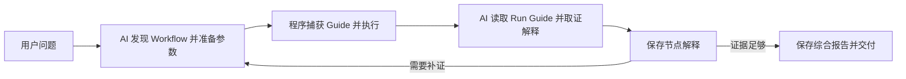

# 分析工作流生命周期

状态：2026-09-21 根据用户确认修订，程序与产品 Skill 已按本模型实现。[Issue #298](https://github.com/maokelong/kat-cli/issues/298) 为实施与验收入口，[ADR-0087](../adr/0087-run-guides-and-plain-analysis-content.md) 记录对旧模型的替代，实际验证证据随 [PR #299](https://github.com/maokelong/kat-cli/pull/299) 更新；旧模型的验证结果不代替本轮验收。

## 目标与交付范围

以最少的 AI 操作完成执行、解释、保存和按需恢复：程序随 Run 固化 Guide，AI 只保存节点解释与总报告正文；同一 Session 的真实 Run 关系组织报告树。当前上下文完整时直接继续，跨任务或上下文缺失时才读取保存内容恢复。

本切片同步调整 Run 发布与读取、CLI 分析存储、公共命令合同和产品 Skills。执行仍使用既有确定性 Workflow，`ctx.run()` 仍返回 Catalog，测试入口 `kat_run` 的业务返回不变；不新增调度器、模型回调、解释依赖图或有效性状态机。验收使用隔离安装产物，不替换用户已有部署或发布新版本。

## 已确定的职责

- 用户通过自然语言提出问题；AI 负责选择已有 Workflow、准备参数、分析证据并交付报告。
- `inspect workflow` 服务执行前的能力发现与输入准备，不返回 Guide 正文。名称、用途与参数合同提供选择和调用所需的信息。
- 每次 Workflow 执行前由程序捕获其 Guide 正文或未声明事实，随成功 Run 保留；顶层 `run` 和 `ctx.run()` 使用同一规则。Guide 快照归属 Run，不依赖 Analysis Record 已初始化。
- 执行结果 JSON 向 AI 提供本次 Run 自身的 Guide、Output 元数据和直接子 Run ID，不递归展开子 Guide。AI 在执行后以该快照解释结果；需要解释某个子节点时，按其身份读取已保存的子 Guide，不再为普通分析单独归档当前 PACK 的 Guide。
- 新增 `kat inspect run --session S --run R` 重读已发布 Run，返回与 `kat run` 成功结果相同的核心内容：本次 Guide 快照、Output 元数据和直接子 Run ID。读取不依赖当前 PACK；`inspect workflow` 专门面向执行前能力与参数，`inspect run` 面向已发布事实。
- 查询程序保存实际 SQL 和关键结果原文；AI 将解释或总报告保存为一个 `content` 字段中的 Markdown 正文。事实、结论、选择原因、证据出处和限制按需要写在正文中，不要求拆分成结构化字段，不提交 `selection`、`uses` 或解释版本依赖。
- 一个 Session 对应一个分析目标和一棵当前报告树。Run 保存程序调用事实，报告树组织所选 Run 的正文；不另外建立 AI 选择图或解释依赖图。
- Analysis Record 只保留 `analysis show` 和 `analysis save` 两个入口；首次保存创建记录，后续按 Run 增量保存正文，或保存目标与总报告。程序从已选 Run 的真实直接父子关系生成报告树，AI 不再提交父引用或节点重挂操作。
- 程序不维护节点或总报告的有效性状态，不自动传播失效、标记待汇总或清空旧报告。记录变化后仍保留最近成功保存的各段正文；AI 在恢复、复用和交付前判断内容是否适用以及是否需要更新。
- 固化正文用于跨任务或上下文压缩后的分析恢复。保存与读取相互独立：解释形成后及时保存，但当前上下文已保留相关解释和成功保存结果时，AI 直接复用并汇总，不要求在汇总前重新读取记录。

## 分析循环



Run 包含执行时 Guide、Output 与真实直接子 Run 关系。节点解释属于 Analysis Record；AI 直接使用当前上下文中的已存解释形成综合报告，缺少相关内容时再读取持久记录，不维护节点解释版本关系。只读恢复时，AI 确认已有报告仍适用即可交付，不重跑 Workflow，也不重复保存。

## 两种调用在报告中的组织

AI 根据 A 的结论继续运行 B：

```text
报告根：用户问题
├── Run A：content 保存 A 的解释
└── Run B：content 保存 B 的解释
            如需说明根据 A 的什么发现继续取证，写在正文中
```

父 Workflow P 通过 `ctx.run()` 调用 A、B：

```text
报告根：用户问题
└── Run P：content 保存父级解释，按需汇总子解释
    ├── Run A：content 保存 A 的解释
    └── Run B：content 保存 B 的解释
```

程序自动保留每个成功 Run 的 Guide；AI 通过保存某个 Run 的解释正文将它选入报告，决定需要展开哪些子节点。尚未解释的成功 Run 仍可从 Session inventory 查到，不为选入树而要求额外保存选择记录或占位解释；需要保留已经形成的部分判断时，可以保存实际进展和缺口正文。程序按真实 `child_runs` 派生已选节点的位置；AI 采用其他节点结论时，直接在正文中说明必要出处，不登记机器依赖边。父失败不抹除成功子 Run，也不产生可选入报告的成功父节点。

## 边界与后续议题

- 本切片的普通分析和恢复使用执行时 Guide。此前提出的“明确采用当前 PACK 的新版 Guide，重新解释已有 Run 而不重新执行”尚未确定取得和保存新依据的路径，保留为后续待确认议题；本轮不新增该入口，也不把默认使用旧快照解释为用户已取消该需求。
- 未声明 Guide 必须明确返回 `null` 或等价未声明事实。已声明 Guide 读取失败不能冒充未声明，不发布缺少所需快照的成功 Run；原 Run 缺少快照也不能用当前 PACK 正文补造历史。
- 无 Output 与明确 Schema 的零行 Output 均保留原合同，不能单凭这两种情况判断没有问题；无 Guide 不强制生成独立解释，AI 根据实际证据说明方法限制。
- 失败父 Workflow 不产生成功父 Run；已发布子 Run 与各自 Guide 保留。后续仅按公开事实读取，既不虚构失败节点，也不跳过失败或未选入的中间父节点伪造直接调用边。
- 固化的是最近成功保存的解释与进展，不是完整调用审计、所有历史报告或模型内部推理过程；不恢复运行中的 Python，也不新增第二个分析身份。

## 分析记录的读取与保存

已确定让 AI 只负责读取和提交分析内容，程序维护记录结构：

### 读取职责

`analysis show` 恢复已形成的分析，不承担普通分析的 Run Guide 读取；`inspect run` 提供某次已发布执行的事实和解释方法。两者不保存或返回两份相互独立的 Run Guide。

| 入口 | 回答的问题 | 主要内容 |
|---|---|---|
| `inspect run --session S --run R` | 这次执行产出了什么，应该按哪份 Guide 分析？ | 该 Run 的 Guide 快照、Output 元数据、直接子 Run ID；即使没有 Analysis Record 也可读取。 |
| `analysis show --session S` | 原问题是什么，已经分析到哪里，有哪些已存结论？ | 目标、已选节点及派生报告树、节点正文、总报告及记录修订号；正文是否适用由 AI 判断，默认不加载全部 Guide 或证据原文。 |
| 分析材料的按需读取 | 已保存的结论实际依据什么查询？ | 归档 SQL、来源和原始结果，保留原材料选择器的能力，不因 Guide 迁出而删除证据读取。 |

例如恢复时先读取分析记录，发现 A 已有解释、B 只有待分析说明：AI 确认 A 的正文仍适用后复用，只读取 B 的 Run Guide 并取证解释。已有总报告经核对适用后可直接交付；没有 Analysis Record 时只能读取 Run 事实，不能把它当作已保存的 AI 结论。不存在记录与记录损坏继续分别处理。

### 按需恢复，不在每次汇总前重读

| 当前情况 | 读取规则 |
|---|---|
| 同一任务持续分析，相关解释、出处和成功保存结果仍在上下文中 | 直接复用这些内容继续分析或汇总；不为确认已有正文而再调用 `analysis show`。 |
| 上下文压缩后，缺少继续分析所需的目标、结论、缺口或记录修订号 | 通过 `analysis show` 恢复缺失的分析内容；必要时再读取对应 Run 或归档材料，不重新执行已有 Workflow。 |
| 新任务只提供 Session ID，或当前没有该 Session 的已存分析内容 | 先 `analysis show` 恢复分析，再决定继续或交付。 |
| 发生并发冲突、获知外部修改或保存结果不确定 | 读取记录核对实际状态；即使没有压缩也不能依赖已知不完整或过期的上下文。 |

判断依据是当前信息是否足够，而不是要求程序检测是否发生过压缩。压缩摘要已完整保留本次所需内容时不必机械重读；未发生压缩但缺少必要内容时仍需读取。正文应足以恢复结论、依据、必要取证原因和未解决问题，不依赖旧对话中的“如上所述”，也不要求保存模型内部推理过程或增加恢复专用字段。

### 正文保存

节点的概念结构只有归属身份和正文：

```json
{
  "run_id": "R1",
  "content": "根据本 Run 的 Guide 和已归档查询材料 M1，发现……。结论……，适用范围与限制……。"
}
```

总报告同样使用一个 `content` 字段保存完整 Markdown。Session 和 Run 身份用于定位，记录修订号用于防止并发覆盖；它们不是需要 AI 编写的分析结构。具体命令参数和请求外层布局另由公共命令合同定义。

不再要求 `facts`、`conclusion`、`scope`、`limitations`、`selection`、`evidence` 或 `uses` 等独立解释字段，也不要求每个节点采用固定小标题。AI 在正文中保留足以恢复判断的必要事实、证据出处和限制；实际 SQL 和原始查询结果仍由查询程序归档，不能用 AI 改写的正文替代原始证据。程序只按文本保存正文，不解析 Markdown 引用来重建另一套依赖图。

| 原职责 | 新模型中的处理 |
|---|---|
| `analysis init` | 合入首次 `analysis save`，首次必须包含已明确的目标；只允许从不存在状态创建，损坏或未知格式不能作为首次保存覆盖。 |
| `analysis show` | 保留，用于跨任务、上下文缺失或保存状态不确定时恢复目标、已选节点、解释及报告；不是每次汇总的必经步骤，与读取 Run 执行事实的 `inspect run` 区分。 |
| `analysis update` 及多种 `op` | 合为 `analysis save` 的领域内容保存，不让 AI 逐条编排内部更新动作。 |
| `select_node` / `set_selection` / `set_interpretation` | 合为按 Run 保存一个 `content` 字段，首次保存选入节点；已知进展、取证原因与最终解释都用正文表达。 |
| 结构化解释及 `uses` | 删除选择记录、拆分的解释字段和解释版本依赖；不把它们移入 `content` 内继续要求一套嵌套 Schema。 |
| 手填 `report_parent` / 重挂节点 | 从已选 Run 的真实直接父关系派生；直接父未选入时挂报告根，父后来选入后自动归位，不跨过未选中的中间父节点制造直接边。 |
| Guide 材料登记 | 普通分析直接引用 Run 的自动快照，不由 AI 再保存一次。 |
| 目标与总报告更新 | 仍通过 `save` 提交；不维护有效性状态，未提交的新正文不改变旧正文，是否复用或重新汇总由 AI 判断。 |

保存必须是按本次内容增量更新：未提交的节点、正文与报告保留；不得要求 AI 重写整份树。保留记录级并发校验、所属 Session 的已发布 Run 身份校验和原子提交；不再分配用于相互引用的解释版本，也不解析正文来校验它采用了哪些结论。创建和已有记录更新都要拒绝旧写，不能把 `save` 变成无条件覆盖。

继续复用 Session 使用租约、独立稳定分析锁和同目录完整替换。每次操作读取或提交完整记录；替换前失败保留原文，提交后响应失败由读取确认，不回滚成功提交。记录不是可丢弃缓存；不存在、损坏和未知格式必须区分，不自动覆盖或重建。显式删除 Session 一并删除记录与归档材料，不能影响外部来源。

查询材料追加仍在锁下保存实际 SQL、来源、列和少量原始 NDJSON，并返回材料 ID 及追加前后记录修订号。只有追加前修订号等于 AI 已读或自行保存的版本时，才能直接沿用追加后修订号；否则先重读核对，不能利用归档返回的新数字跳过并发修改。材料正文不可由 AI 抄写替代；归档失败不返回成功材料身份，也不改变已有解释正文。

一次 `save` 整体校验并原子提交，成功返回记录修订号与已保存内容。Skill 仍在需要复用某个解释前保存该正文，先保留子解释、再形成父级或最终汇总，但无需取得或填写解释版本。正常成功 Response 即可确认此次保存，不要求另行读取记录来验证同一成功结果。

报告树结构是派生视图，不持久保存第二份父子映射。选入真实父 Run 导致已有子节点自动归位时，保持子节点与总报告正文；树的位置变化不证明解释正确或失效。目标、节点正文或树成员改变都不触发任何有效性标记或自动清空。`analysis show` 返回最近保存的内容，不承诺这些内容已随其他更新同步；AI 阅读后判断是否需要修订相关解释和总报告。

AI 串联时，必要的取证原因和采用其他结论的说明写在正文中，程序不尝试从时间先后、正文或 Run 调用关系推断。首次保存目标、解释形成后逐节点保存和最终保存报告仍是必要时机；正文简化不意味着只在最后写一次，也不增加一次专门登记选择信息的保存。

## 分析 Skill 的强制流程

以下约束落实到 `kat-analyze/SKILL.md`，与新命令及公共命令合同成套交付。触发时机、必要保存点和交付条件放在 Skill 主文件；JSON 格式、材料读取与冲突恢复细节放在既有 references，不在两处重复维护。

### 问题分析流程（必须遵守）

在用户已授权的分析范围内，AI 自动执行以下流程，不等待用户要求保存，也不要求用户手动调用后台命令。解释和报告只提交正文，不拆分选择或依赖字段；AI 管理所属 Session、Run 和用于并发控制的记录修订号。解释形成后必须保存；读取记录按需进行，当前上下文足够时直接复用，不在汇总前重复读取。只读请求不创建记录、执行 Workflow 或写入分析；只读恢复已有报告时，经核对适用即可交付，无需重复保存。

| 触发时机 | 必须执行的动作与完成条件 |
|---|---|
| 新任务恢复已有 Session，或当前上下文缺少继续分析所需的信息 | 先 `analysis show` 恢复目标、报告树、正文及记录修订号；同一任务信息完整时直接继续，不因再次提到 Session 或准备汇总而重读。复用前确认内容仍适用于当前问题和范围；程序保存成功不证明正文正确或证据充分。明确无记录时，才根据已知目标和 Session inventory 建立新分析；记录损坏不能按无记录处理或覆盖。 |
| 新分析确定目标并选定首个 Workflow | 创建 Session，用首次 `analysis save` 保存目标；成功后再执行。独立新目标使用新 Session，同一目标的追问和补证沿用原 Session。仅浏览能力不创建记录。 |
| 准备执行 Workflow | 通过 `inspect workflow` 获取用途与参数合同，确认输入后运行。执行前不读取分析 Guide；Guide 的执行前捕获由程序完成。 |
| 某个 Run 需要新解释或修订解释 | 使用该 Run 的执行时 Guide 和 Output 元数据：上下文中已有时直接使用，缺失的历史或子 Run 信息通过 `inspect run` 获取。普通分析不得拿当前 PACK 的 Guide 替换该快照，也不由 AI 重复归档 Guide。 |
| 形成解释 | 按 Guide 查询真实 Output，将实际采用的关键 SQL 与结果归档，读取真实结果后形成正文，说明必要事实、结论、出处和限制。Guide 是方法依据，不能替代数据证据；无需拆分字段或登记结论依赖。 |
| 一个节点的解释已形成 | 及时 `analysis save` 保存正文，再复用它选择后续 Workflow 或形成其他解释，不等最终报告才保存。首次保存正文即选入报告树；解释前不额外保存选择记录。需要保留的取证原因和出处写入正文，不填写 `selection`、`uses` 或解释版本。 |
| 准备交付新报告或修订后的报告 | 使用当前上下文中已成功保存且适用的解释直接汇总；缺少必要内容时才读取记录补齐。保存总报告正文并收到成功 Response 后，交付与已保存正文一致的结论和 Session ID，无需再次 `analysis show`。保存未确认时只能说明已知判断与受阻状态，不能宣称报告已完成且可恢复。 |

`ctx.run()` 场景先读取父 Run 自身的 Guide 和 Output；根据问题与 Guide 按需解释子节点，不要求遍历或解释全部后代。需要采用子解释时，先复用或形成并保存子解释，再保存消费它的父解释；执行父子关系由程序维护，AI 不填写报告父引用，也不将临时串联伪造为程序调用关系。

每次保存使用实际返回并已核对的记录修订号。冲突必须先重读分析记录并核对影响，不能只换 revision 重试；保存响应不确定时先读取确认，不能盲目重复保存或重新运行 Workflow。失败 Run 不视为成功产物，必要进展和已确认缺口能保存时及时保存；证据足够即结束，不为补齐树而运行更多 Workflow。

这份正文约束 AI 的行为，程序负责 Guide 快照、真实 Run 身份校验、报告树派生、原文保存和并发校验，不验证正文含义、维护解释依赖图或标记有效性。验收继续采用 CLI 集成测试和全新 AI 任务恢复测试，后者检查实际命令与交付行为，不以是否复述流程文字作为通过标准；原来的精确依赖失效验收删除，改为验证正文修改不会清空其他正文或产生有效性状态，恢复任务由 AI 核对并按需更新。

Skill 行为验收同时覆盖持续上下文与恢复场景：前者在保存后直接汇总，不为了交付额外重读；后者在缺少分析内容时读取记录恢复并继续，不补造未保存的历史结论。若无法实际触发上下文压缩，只能将缺失上下文的任务测试标为恢复模拟，不宣称已经验证平台压缩行为。

## 现有知识的衔接

inspection 的用途和参数说明应足够支持执行前选择与输入准备，Guide 承载执行后的解释方法；不因取消 Guide 正文而删掉现有名称、用途和参数语义。优先补充已有描述，不为这次边界调整预建新的前置条件框架。

抽查发现 `query-observations` 的 `clock_domain` 在 Guide 才明确为调用方标签、不会验证或转换时钟，需要将这项输入语义补到参数说明。`summarize-native-hook` 还依赖 `KAT_TRACE_STREAMER_EXECUTABLE`，现在仅代码与 README 说明，应在执行前可见的用途说明中表达。两项都不要求 AI 提前读取完整分析 Guide。

## 对既有决定的影响

本模型由 [ADR-0087](../adr/0087-run-guides-and-plain-analysis-content.md) 替代 [ADR-0086](../adr/0086-analysis-records-enable-cross-task-resumption.md)：调整执行前由 AI 显式保存 Guide、Guide 原文统一归属 Analysis Record，以及由 AI 保存父引用并重挂节点的部分；同时局部替代 [ADR-0078](../adr/0078-workflows-compose-through-context-run.md) 中解释已有 Run 时读取当前 PACK Guide、不新增 `inspect run`、中间解释仅存在于上下文以及顶层 Response 不携带 Guide/直接子 ID 的条款。确定性执行、Catalog、子 Run 发布及失败边界保持原合同。

用户进一步明确解释只保存一个正文，取消结构化选择依据、解释字段和 `uses`，并明确不维护有效性状态，全部由 AI 判断。这替代 ADR-0086 中的解释版本引用与精确依赖失效：程序不再判断哪些节点采用了某个解释，不标记待汇总，也不自动删除旧报告；AI 根据当前上下文或按需恢复的正文复核和汇总。原 Guide 与关键证据仍保留，恢复的是已保存正文与材料，不是可机器查询的 AI 调度或结论依赖图。

## 实施切片与验收

1. Run 发布链捕获 Guide；顶层与嵌套执行使用同一保存规则，交付 `inspect run`，收敛 `inspect workflow` 为执行前用途与参数合同。
2. 分析记录收敛为目标、Run 正文、材料和总报告，提供 `show/save`、自动派生报告树，删除结构化选择、解释版本和有效性逻辑；保留记录级并发与提交保护。
3. 同步分析 Skill、公共命令、结果合同、作者示例和安装产物。新 Skill 不得与仍要求 `init/update`、手动 Guide 归档或 `uses` 的旧 references 混用。

验收继续采用已确认的两个入口：公开 CLI 集成测试为主，全新 AI 任务验证已安装 Skill。沿用真实 Host 组合执行、Session 生命周期及材料归档测试，不为本功能建立新的测试框架。

| 场景 | 可观察结果 |
|---|---|
| 执行前与执行后 inspection | Workflow inspection 不返回 Guide 正文；run 成功结果与 Run inspection 的核心内容相同，包含自身 Guide、Output 元数据、直接子 Run ID，不递归加载子 Guide。 |
| 自动 Guide 快照 | 没有 Analysis Record 时执行仍能保存 Guide；顶层、重复调用和多层 `ctx.run()` 各自保留执行前正文。PACK 修改或移除后仍能读取原快照；未声明与读取失败分开处理。 |
| 成功子节点与失败父节点 | 成功子 Run 可独立读取原 Guide；失败父不出现成功身份，不产生虚构或压平的父子边。`ctx.run()` 与 `kat_run` 业务返回不变。 |
| 正文保存与派生树 | 首次 save 创建、后续局部更新；每个 Run 只有一份正文。AI 串联为根下兄弟，真实直接父后保存时子节点自动归位，无需 AI 提交关系；未选入的中间节点不被跳过。 |
| 不维护有效性 | 修改目标、节点或树成员不清空其他正文及总报告，不生成有效/失效/待汇总状态，不要求选择信息、解释依赖或解释版本。 |
| 原材料恢复 | 真正执行的 SQL、列、来源与 NDJSON 原文可恢复；普通查询文件失效不影响归档，AI 正文不替代原始证据。 |
| 并发与失败 | 旧修订写入被拒绝；归档竞争不能跳过未读修改；提交失败保留完整记录，响应不确定可读取确认，修复保存不重跑 Workflow。缺记录与损坏分别诊断。 |
| Session 生命周期 | 删除与活动读写遵守租约；显式删除清理本 Session 的 Run、分析记录及材料，外部来源不受影响。 |
| 当前上下文完整 | 实际 Skill 逐节点保存后直接汇总并保存总报告，没有仅为汇总或确认成功而重复读取记录。 |
| 跨任务或上下文缺失 | 新任务仅凭 Session ID 恢复目标、正文、树和必要材料，按需继续；复用已有结论不要求重跑或重读当前 PACK Guide。模拟信息丢失的测试不得冒称真实触发了平台压缩。 |
| 按需解释和交付 | 父级证据足够时不遍历全部子节点；需要子解释时先保存再汇总，最终交付与成功保存正文一致，保存失败如实说明。 |

CLI 存储与命令合同在受支持的 Windows/Linux 环境验收；真实 Skill 测试必须使用安装产物、公开命令和实际记录。验收记录须注明本轮实际入口与结果，不能沿用旧模型测试结果直接勾选。旧格式分析记录及缺少 Guide 字段的历史 Run 明确拒绝读取，不自动迁移或补造快照。
