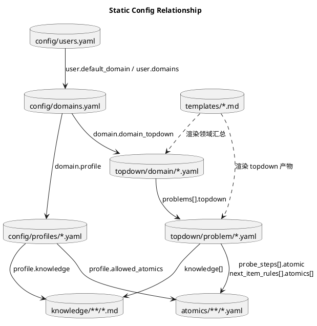
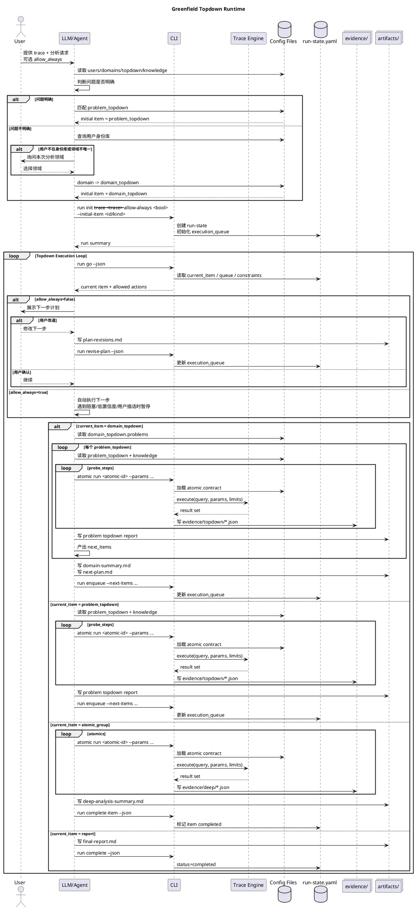

# Greenfield Trace Analysis 设计

## 背景

本设计不考虑旧 workflow、旧阶段名、旧 strategy 结构和历史 run-state 的兼容性。目标是重新定义一套面向 LLM + CLI 协作的 trace 分析系统：

- LLM 负责语义判断、计划编排、专家经验应用、报告表达。
- CLI 负责确定性校验、状态维护、atomic 执行、artifact 落盘。
- Trace Engine 只负责执行查询，不理解分析语义。
- 所有专家经验、分析路径、原子能力和报告格式都通过显式配置文件表达。

设计核心是一个统一的 `Topdown Execution Loop`。无论用户问题明确还是不明确，最终都进入同一个队列执行模型。

## 总体模型

```text
User
  -> LLM/Agent
  -> CLI
  -> Trace Engine

Config files
  -> 给 LLM 提供专家知识和拆解计划
  -> 给 CLI 提供可校验的执行契约

Runtime files
  -> run-state.yaml
  -> evidence/*.json|csv
  -> artifacts/*.md|yaml
```

系统中的静态配置和运行时产物严格分离：

- 静态配置定义“能怎么分析”。
- 运行时产物记录“本次实际怎么分析”。

## 需要的配置文件

### 1. `skill/config/users.yaml`

作用：用户身份库，用于在用户问题不明确时选择默认分析领域。

示例：

```yaml
users:
  alice:
    display_name: Alice
    default_domain: scheduling
    domains:
      - scheduling

  bob:
    display_name: Bob
    default_domain: memory
    domains:
      - memory
      - storage
```

规则：

- 用户命中唯一领域：直接使用该领域。
- 用户命中多个领域且有 `default_domain`：默认使用 `default_domain`，但 LLM 可以向用户确认。
- 用户命中多个领域但无默认领域：LLM 必须询问用户选择领域。
- 用户不在身份库：LLM 必须询问用户要分析哪个领域。

该文件不参与 trace 查询，只参与入口路由。

### 2. `skill/config/domains.yaml`

作用：领域目录，定义领域 ID、显示名、职责范围、profile、领域 topdown 入口。

示例：

```yaml
domains:
  - id: scheduling
    display_name: 调度
    profile: scheduler-kernel
    domain_topdown: scheduling-domain-scan
    responsibilities:
      - runnable wait、CPU 竞争、线程状态
      - futex、binder、D 态、io_wait、调度/阻塞归因

  - id: memory
    display_name: 内存
    profile: memory
    domain_topdown: memory-domain-scan
    responsibilities:
      - RSS/PSS、缺页、匿名页、映射、回收
      - 内存压力、GC、LMK、working set

default_domain: scheduling
```

规则：

- `id` 是 LLM 和 CLI 共同使用的稳定领域 ID。
- `profile` 指向 `skill/config/profiles/*.yaml`。
- `domain_topdown` 指向 `skill/topdown/domain/*.yaml`。
- `responsibilities` 给 LLM 做领域解释和用户询问时使用。

### 3. `skill/config/profiles/*.yaml`

作用：领域执行 profile，定义该领域允许使用哪些 atomic、默认知识文档、资源约束。

示例：

```yaml
id: scheduler-kernel
display_name: 调度/内核

knowledge:
  - knowledge/scheduler-kernel/scheduling-latency.md
  - knowledge/scheduler-kernel/cpu-contention.md
  - knowledge/scheduler-kernel/blocking-analysis.md

allowed_atomics:
  - trace_sanity_check
  - process_startup_candidates
  - main_thread_state_overview
  - sched_latency_overview
  - cpu_pressure_overview
  - blocking_category_overview
  - cpu_contention_summary
  - thread_state_detail_window
  - top_runnable_competitors

resource_policy:
  max_parallel_atomics: 1
  default_timeout_ms: 30000
```

规则：

- `allowed_atomics` 是 CLI 校验边界。
- `problem_topdown` 或用户改道引用不在 `allowed_atomics` 内的 atomic 时，CLI 必须拒绝。
- `knowledge` 是 LLM 可读专家经验，不是可执行能力。

### 4. `skill/topdown/domain/*.yaml`

作用：领域级 topdown 编排器。它不直接判断根因，不直接输出 deep atomics，只循环执行该领域关心的多个 `problem_topdown`。

示例：

```yaml
id: scheduling-domain-scan
kind: domain_topdown
domain: scheduling
description: 调度领域问题扫描

problems:
  - id: cold_start
    topdown: scheduling-cold-start
    priority: 1
    description: 冷启动慢

  - id: frame_jank
    topdown: scheduling-frame-jank
    priority: 2
    description: 丢帧/卡顿

  - id: cpu_contention
    topdown: scheduling-cpu-contention
    priority: 3
    description: CPU 竞争

output:
  artifact: artifacts/topdown/domain-summary.md
  next_plan: artifacts/topdown/next-plan.md
```

规则：

- `domain_topdown` 只引用 `problem_topdown`。
- 它的运行结果是一个汇总后的 `next_items` 队列。
- 新增领域关注的问题时，只需要新增 `problem_topdown` 并挂到这里。

### 5. `skill/topdown/problem/*.yaml`

作用：具体问题分析单元。它定义 probe steps、专家判断规则、下一步探索方向。

示例：

```yaml
id: scheduling-cold-start
kind: problem_topdown
domain: scheduling
problem: cold_start
description: 调度领域冷启动拆解

knowledge:
  - knowledge/scheduler-kernel/cold-start-topdown.md
  - knowledge/scheduler-kernel/scheduling-latency.md

probe_steps:
  - id: startup_candidates
    atomic: process_startup_candidates
    purpose: 定位目标进程和启动窗口候选
    params:
      process_name: "{{target.process_name}}"

  - id: main_thread_state
    atomic: main_thread_state_overview
    purpose: 判断主线程启动窗口内的主要状态
    params:
      process_name: "{{target.process_name}}"
      start_ts: "{{target.window.start_ts}}"
      end_ts: "{{target.window.end_ts}}"

  - id: runnable_latency
    atomic: sched_latency_overview
    purpose: 判断 runnable wait 是否显著
    params:
      process_name: "{{target.process_name}}"
      start_ts: "{{target.window.start_ts}}"
      end_ts: "{{target.window.end_ts}}"

next_item_rules:
  - id: cpu_contention_deep
    kind: atomic_group
    when: runnable wait high and cpu pressure exists
    confidence_hint: high
    atomics:
      - id: cpu_contention_summary
        params:
          start_ts: "{{target.window.start_ts}}"
          end_ts: "{{target.window.end_ts}}"
      - id: top_runnable_competitors
        params:
          start_ts: "{{target.window.start_ts}}"
          end_ts: "{{target.window.end_ts}}"
    guidance:
      - 必须区分窗口 CPU pressure 和目标线程受影响的因果证据。
      - 不能只凭 runnable wait 高直接写成 CPU contention 根因。

  - id: blocking_deep
    kind: atomic_group
    when: blocked time dominates
    confidence_hint: medium
    atomics:
      - id: blocking_category_overview
      - id: thread_state_detail_window
    guidance:
      - 先判断 blocked 类别，再进入具体片段。
      - 不要把所有 sleep 都写成异常阻塞。

  - id: no_scheduler_issue
    kind: report
    when: scheduler evidence is weak
    confidence_hint: medium
    deep_required: false
```

规则：

- `probe_steps` 是浅层证据采集。
- `next_item_rules` 是 LLM 决策规则，不由 CLI 做语义判断。
- 每个 `atomic` 必须能在 `atomics/*.yaml` 中找到，并属于当前 profile 的 `allowed_atomics`。
- `when` 和 `guidance` 是给 LLM 的专家判断文本，不是 CLI 规则表达式。

### 6. `skill/knowledge/**/*.md`

作用：专家分析经验。给 LLM 使用，解释为什么看这些信号、如何避免误判、如何写结论。

示例内容：

```markdown
# CPU Contention 分析经验

- runnable wait 高只能说明线程等待调度，不等于 CPU contention 根因。
- CPU contention 需要同时看到窗口负载、竞争者证据和目标线程受影响证据。
- 如果只有 cpu_pressure_overview 支持，而缺少 top_runnable_competitors 支持，应写成“存在 CPU pressure，但不足以证明目标慢的主因”。
```

规则：

- 可以引用 atomic ID 和输出字段。
- 不可以要求 LLM 直接查 SQL。
- 如果专家经验需要新字段，应新增 atomic contract。

### 7. `skill/atomics/<domain>/*.yaml`

作用：原子能力定义，是 CLI 与 Trace Engine 之间的可执行契约。

示例：

```yaml
id: sched_latency_overview
domain: scheduler-kernel
engine: perfetto-sql
description: 估算目标进程线程 runnable 等待时间分布。

inputs:
  process_name:
    type: string
    required: true
  start_ts:
    type: timestamp
    required: true
  end_ts:
    type: timestamp
    required: true

resources:
  timeout_ms: 30000
  max_rows: 100
  max_result_bytes: 65536
  priority: p1

sql: |
  SELECT ...

outputs:
  columns:
    - name: runnable_wait_ms
      type: duration_ms
    - name: max_runnable_wait_ms
      type: duration_ms
```

规则：

- SQL 只能出现在 atomic YAML 中。
- LLM 不直接读取或执行 SQL。
- CLI 负责参数绑定、资源限制、执行、裁剪和 JSON/CSV 落盘。
- Trace Engine 只接收 CLI 生成的查询请求。

### 8. `skill/templates/*.md`

作用：运行时 Markdown 产物模板。

建议模板：

```text
skill/templates/problem-topdown-report.md
skill/templates/domain-summary.md
skill/templates/next-plan.md
skill/templates/deep-analysis-summary.md
skill/templates/final-report.md
skill/templates/plan-revision.md
```

规则：

- 模板定义报告结构。
- 模板不定义分析逻辑。
- 分析逻辑来自 `problem_topdown.yaml` 和 `knowledge/*.md`。

## 配置文件之间的关系



## 运行时文件

### `run-state.yaml`

作用：本次分析的事实源。记录用户、trace、allow_always、当前队列、已完成项、plan revisions。

示例：

```yaml
schema_version: 1
run_id: 20260602-160000
status: running

user:
  id: alice
  domain_source: users.yaml

trace:
  path: sample.htrace

analysis:
  allow_always: false
  current_item:
    id: scheduling-cold-start
    kind: problem_topdown

  execution_queue:
    - id: scheduling-cold-start
      kind: problem_topdown
      priority: 1
      source: explicit_problem

  completed_items: []

  plan_revisions: []
```

### `evidence/`

作用：CLI 执行 atomic 后产生的机器证据。

```text
evidence/topdown/<problem-id>/<atomic-id>.json
evidence/deep/<next-item-id>/<atomic-id>.json
```

### `artifacts/`

作用：LLM 生成的人类可读分析产物。

```text
artifacts/topdown/problems/<problem-id>.md
artifacts/topdown/domain-summary.md
artifacts/topdown/next-plan.md
artifacts/deep-analysis-summary.md
artifacts/plan-revisions.md
artifacts/final-report.md
```

## 运行时流程



## CLI 与 Trace Engine 的界面

CLI 是唯一允许调用 Trace Engine 的组件。LLM 不能直接调用 Trace Engine。

### 输入

CLI 从 atomic YAML 和命令参数构造 trace engine 请求：

```rust
TraceQueryRequest {
    engine: EngineKind,
    trace_path: PathBuf,
    sql: String,
    params: BTreeMap<String, String>,
    limits: QueryLimits,
}
```

字段含义：

- `engine`：如 `perfetto-sql`。
- `trace_path`：当前 run 使用的 trace。
- `sql`：来自 atomic YAML。
- `params`：由 LLM 提供、CLI 校验并绑定。
- `limits`：来自 atomic `resources`。

### 输出

Trace Engine 返回结构化结果：

```rust
TraceQueryResult {
    columns: Vec<Column>,
    rows: Vec<Row>,
    stderr: String,
    stats: QueryStats,
}
```

CLI 负责：

- 校验输出列是否符合 atomic `outputs.columns`。
- 应用 `max_rows` 和 `max_result_bytes`。
- 写入 JSON/CSV artifact。
- 记录 stdout/stderr、耗时、退出码和 trace engine 版本。

### 错误

Trace Engine 错误不直接暴露为分析结论。CLI 应转换为 atomic execution finding：

```yaml
finding:
  level: error
  code: ATOMIC_EXEC_FAILED
  atomic: sched_latency_overview
  message: trace engine query failed
  stderr_artifact: evidence/topdown/...stderr.txt
```

LLM 只能基于 CLI 的 finding 和 artifact 做解释。

## LLM 与 CLI 的界面

LLM 通过 CLI 命令推进状态：

```text
run init
run go
run guard
run enqueue
run revise-plan
run complete-item
run complete
atomic run
```

### `run go`

返回当前状态：

```json
{
  "run_id": "...",
  "status": "running",
  "allow_always": false,
  "current_item": {
    "id": "scheduling-cold-start",
    "kind": "problem_topdown"
  },
  "execution_queue": [],
  "allowed_actions": [
    "run_probe_atomic",
    "enqueue_next_items",
    "revise_plan"
  ],
  "findings": []
}
```

### `run enqueue`

LLM 产出 `next_items` 后调用：

```json
{
  "next_items": [
    {
      "id": "cpu_contention_deep",
      "kind": "atomic_group",
      "priority": 1,
      "confidence": "high",
      "reason": "runnable wait high and cpu pressure exists",
      "atomics": ["cpu_contention_summary", "top_runnable_competitors"]
    }
  ]
}
```

CLI 校验：

- `kind` 合法。
- atomic 存在。
- atomic 属于当前 profile `allowed_atomics`。
- required params 可解析或标记 blocked。

### `run revise-plan`

用户改道后调用：

```json
{
  "source": "user",
  "message": "先别看 CPU，先查 binder",
  "effect": {
    "insert_next": [
      {
        "id": "binder_blocking_deep",
        "kind": "atomic_group",
        "atomics": ["blocking_category_overview", "thread_state_detail_window"]
      }
    ],
    "deprioritize": ["cpu_contention_deep"]
  },
  "reason": "用户明确要求优先查看 binder/blocking 方向"
}
```

CLI 记录 revision，不删除历史 evidence。

## 分析指导与 Atomic 的边界

专家指导只能引用 atomic contract。

允许：

```text
当 sched_latency_overview.runnable_wait_ms 高，且 cpu_pressure_overview 显示窗口 pressure 明显时，将 cpu_contention_deep 放入 next_items。
```

不允许：

```text
直接查询 thread_state 表确认 R 状态。
```

如果专家指导需要新的信号，应新增 atomic：

```text
新增 atomics/scheduler-kernel/<new_atomic>.yaml
```

然后在 profile `allowed_atomics` 和 problem topdown 中引用它。

## 校验规则

CLI 必须校验：

- `users.yaml` 引用的 domain 存在。
- `domains.yaml` 引用的 profile 和 domain_topdown 存在。
- `domain_topdown` 引用的 problem_topdown 存在。
- `problem_topdown` 引用的 knowledge 文件存在。
- `problem_topdown` 引用的 atomic 存在。
- 引用 atomic 属于当前 profile `allowed_atomics`。
- atomic required inputs 均已提供或可由上下文模板解析。
- atomic 输出列符合 `outputs.columns`。
- execution queue 中的 item kind 合法。
- `allow_always=true` 不得绕过 blocked finding。

## 报告规则

最终报告必须引用运行时产物，而不是静态配置结论：

- 引用 `evidence/**/*.json|csv`。
- 引用 `artifacts/topdown/**/*.md`。
- 引用 `artifacts/plan-revisions.md` 中的用户改道记录。
- 区分事实、推断和不确定性。
- 说明哪些问题方向被扫描过、哪些被排除、哪些进入 deep analysis。

## 测试建议

配置测试：

- 加载 users/domains/profiles/topdown/atomics。
- 校验所有引用关系。
- 校验缺失引用能给出明确错误。

CLI 测试：

- `run init` 能初始化 queue。
- `run go` 返回 current item 和 allowed actions。
- `run enqueue` 校验 next_items 并更新 queue。
- `run revise-plan` 能插入、降级、跳过 item，并保留 revision。
- `atomic run` 只通过 atomic YAML 调用 trace engine。

Trace Engine 接口测试：

- 参数绑定正确。
- 输出列校验正确。
- 超出 max rows / bytes 时被裁剪。
- stderr 被落盘，不直接当分析结论。

端到端测试：

- 问题明确：直接进入 problem_topdown。
- 问题不明确且用户命中身份库：进入 domain_topdown。
- 用户不在身份库：LLM 必须询问领域。
- `allow_always=false`：每步前可被用户改道。
- `allow_always=true`：按 queue 自动执行，遇到 blocked 停止。

## 自审

- 本设计不依赖旧 workflow 和旧阶段名。
- 配置文件职责明确：身份、领域、profile、domain topdown、problem topdown、knowledge、atomic、template 分层。
- `domain_topdown` 只编排 `problem_topdown`。
- `problem_topdown` 是输出下一步探索方向的唯一分析单元。
- CLI 与 Trace Engine 的接口只以 atomic contract 为入口。
- LLM 不直接查询 trace，不直接改 run-state。
- 用户改道和 `allow_always` 都被建模为运行时执行控制。
