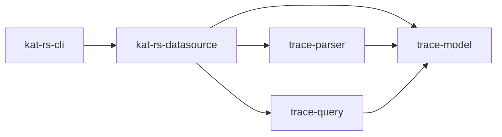

# kat-rs datasource 首次上库设计

## 背景

kat-rs 需要把 Harmony trace 的解析、建模和 SQL 查询能力整理成可 review、可验证、可持续演进的 Rust 工程结构。本次 PR 是 datasource 能力的首次上库切片，目标是建立一个清晰、可运行、可测试的基础版本。

当前业务重点是：

- `kat-rs-cli` 提供统一命令入口。
- `kat-rs-datasource` 作为库提供 trace 数据读取、建模、查询和指标能力。
- datasource 优先保证数据准确和查询快速。
- 工程结构需要支持端到端验证、schema/table contract、冷启动性能度量和基础 CI 门禁。

如果没有这个基础切片，trace 数据缺少统一入口，表结构缺少稳定 contract，SQL 查询也缺少可重复验证路径。

## 目标

- 建立 `kat-rs-cli` 和 `kat-rs-datasource` 的 workspace 结构。
- 让 CLI 通过 datasource lib 访问 trace validate/query 能力。
- 在 datasource 内部收敛当前强绑定的 trace model/parser/query 模块。
- 当前只开放已验证的 protobuf htrace 解析能力。
- 只暴露 protobuf htrace 样例中已验证有数据的表。
- 提供基础 metrics，用于观察 parse/query 耗时。
- 将测试放到各自 crate 的 `tests/` 下，支撑本地和 CI 验证。

## 非目标

- 不支持未验证的 bytrace / ftrace text trace 格式。
- 不暴露 protobuf htrace 中尚未确认有数据或未映射 parser 的表。
- 不提交本地 trace-validation、临时 probe、generated dump 或本地 fixture 大文件。
- 不在本次 PR 完成完整性能优化；只保留可观测的冷启动和查询指标基础。

## 架构总览



本次结构采用 datasource lib 为核心的分层方式：

- CLI 只面向 datasource 对外 API，不直接操作 parser/model/query 的内部实现。
- datasource 负责组织 dataset lifecycle、schema contract、query session、metrics 和错误边界。
- `trace-model`、`trace-parser`、`trace-query` 当前作为 datasource 内部子 crate 保留，因为三者目前是强业务绑定关系。
- `trace-parser` 当前只启用 protobuf htrace parser，避免未验证格式进入 production path。

## 模块职责

### kat-rs-cli

位置：`crates/kat-rs-cli`

职责：

- 提供统一命令入口。
- 提供 datasource 相关子命令。
- 初始化日志配置。
- 将 CLI 参数转换为 datasource lib 调用。
- 负责输出格式，不承担 parser/model/query 业务逻辑。

### kat-rs-datasource

位置：`crates/kat-rs-datasource`

职责：

- 作为 datasource 库入口。
- 管理 dataset、query、schema、metrics、lifecycle、port。
- 对 CLI 暴露稳定 API。
- 屏蔽内部 parser/model/query 的组织细节。

关键文件：

- `src/trace_datasource_lib.rs`：datasource lib 实现入口。
- `src/port.rs`：datasource 对外能力边界。
- `src/session.rs`：查询会话组织。
- `src/schema_manifest.rs`：表清单和 schema contract。
- `src/metrics.rs`：性能指标结构。

### trace-model

位置：`crates/kat-rs-datasource/crates/trace-model`

职责：

- 定义 trace 表结构。
- 定义 batch/row builder。
- 维护 schema JSON。
- 暴露当前已验证的表集合。

当前暴露表数量为 19，均来自 protobuf htrace 已验证有数据表。

### trace-parser

位置：`crates/kat-rs-datasource/crates/trace-parser`

职责：

- 解析 trace 文件。
- 当前只启用 protobuf htrace。
- 将 parser 结果写入 trace-model 定义的表。
- 对未知或 metadata 类 plugin 使用日志记录和诊断控制，不把未验证格式接入 production path。

### trace-query

位置：`crates/kat-rs-datasource/crates/trace-query`

职责：

- 基于 DataFusion 注册 trace 表。
- 执行 SQL 查询。
- 返回 JSON/query result。
- 记录 query 阶段指标。

## 关键设计决策

### 1. datasource 是 lib，不是进程

本次 PR 中 `kat-rs-datasource` 只作为 Rust library 存在。CLI 依赖它并调用它的 API。这样可以先把数据准确性、schema contract 和查询能力稳定下来。

### 2. parser/model/query 暂时放入 datasource 内部

当前 `trace-model`、`trace-parser`、`trace-query` 之间关系强绑定：parser 直接产出 model 表，query 直接消费 model 表。提前把它们拆成顶层独立模块会增加首次上库复杂度。

因此本次把它们作为 datasource 内部子 crate 保留，同时通过 datasource 对外 API 控制边界。

### 3. 只保留 protobuf htrace production path

未验证的 bytrace / ftrace text parser 不进入本次 production path。当前 parser registry 只暴露 htrace protobuf 能力，trace-model 也只保留已验证可产出数据的表。

这能降低误导风险：PR 中出现的表和 parser 都应该能被真实 trace 验证。

### 4. 表清单以已验证数据为准

trace-model 不生成 parser 未映射的表，也不暴露真实 trace 中尚未确认有数据的表。当前表清单和 schema contract 保持一致，避免 CLI/query 展示空壳能力。

### 5. 测试跟随 crate

测试文件统一放在各自 crate 的 `tests/` 下，减少跨目录临时验证代码。真实大 trace fixture 只保留本地验证使用，不提交进入本次 PR。

## 当前表清单

当前 protobuf htrace 验证后暴露 19 张表：

- `args`
- `callstack`
- `cpu_measure_filter`
- `data_dict`
- `dma_fence`
- `instant`
- `irq`
- `measure`
- `measure_filter`
- `process`
- `process_measure`
- `process_measure_filter`
- `raw`
- `raw_event`
- `sched_slice`
- `thread`
- `thread_state`
- `trace_bounds`
- `trace_metadata`

## 验证计划

本地基础验证：

```text
cargo check --workspace --locked
cargo test --workspace --locked
git diff --check
```

PR guard 验证：

```text
python .github/scripts/test_pr_guard.py
```

真实 trace 端到端验证：

```text
cargo run --locked -p kat-rs-cli -- datasource validate --trace tests/fixtures/traces/hiprofiler-wechat-coldstart-smartperf-20260523-182338.htrace
```

预期结果：

- datasource validate 返回 `status: ok`。
- 暴露表数量为 19。
- 19 张表均来自 protobuf htrace 解析后的有数据表。
- query 阶段具备 metrics 输出，可以观察 parse/query 耗时。

## 预计改动范围

- `Cargo.toml`
- `Cargo.lock`
- `crates/kat-rs-cli/**`
- `crates/kat-rs-datasource/**`
- `crates/kat-rs-datasource/crates/trace-model/**`
- `crates/kat-rs-datasource/crates/trace-parser/**`
- `crates/kat-rs-datasource/crates/trace-query/**`
- `.gitignore`

## 风险与处理

- protobuf htrace 当前只基于已知样例验证，新的 trace 可能暴露更多字段或表映射需求。处理方式是按真实 trace 证据逐步扩展表和 parser。
- 首次上库 PR 偏大，因为需要同时建立 workspace、CLI、datasource、model、parser、query 和基础测试骨架。处理方式是后续 PR 缩小增量范围。
- CI 在 GitHub Windows runner 上完整 `cargo check/test` 耗时较长。处理方式是保留基础门禁，并继续观察是否需要缓存和测试分层优化。
- 冷启动解析性能仍有优化空间。处理方式是本次先保留 metrics，优化动作必须以可重复耗时证据为基础。
