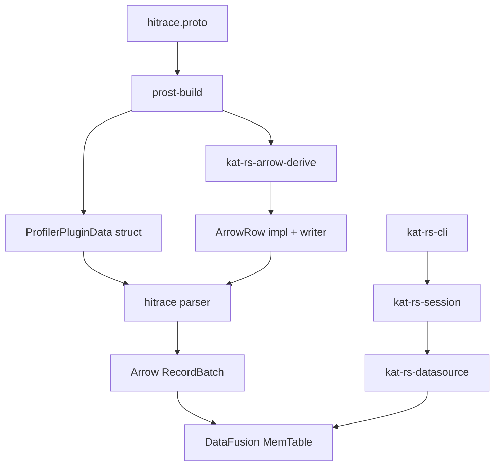

# kat-rs datasource / session / cli 基础架构设计

## 背景

kat-rs 需要从目标库 `main` 的干净状态建立最小可用架构。当前目标不是一次性覆盖所有日志格式，而是先把核心边界搭好：`datasource` 负责解析和查询，`session` 负责持有运行期状态，`cli` 负责提供二进制命令入口。

当前实现只支持 `hitrace` 数据源，并且只暴露 `.htrace` 外层 profiler plugin 数据表。

## 目标

1. 新增 `kat-rs-datasource` crate。
2. 新增 `kat-rs-session` crate。
3. 新增 `kat-rs-cli` crate，并作为 `kat-rs` 二进制入口。
4. 新增 `kat-rs-arrow-derive` crate，用于编译期生成 protobuf struct 到 Arrow 的写入能力。
5. `datasource` 接收数据源类型和文件路径，`build` 完成后只暴露基于 SQL 字符串的查询能力。
6. SQL 查询结果返回 JSON。
7. hitrace 文件是二进制 `.htrace` profiler 文件，当前解析 `OHOSPROF` section 中的 length-prefixed protobuf message。
8. protobuf 使用 `prost-build` 生成 Rust message struct。
9. `prost-build` 在生成的 message struct 上注入 `#[derive(ArrowRow)]`。
10. derive 宏为 prost struct 生成 Arrow schema、列 writer、append 和 finish 能力。
11. 解析期间使用 mmap 读取文件，解析完成后文件句柄和 mmap 都释放。
12. 维测日志使用 `log`，不使用 `print` / `println` 输出日志。

## 非目标

1. 不接入真实华为 hitrace 全量 schema。
2. 不支持除 `hitrace` 之外的日志格式。
3. 不解析 profiler plugin payload 内层数据。
4. 不引入 Web UI、MCP、Skill 或服务化入口。
5. 不提交大体积真实 trace fixture。
6. 不做缓存、多数据源管理、并发 session 池或跨进程状态。

## crate 职责

| crate | 职责 |
| --- | --- |
| `kat-rs-datasource` | 解析数据源，构建 Arrow `RecordBatch`，注册 DataFusion，并提供 `query_json(sql)`。 |
| `kat-rs-arrow-derive` | 提供 `#[derive(ArrowRow)]` proc macro，根据 prost 生成的 struct 字段生成 Arrow schema 和写入器。 |
| `kat-rs-session` | 创建和持有运行期状态，当前主要持有一个已 build 的 datasource。 |
| `kat-rs-cli` | 使用 `clap` 解析命令行参数，创建 session，build datasource，执行 SQL，并把 JSON 写到 stdout；参数结构支持 `serde`。 |

## 依赖方向

```text
kat-rs-cli -> kat-rs-session -> kat-rs-datasource
                                      |
                                      v
                              kat-rs-arrow-derive
```

`kat-rs-datasource` 不依赖 `session` 或 `cli`。`session` 不解析 CLI 参数，也不理解 stdout/stderr。

`kat-rs-arrow-derive` 只在编译期服务于 datasource 的 protobuf struct 代码生成，不承载运行期 datasource 状态。

## 架构图



## 构建期生成

`kat-rs-datasource/build.rs` 负责：

1. 使用 vendored `protoc`。
2. 使用 `prost-build` 编译 `proto/hitrace.proto`。
3. 对 `.kat.hitrace.ProfilerPluginData` 注入：

```rust
#[derive(kat_rs_arrow_derive::ArrowRow)]
```

生成后的 `ProfilerPluginData` 同时具备：

1. `prost::Message` 能力，用于 decode protobuf 二进制。
2. `ArrowRow` 能力，用于写入 Arrow `RecordBatch`。

当前不再生成或读取 protobuf descriptor 文件，也不使用 `prost-reflect` / `DynamicMessage`。

## datasource 生命周期

```rust
let datasource = TraceDatasource::build(DataSourceConfig {
    source_type: DataSourceType::Hitrace,
    path,
})?;

let json = datasource
    .query_json("select count(*) as count from profiler_plugin_data")
    .await?;
```

`build` 阶段负责：

1. 打开文件。
2. mmap 文件。
3. 校验 `.htrace` 是否包含 `OHOSPROF` header。
4. 遍历 profiler section。
5. 跳过非 protobuf section。
6. 从 section body 中读取 length-prefixed protobuf segment。
7. 使用 `ProfilerPluginData::decode` 解码 segment。
8. 调用 `save_to_arrow!(messages)` 生成 Arrow `RecordBatch`。
9. 将一个或多个 `RecordBatch` 注册为 DataFusion `MemTable`。
10. 释放 mmap 和文件句柄。

`query_json` 阶段只执行 SQL，不再读取或映射原始文件。

## save_to_arrow 边界

`save_to_arrow!` 是 datasource 内部稳定入口，接收一批 prost message：

```rust
let batch = save_to_arrow!(messages)?;
```

它内部流程是：

```rust
let mut writer = T::new_arrow_writer(capacity);

for row in rows {
    row.append_to_arrow(&mut writer)?;
}

writer.finish()
```

字段级 Arrow schema 和 append 逻辑由 `#[derive(ArrowRow)]` 生成，不在 `hitrace.rs` 中手写，也不在运行时读取 protobuf descriptor。

## 当前 hitrace 契约

当前 PR 只提供一个最小 hitrace protobuf 契约，用于打通 `.htrace -> protobuf struct -> Arrow -> DataFusion -> JSON` 主链路。

```proto
message ProfilerPluginData {
  string name = 1;
  uint32 status = 2;
  bytes data = 3;
  int32 clock_id = 4;
  uint64 tv_sec = 5;
  uint64 tv_nsec = 6;
  string version = 7;
  uint32 sample_interval = 8;
}
```

对应 SQL 表：

| 表名 | 字段 |
| --- | --- |
| `profiler_plugin_data` | `name`, `status`, `data`, `clock_id`, `tv_sec`, `tv_nsec`, `version`, `sample_interval` |

`data` 字段当前作为二进制列暴露，JSON 输出时使用十六进制字符串表示。

## session 边界

`kat-rs-session` 提供 `Session::create()`，并存储重要运行状态。当前最小状态为一个可选 datasource：

```rust
let mut session = Session::create();
session.build_datasource(config)?;
let json = session.query_json(sql).await?;
```

如果未 build datasource 就查询，返回明确错误。

## CLI 行为

命令：

```text
kat-rs query --source hitrace --file <path> --sql <sql>
```

行为：

1. `--source` 当前只接受 `hitrace`。
2. `--file` 是 `.htrace` 文件路径。
3. `--sql` 是交给 DataFusion 的 SQL 字符串。
4. stdout 只输出 JSON 查询结果。
5. 诊断信息走 `log`，由 `RUST_LOG` 控制。
6. 参数解析使用 `clap`，参数结构支持 `serde` 序列化。

## JSON 输出

查询结果返回 JSON 数组。每一行是一个对象，字段名来自 SQL result schema。

示例：

```json
[
  {
    "count": 2
  }
]
```

## 验证标准

1. datasource 测试可以构造最小 `.htrace` 文件并查询 `profiler_plugin_data`。
2. `datasource` build 后删除或关闭原文件句柄不影响后续 SQL 查询。
3. `session` 可以持有 datasource 并执行 SQL。
4. CLI 可以用 SQL 查询给定 hitrace 文件，并输出合法 JSON。
5. 代码中维测日志使用 `log`，不使用 `println!` 输出诊断信息。
6. `cargo build --workspace` 通过。
7. `cargo test --workspace` 通过。
8. `cargo clippy --workspace --all-targets -- -D warnings` 通过。
