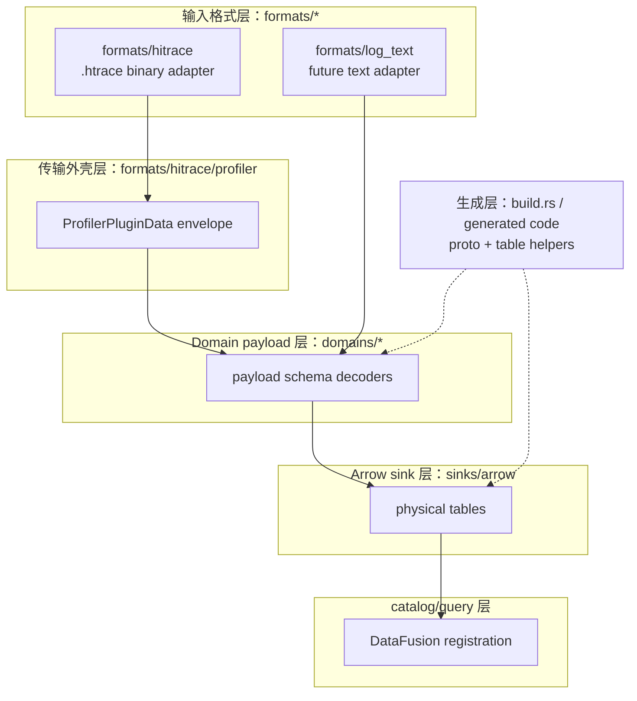

# Payload Schema 作为主模型的架构提案

## 状态

Review draft。

本文提出一套更通用的 profiler datasource 架构原则：传输外壳只负责说明 payload bytes 从哪里来，真正决定领域模型的是 payload schema。protobuf `oneof` 只是 payload schema 的一种形态，不是所有 plugin 的通用模型。

## 核心结论

datasource 里有三个概念不能混在一起：

| 概念 | 含义 | 示例 |
| --- | --- | --- |
| 输入格式 | bytes 如何存储或传输 | `.htrace` binary、text log、protobuf text |
| 传输外壳 | 某种输入格式如何包裹 payload bytes | `ProfilerPluginData` |
| payload schema | payload 解码后的领域形态 | `BatchNativeHookData`、`TracePluginResult`、`CpuData`、`MemoryData` |

架构上更准确的规则是：

> payload schema 是主模型；`oneof` 只是其中一种 schema 形态。

这个规则带来几个直接影响：

1. native hook 和 ftrace 属于 oneof 事件流，可以按 oneof variant 建模。
2. CPU、memory、process、network、GPU、disk I/O、hilog、hisysevent、hidump、xpower 等插件不是 oneof 主模型，应该按固定 result message 和 repeated child fields 建模。
3. `ProfilerPluginData` 是 `.htrace` 的 source metadata，不应该成为所有输入格式的通用顶层 record。
4. TraceStreamer 风格查询表是否需要、由谁生成、在哪一层生成，本文暂不决策；本文只定义 raw/direct payload 接入边界。

## 目标

1. 输入格式可以替换，而不要求 domain 和 sink 跟着重写。
2. 每个 plugin 按自己的真实 payload schema 建模。
3. `.htrace` envelope 处理不进入 domain 逻辑。
4. domain payload 语义不进入通用 sink/table 代码。
5. 在同一套架构原则下支持 oneof 事件流、固定 result message、repeated child tables，以及未来文本输入。
6. 明确哪些映射需要手写，哪些映射可以自动生成，新增字段时需要修改哪些代码。

## 非目标

1. 不定义 TraceStreamer 兼容查询表的实现方式。
2. 不要求所有 plugin 都按 oneof variant 生成一张表。
3. 不要求 runtime descriptor reflection 成为唯一生成策略。
4. 不把输入格式解析放进 domain。
5. 不把 `ProfilerPluginData` 做成非 `.htrace` 输入的通用顶层 record。

## 1. 架构分层设计

目标分层如下：



### 1.1 输入格式层：`formats/*`

职责：

- 识别并解析输入文件或输入流的格式。
- `.htrace` 输入解析 header、section、section body。
- 未来文本输入解析行、块、多行 record、source location。
- 把输入格式相关 metadata 传给 domain decoder，或调用 domain decoder 产出对应的领域数据。

边界：

- 可以知道 `.htrace`、文本语法、文件偏移、行号。
- 不应该知道 Arrow 表结构、SQL 表名、查询表实现策略。
- 不应该实现 native hook/ftrace 的 payload 业务语义。

### 1.2 传输外壳层：`formats/hitrace/profiler`

职责：

- 解析 profiler section 中的 length-prefixed `ProfilerPluginData`。
- 建模 envelope，包括 plugin name、config/data 区分、payload bytes、section 起点、sample interval 等。
- 提供 plugin payload decoder 的调度机制。

边界：

- 这是 `.htrace` profiler 机制层，不是全项目通用 plugin framework。
- registry 可以调度外部传入的 decoder specs，但不应该内置 ftrace/native hook 等 domain decoder。
- 它不应该理解 `NativeHookData.event` 或 `FtraceEvent.event` 的内部语义。

### 1.3 Domain payload 层：`domains/*`

职责：

- 按 payload schema 解码 plugin payload。
- 把 payload schema 转成领域数据，并交给当前 sink/builder。
- 保存 domain policy，例如空事件是否跳过、unsupported event 是否保留、是否生成 direct record。

边界：

- 应该知道 payload proto，例如 `BatchNativeHookData`、`TracePluginResult`、`CpuData`。
- 不应该知道 `.htrace` section 读取细节。
- 不应该写 Arrow、注册 SQL、执行查询。

### 1.4 可选边界接口：decoder 与 sink 的连接

职责：

- 作为 domain decoder 和 sink/builder 之间的连接边界。
- 在当前“一次只解析一种输入、只输出 Arrow”的约束下，它不需要成为独立架构层。
- 如果未来出现多输入、多 sink 或需要统一测试边界，可以再抽象成 `TraceRecordSink` 或等价接口。

当前推荐形态：

```text
formats/hitrace -> domains/native_hook -> sinks/arrow
formats/hitrace -> domains/ftrace -> sinks/arrow
formats/log_text -> domains/native_hook -> sinks/arrow
```

边界：

- `log_text` 是输入格式，不是 domain。文本如果表达 native hook 语义，应进入 `domains/native_hook`；如果表达 ftrace 语义，应进入 `domains/ftrace`。
- 不建议现在建立全局 `TraceRecord` 大枚举；如需接口，也应保持非常薄，只表达当前 domain record 到 sink 的推送关系。
- `ProfilerPluginData` 仍应视为 `.htrace` source metadata，不应绑定成所有输入格式的通用 record。

### 1.5 Arrow sink 层：`sinks/arrow`

职责：

- 把 domain records 物化为 Arrow tables。
- 维护 table builder、schema builder、empty table、table category。
- 输出 `TraceDataset` 供 query 层注册。

边界：

- 可以知道物理表名、Arrow schema、raw/direct 表分类。
- 不应该解析 `.htrace`。
- 不应该直接 match protobuf oneof；oneof 到 domain record 的转换应发生在 domain 层。

### 1.6 Catalog/query 层

职责：

- 接收 `TraceDataset`。
- 注册 DataFusion tables。
- 执行 SQL 查询。

边界：

- 不应该依赖 format/domain/sink 内部实现。
- 不应该决定 payload 如何解码。

### 1.7 生成层：`build.rs` / generated code

职责：

- 编译 proto 到 Rust structs。
- 为需要自动化的 payload shape 生成 domain match、table builders 或 serde derives。
- 降低新增字段、新增 oneof variant、新增 child table 的维护成本。

边界：

- build-time 生成优先于 runtime reflection。
- generator 可以按 payload shape 分多个策略，不要求所有 plugin 共用一个 generator。

## 2. 数据流

### 2.1 `.htrace` 二进制输入

```text
.htrace file
  -> formats/hitrace 读取 header 和 section
  -> formats/hitrace/profiler 读取 ProfilerPluginData
  -> 根据 envelope name/plugin name 分发到 domain decoder
  -> domain decoder 按 payload schema 产出 TraceRecord
  -> sinks/arrow 将 TraceRecord 物化成 Arrow tables
  -> catalog/query 注册并查询 TraceDataset
```

这里 `.htrace` 只定义外层容器，`ProfilerPluginData` 只定义 profiler payload 外壳。真正的 record shape 由 payload schema 决定。

### 2.2 Native hook oneof 数据流

```text
ProfilerPluginData(name = nativehook/nativehook_config/hookdaemon)
  -> native hook domain decoder
  -> NativeHookConfig 或 BatchNativeHookData
  -> repeated NativeHookData
  -> NativeHookData.event oneof
  -> NativeHookRecord::Alloc / Free / Mmap / ...
  -> native hook direct Arrow tables
```

native hook 的主模型是：

```text
BatchNativeHookData
  -> repeated NativeHookData
    -> NativeHookData.event oneof
```

因此 `native_hook_alloc` 这类表应该是 `AllocEvent` 加公共 event metadata 的 direct projection，而不是 TraceStreamer `native_hook` 查询表的复制。

### 2.3 Ftrace oneof 数据流

```text
ProfilerPluginData(name = ftrace-plugin)
  -> ftrace domain decoder
  -> TracePluginResult
  -> repeated FtraceEvent
  -> FtraceEvent.event oneof
  -> FtraceRecord
  -> ftrace direct event tables
```

ftrace 和 native hook 共享 oneof event stream 这个 payload shape，但 ftrace 的事件族更大、kernel version 约束更强，所以 generator 可以继续专用化。

### 2.4 固定 Result Message 数据流

以 CPU/memory/process/network 这类插件为例：

```text
ProfilerPluginData(name = cpu-plugin/memory-plugin/...)
  -> corresponding domain decoder
  -> CpuData / MemoryData / ProcessData / ...
  -> root record + repeated child records
  -> root/raw table + child direct tables
```

这条路径不需要 fake oneof model。它的主模型是 result message，扩展点是 repeated child fields。

### 2.5 未来文本输入数据流

```text
text file / line stream
  -> formats/log_text 解析文本 grammar
  -> parsed payload-shaped data
  -> domain record
  -> sinks/arrow
```

文本输入不一定存在 `ProfilerPluginData`。它可以通过 source metadata 或 raw source table 保留文件名、行号、原始文本，同时尽量产出和 `.htrace` 路径一致的 domain records。

## 3. Proto 解析实现

### 3.1 构建期 proto 编译

推荐继续使用 prost 在 build time 编译 proto：

- proto message 生成 Rust struct。
- proto oneof 生成 Rust enum。
- config/result payload 均通过 prost decode。
- 对需要进入 Arrow direct tables 的 message 增加 serde derive。

优点：

- runtime decode 路径简单。
- 不需要 runtime descriptor reflection。
- Rust 类型和 proto schema 同步。

限制：

- 如果只靠手写 mapping，新增 oneof variant 或 child field 仍然需要维护额外表清单。
- 如果需要全自动 schema 发现，应在 build time 引入 source parser 或 descriptor-driven generator。

### 3.2 运行期 `.htrace` envelope 解析

运行期 `.htrace` 解析分两步：

1. format 层解析 `.htrace` section 和 length-prefixed `ProfilerPluginData`。
2. domain 层根据 envelope 的 name/config/data 信息 decode payload bytes。

这个分层很重要：`.htrace` 解析失败是 format-level error；`BatchNativeHookData` decode 失败是 payload-level error。

### 3.3 Oneof payload 解析

适用于 native hook、ftrace、ffrt profiler、部分 agent payload。

实现策略：

- decode batch/root result message。
- 遍历 repeated event。
- 构建 event context，例如 event index、timestamp、source metadata。
- match oneof variant。
- 产出 domain record。

native hook 的理想实现是从 `NativeHookData.event` 自动推导：

| proto oneof 字段 | payload message | domain variant | direct table |
| --- | --- | --- | --- |
| `alloc_event` | `AllocEvent` | `NativeHookRecord::Alloc` | `native_hook_alloc` |
| `free_event` | `FreeEvent` | `NativeHookRecord::Free` | `native_hook_free` |
| `trace_alloc_event` | `TraceAllocEvent` | `NativeHookRecord::TraceAlloc` | `native_hook_trace_alloc` |

### 3.4 固定 result message 解析

适用于 CPU、memory、process、network、GPU、disk I/O、hilog、hisysevent、hidump、xpower。

实现策略：

- decode root result message。
- root scalar fields 进入 root/raw record。
- repeated child fields 展开为 child records。
- 每条 child record 带上 source metadata 和 parent/sample id。

这种解析不需要 oneof match。它需要维护的是 root message 和 repeated child field 到表的映射。

### 3.5 外部或特殊 payload 解析

bytrace、hiperf、hiebpf 等插件需要以真实输入契约为准。如果它们不是普通 result proto，就应该使用专用 domain decoder。

原则：

- 先保留 raw/source data。
- 只归一化稳定字段。
- 不强行伪装成 oneof 或固定 result schema。

## 4. Arrow 转换实现

### 4.1 表类型

本文只定义两类基础表：

| 表类型 | 含义 |
| --- | --- |
| Raw source table | 保留输入 envelope 或原始文本 source data |
| Direct payload table | payload schema 字段的直接投影 |

TraceStreamer 风格的 `native_hook`、`native_hook_frame`、`native_hook_statistic` 等查询表是否需要、如何生成、放在 domain 后处理还是 query 层生成，本文暂不决策。

### 4.2 通用 Arrow table builder

通用能力应该放在 `sinks/arrow/table`：

- 根据 Rust row type 推导 Arrow schema。
- 管理 `ArrayBuilder`。
- 生成 `TraceTable`。
- 支持 empty table。

这层不应该知道 ftrace/native hook/CPU/memory 语义。

### 4.3 Oneof event stream 的 Arrow 转换

对于 native hook 这类 oneof event stream：

- 每个 oneof variant 可以生成一张 direct event table。
- 每张表由公共 metadata + payload message 字段组成。
- 公共 metadata 包括 event timestamp、event index、plugin/source 信息。
- payload 字段由 prost struct + serde/serde_arrow 推导。

这种设计让 sink 不需要手写 `AllocRow`、`FreeRow`、`TraceAllocRow` 等重复结构。

### 4.4 固定 result message 的 Arrow 转换

对于固定 result message：

- root scalar fields 可以进入 root table。
- repeated child fields 更适合展开为 child tables。
- child table 应带 parent/sample id，以便 query 时回连 root/source。

是否把 repeated/nested 字段保留为 Arrow list/struct，还是拆成 child table，应按查询需求决定：

- direct/raw 保真优先时，可以保留 list/struct。
- SQL 查询便利性和性能优先时，拆成 child table 通常更合适。

### 4.5 Source metadata 的 Arrow 转换

`.htrace` 输入可以保留 `ProfilerPluginData` raw source table。

文本输入可以保留 text line raw source table，包含：

- source file；
- line number；
- raw line；
- parse status；
- optional domain record id。

这样可以让不同输入格式都保留可追溯 source 信息。

## 5. 需要维护的映射代码和维护成本

### 5.1 总览

| 映射项 | 位置 | 手写/生成 | 维护成本 | 说明 |
| --- | --- | --- | --- | --- |
| 输入格式识别 | `formats/*` 或上层入口 | 手写 | 低 | 文件头、扩展名、用户指定格式等 |
| `.htrace` section 解析 | `formats/hitrace` | 手写 | 低 | 容器格式稳定 |
| `ProfilerPluginData` envelope 解析 | `formats/hitrace/profiler` | 手写 | 低 | 机制稳定，不含 domain 语义 |
| plugin name 到 decoder spec | `.htrace` pipeline 装配处 | 手写 | 中 | 新增 plugin 时需要注册 |
| proto message Rust 类型 | `build.rs` + prost | 自动生成 | 低 | proto 变更后自动更新 |
| serde derives 注入 | `build.rs` | 半自动 | 中 | 生成：为选中的 proto message 注入 serde derives；不生成：哪些 message 应进入 Arrow 的业务选择 |
| oneof variant 到 domain record | domain generated code | 可自动生成 | 低到中 | 应从 oneof schema 推导 |
| oneof variant 到 direct table | Arrow generated builders | 可自动生成 | 低到中 | 表名规则需要稳定 |
| fixed result repeated field 到 child table | domain/sink manifest 或 generator | 半自动 | 中 | 生成：候选 child table schema、builder 骨架；不生成：哪些 repeated 字段需要展开、parent/sample id 语义、表名稳定规则 |
| 文本日志 grammar 到 domain record | `formats/log_text` | 手写 | 中到高 | 取决于日志格式稳定性 |

### 5.2 哪些地方需要手写代码

必须手写或至少需要人工决策的部分：

1. 输入格式 adapter：`.htrace`、text log、其他外部格式。
2. `.htrace` pipeline 的 decoder specs 装配。
3. plugin name / envelope name 的兼容策略，例如 `nativehook`、`hookdaemon`、`nativehook_config`。
4. domain policy，例如空 oneof 是否跳过、未知 payload 是否报错、是否保留 raw。
5. fixed result plugin 的 root/child table 选择策略。
6. 文本日志 grammar parser。
7. 性能优化策略，例如是否保留 raw payload、是否拆 nested list、是否做 dictionary 编码。

### 5.3 哪些地方可以自动生成

适合自动生成的部分：

1. proto message Rust structs。
2. oneof variant 清单。
3. oneof variant 到 domain enum/match 的映射。
4. oneof payload message 到 direct event table builder 的映射。
5. prost message 字段到 Arrow schema 的直接投影。
6. fixed result message 中 repeated child fields 的候选表清单。
7. 空表 schema。

建议优先自动化 native hook 的 oneof path，因为它的 schema 小、结构清晰、收益直接。

### 5.4 新增字段后需要修改哪些代码

| 变更类型 | 需要修改 | 不应修改 |
| --- | --- | --- |
| 已有 message 新增 scalar 字段 | proto；重新生成；确认 serde/Arrow schema 是否接受 | domain match、手写 Row |
| 已有 message 新增 repeated/nested 字段 | proto；决定保留 nested 还是拆 child table | `.htrace` envelope 层 |
| native hook 新增 oneof variant | proto；生成 oneof mapping、domain variant、table builder；必要时补 domain policy | 手写 sink match protobuf oneof |
| fixed result plugin 新增 repeated child field | proto；manifest/generator 决定是否新建 child table | oneof generator |
| 新增 plugin | proto；domain decoder；pipeline 注册；Arrow tables；测试 | 修改已有 plugin domain |
| plugin/envelope name 变化 | pipeline 或 decoder spec 兼容表 | payload table schema |
| 新增文本输入字段 | text parser；source metadata；必要时 domain mapping | `.htrace` parser |

维护成本结论：

- direct payload 字段扩展成本应尽量接近“改 proto + regenerate”。
- 新 oneof variant 的成本应降到“改 proto + regenerate + 少量 policy review”。
- fixed result child table 需要人工判断查询价值，维护成本中等。
- 查询表需求暂不进入本文的维护成本模型，后续需要单独设计。

## 6. 性能分析

### 6.1 Decode 开销

`.htrace` 容器解析开销：

- 主要是顺序扫描 section 和 length-prefixed profiler messages。
- 时间复杂度与输入大小线性相关。
- 使用 mmap 读取时可以减少文件读取拷贝，但 payload decode 仍会分配目标 protobuf struct。

protobuf decode 开销：

- prost decode 与 payload bytes 大小线性相关。
- oneof match 本身开销很小，通常不是瓶颈。
- `BatchNativeHookData` 这类 batch root 会一次性持有 batch 内所有 events，batch 很大时会增加峰值内存。

生成策略影响：

- build-time 生成没有 runtime reflection 开销。
- runtime descriptor reflection 会增加 schema lookup 和动态分派成本，不建议作为第一阶段默认路径。

文本输入 decode 开销：

- 文本解析通常比 protobuf decode 更贵。
- 如果未来支持文本输入，应避免在热路径大量使用复杂正则。
- 多行 record 需要状态机，会增加 parser 状态内存。

### 6.2 Arrow 构建开销

Arrow 构建开销主要来自：

- row push 时的字段复制；
- string/bytes 字段分配；
- nested/repeated 字段的 list/struct 构建；
- 多 table builder 同时持有未完成 arrays。

优化方向：

- schema tracing 在 builder 初始化时完成，避免每行重复推导。
- event metadata 使用紧凑字段，例如 timestamp、event index、source id。
- 大字符串可以考虑 dictionary 编码或独立字典表，但不应阻塞 direct payload 接入。
- 对查询频繁的 repeated child 字段，拆 child table 通常比保留 nested list 更有利。

### 6.3 Query 性能

direct payload tables 的优势：

- 表结构接近 payload schema，decode 后无需复杂预计算。
- 按 event type 分表时，查询单类事件可以少扫无关行。
- DataFusion 注册简单。

潜在问题：

- 跨事件查询需要 union 或 join。
- 如果只提供 direct tables，用户需要理解 payload schema 对应的表结构。
- nested/list 字段的 SQL 可用性和性能可能不如拆表。

### 6.4 内存占用

主要内存来源：

- mmap 或输入 bytes 视图；
- prost decode 后的 batch/root message；
- Arrow builders 累积的 column arrays；
- raw source table 如果保存完整 payload bytes，会显著增加内存；
- string、bytes、nested repeated fields。

风险点：

- native hook batch 较大时，一次性 decode `BatchNativeHookData` 会提高峰值内存。
- 同时维护 raw source table 和 direct payload tables 会重复保存数据。

优化方向：

- source raw payload 可配置是否保留。
- batch decode 后尽快 push 到 sink 并释放 protobuf message。
- 对固定 result repeated child fields 使用 child table，避免在单行里持有巨大 nested list。
- 长期可以考虑 streaming decode 或 chunked Arrow flush，但这不是第一阶段必须项。

## 7. 架构优缺点

| 维度 | 优点 | 缺点/风险 | 建议 |
| --- | --- | --- | --- |
| 实现复杂度 | 分层清晰，format/domain/sink 职责分开；oneof 和 fixed result 可分别实现 | 初期需要建立 payload shape 分类和生成约定 | 先从 native hook oneof 自动化做起 |
| 维护成本 | 字段级 direct payload 扩展可自动化；新增字段不应触碰 sink 手写 Row | plugin name 注册、文本 parser、child table 选择仍需手写或人工确认 | 把高成本逻辑限制在 domain 边界内 |
| 性能 | direct tables decode 路径短；build-time 生成无 runtime reflection 开销 | nested/repeated 字段可能增加内存和查询成本 | direct tables 先落地，热点查询后续再单独评估 |
| 灵活性 | 支持 `.htrace`、未来 text log、oneof、fixed result、special payload | 抽象过早会让 generator 变复杂 | generator 按 payload shape 分阶段引入 |

整体优点：

1. 不把 native hook/ftrace 的 oneof 形态强加给所有 plugin。
2. 输入格式可替换，未来文本输入可以复用 domain/sink。
3. raw/direct 表语义清楚，避免一开始就背负未定型的查询表实现。
4. 新字段和新 oneof variant 有明确自动化方向。

主要风险：

1. 如果 generator 过早追求统一，会把 ftrace、native hook、fixed result 的不同约束揉在一起。
2. 如果 source raw table 默认保存完整 payload，内存会被放大。
3. 如果文本输入格式不稳定，`formats/log_text` 维护成本会高于 protobuf path。

## 8. 推荐迁移路径

1. 保留当前 `formats/hitrace/profiler` envelope 机制，但明确文档化为 htrace-specific。
2. 暂不引入全局 `record stream` 层；保留很薄的 decoder/sink 连接边界即可。
3. native hook 继续放在 `domains/native_hook` 下，但生成代码应从 `NativeHookData.event` 推导。
4. ftrace generator 继续专用化，不强行抽象成所有 plugin 共用。
5. 接入下一个 non-oneof plugin 时，再引入 fixed result message 的 child-table manifest 或 generator。
6. 只有在具体文本输入语法明确后，才添加 `formats/log_text`。
7. TraceStreamer 兼容查询表先不进入本文实现范围；后续可以单独评估由 domain 后处理生成，或由 query 层生成。

## 9. Review 问题

1. 是否需要现在引入全局 `record stream`，还是保持当前轻量 decoder/sink 边界？
2. native hook 是否应该立刻从 `NativeHookData.event` 生成，还是第一阶段保留当前显式 table list？
3. 固定 result 插件是否需要共享 child-table generator，还是先手写第一个固定 result 插件来验证形态？
4. raw source table 是否默认保留完整 payload bytes，还是只保留 metadata？
5. TraceStreamer 兼容查询表是否应该另开设计文档，不在本文展开？
