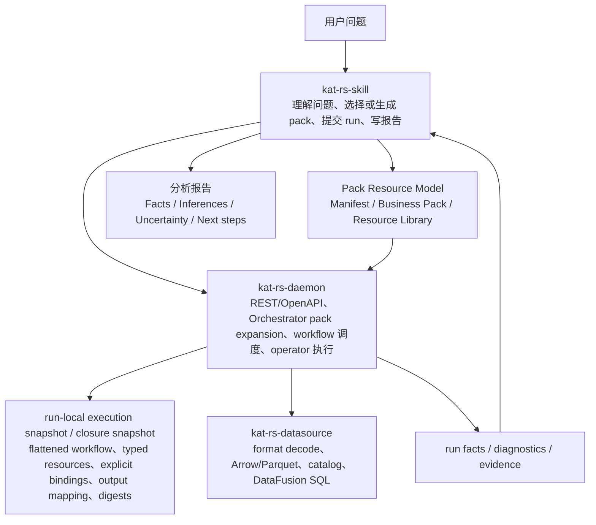

# kat-rs 整合架构设计

## 1. 文档目的

本文把以下三份设计合并成一版更完整的 kat-rs 目标架构：

- `docs/superpowers/specs/2026-07-03-kat-rs-complete-design.md`
- `docs/superpowers/specs/2026-07-05-pack-authoring-architecture-design.md`
- `docs/superpowers/specs/2026-07-05-binding-expansion-mechanism-design.md`

本文解决的是架构边界、对象模型、数据流和可验证契约，不是实现排期。若本文与三份输入文档存在表达粒度差异，以本文的分层模型为整合口径；原文档中的细节可继续作为局部设计依据。

核心结论：

```text
Pack Resource Model 由 Manifest、Business Pack、Resource Library 组成
Manifest 是 pack/resource/operator 的发现索引
Business Pack 是作者层业务问题包，可包含 pack-local local resources
pack expansion 是 daemon Orchestrator 装载 run 时的确定性展开步骤
execution snapshot / closure snapshot 是 daemon 为 run 生成并沉淀的机器审计快照
kat-rs-skill 提交 pack ref + inputs，并只基于 evidence 生成报告推断
```

## 2. 架构定位

kat-rs 是本地 trace/log 分析系统，核心价值是把异构输入转换为可复现、可查询、可审查的事实，并让分析报告基于 evidence 形成。

目标数据流：

```text
trace/log files
  -> kat-rs-datasource format/domain decode
  -> Arrow / Parquet / DataFusion dataset
  -> pack selection or authoring
  -> kat-rs-daemon REST/OpenAPI run request (pack ref + inputs)
  -> daemon Orchestrator pack expansion
  -> run-local execution snapshot / closure snapshot
  -> daemon workflow/operator execution
  -> daemon-owned run facts / diagnostics / evidence
  -> kat-rs-skill report with cited evidence
```

kat-rs 不是：

- LLM agent runtime。
- 任意代码插件平台。
- 把根因判断硬编码进 daemon core 的专家系统。
- 用自然语言上下文替代机器状态的 workflow 引擎。
- 让 CLI 与 REST/OpenAPI 维护两套业务契约的工具集合。

kat-rs 可以让人或 LLM 参与问题理解、pack 选择、Business Pack 生成和报告写作；但 pack expansion、确定性执行、状态登记和 evidence 生成必须留在 daemon 与 datasource 的机器边界内。

## 3. 总体分层

目标架构按五层组织：



各层职责：

| 层 | 主要职责 | 不承担 |
| --- | --- | --- |
| kat-rs-skill | 理解用户问题、选择或生成 pack、提交 `pack ref + inputs`、读取 evidence、生成报告 | 不直接执行 daemon operator，不提交预展开 runtime wiring，不绕过 evidence 输出 inference |
| Pack Resource Model | 组织 Manifest、Business Pack、Resource Library 三类资源 | 不作为 daemon 插件系统，不等同于 run-local execution snapshot |
| Manifest | 提供 pack catalog、table list、公共能力和控制结构等发现索引 | 不承载资源实现、runtime wiring 或执行契约 |
| Business Pack | 表达业务问题、输入、主流程、分析输出、examples 和 local resources | 不承担共享资源库职责，不手写 runtime topic、binding wiring 或 digest |
| Resource Library | 沉淀 reusable flows、query、summaries 和 schemas | 不承载 pack-local 逻辑，除非经过复用提升 |
| pack expansion | 由 daemon Orchestrator 在 run 装载阶段解析 Business Pack，校验显式 `run.inputs` / `run.outputs` 并生成快照 | 不从 SQL/prose/命名惯例推断业务语义 |
| execution snapshot / closure snapshot | 承载 daemon 本次 run 可执行的机器契约和审计快照 | 不作为作者主界面，不作为 REST 顶层输入 |
| kat-rs-daemon | 装载 Pack Resource Model、执行 pack expansion、执行 workflow/operator、维护 run facts/evidence、暴露 REST/OpenAPI | 不调用 LLM，不解释自然语言策略，不扩展任意代码 |
| kat-rs-datasource | 解码输入、物化列式事实、注册 catalog、执行 DataFusion SQL | 不理解 pack/run/evidence，不承载诊断策略 |

## 4. 当前代码边界

当前 workspace 的 crate 对应目标架构如下：

| Crate | 当前职责 | 目标架构位置 |
| --- | --- | --- |
| `kat-rs-cli` | Clap 入口、日志、server 启停、OpenAPI 输出 | 本机 daemon 的薄入口；不承载业务参数解释 |
| `kat-rs-daemon` | loopback Axum server、REST DTO、datasource registry、identity、并发加载协调 | 扩展为 REST/OpenAPI 资源面、Pack Resource Model 装载、pack expansion、workflow 执行、run facts/evidence 写入层 |
| `kat-rs-datasource` | 输入适配、domain decode、Arrow/Parquet、DataFusion catalog/query | 保持事实底座；不理解 pack/run/evidence |

当前新增的 `packs/` 示例目录体现 Pack Resource Model 的目标形态：

```text
packs/
  manifest.json
  manifest.schema.json
  common/
    flows/
    query/
    summaries/
  scheduling/
    app-launch-critical-path/
      critical-task-extraction.yaml
      local/
        flows/
        query/
        summaries/
  memory/
  storage/
```

旧示例目录保留为历史参考，不作为新设计的覆盖目标。

## 5. Pack Resource Model 作者层

### 5.1 目标

Pack Resource Model 面向 pack 作者、reviewer 和选择 pack 的 skill。它应让人不阅读 daemon runtime IR，也能理解：

- 这个 pack 解决什么业务分析问题。
- 调用者必须提供哪些业务输入。
- 依赖哪些事实表。
- 主流程分几步。
- 产出哪些分析结果。
- 哪些 examples 可以作为 smoke/golden input。

Pack Resource Model 不应暴露 routine runtime wiring。分析任务 pack 的主阅读路径应短，默认优先读一个任务 YAML：

```text
<analysis-task>.yaml
```

### 5.2 推荐目录

```text
packs/
  manifest.json
  manifest.schema.json
  common/
    flows/
    query/
    summaries/
  scheduling/
    <analysis-task-pack>/
      <analysis-task>.yaml
      local/
        flows/
        query/
        summaries/
  memory/
    <analysis-task-pack>/
  storage/
    <analysis-task-pack>/
```

`packs/manifest.json` 是 Manifest，用于帮助人或 LLM 发现可选 pack、事实表、公共能力和控制结构。它不是 daemon execution manifest，也不是全量文件索引。Manifest 面向发布版本，文件内必须声明随版本发布后不可原地修改。

`packs/<domain>/<analysis-task-pack>/` 是一个 Business Pack 目录。二级目录固定为领域目录，当前领域收敛为 `scheduling`、`memory`、`storage`；三级及以下由各领域自由组织。

`packs/common/<type>/...` 是公共 Resource Library，所有领域都可引用。任务目录下的 `local/` 资源默认只服务当前任务 pack。资源解析完全由 `run` 坐标中的 `common` / `local` scope 决定，不再需要 `imports`；一旦 `local` 资源被多个 pack 复用，应提升到 `common/`。

### 5.3 Pack Resource Model

Pack Resource Model 包含三个稳定子模型：

- Manifest：发现索引，列出 pack catalog、table list、公共能力和控制结构，帮助 skill 或 reviewer 选择资源。
- Business Pack：业务问题包，包含一个分析任务 YAML 和可选 pack-local `local/` 资源。
- Resource Library：可复用资源库，包含跨 pack 复用的 flows、query、summaries 和 schemas。

这三个子模型属于作者层资源表达。daemon Orchestrator 在收到 run 请求后装载它们，并在 pack expansion 阶段生成本次 run 的 execution snapshot / closure snapshot。

### 5.4 Manifest

Manifest 面向选择和生成，不参与直接执行。它是给 AI 和 reviewer 使用的轻量 catalog，核心字段是 `name` 和 `description`。Manifest 可以包含面向选择的 `inputs` / `outputs` 自然语言提示，但不重复资源 input/output schema，不承诺列出所有资源文件，不影响 expansion、execution、evidence 或 provenance。

Manifest 中的 `packs.common.resources` 是推荐公共能力提示，用于指导 AI 在没有现成业务 pack 时优先阅读和复用哪些能力；它不是完整文件索引。能力文件的真实位置仍由目录约定和 `run` 坐标解析确定。

示例形态：

```json
{
  "$schema": "./manifest.schema.json",
  "schema_version": 1,
  "kind": "kat-rs.pack_manifest",
  "release_policy": {
    "versioned_with_release": true,
    "immutable_after_release": true,
    "change_rule": "Once this file is included in a kat-rs release, do not mutate it in place. Publish a new manifest version instead."
  },
  "packs": {
    "scheduling": {
      "description": "Thread scheduling, wakeup-chain, and execution latency analysis packs.",
      "analysis_packs": [
        {
          "name": "critical-task-extraction",
          "description": "Extract ranked task-level latency contributors from an app launch thread window.",
          "inputs": [
            "process name regex",
            "start marker regex",
            "end marker regex"
          ],
          "outputs": [
            "target thread window",
            "critical path steps",
            "ranked critical tasks",
            "structured evidence"
          ]
        }
      ]
    },
    "memory": {
      "description": "Memory allocation, pressure, leak, and reclaim analysis packs.",
      "path": "memory/",
      "analysis_packs": []
    },
    "storage": {
      "description": "Storage, file system, I/O, and persistence latency analysis packs.",
      "path": "storage/",
      "analysis_packs": []
    },
    "common": {
      "description": "Shared capability resources available when authoring or extending packs.",
      "path": "common/",
      "resources": {
        "flows": [
          {
            "name": "locate_thread_by_process",
            "description": "Select a subject thread from a process name pattern."
          },
          {
            "name": "locate_window_by_markers",
            "description": "Build a target thread window from start and end marker patterns."
          }
        ],
        "query": [
          {
            "name": "process_by_name_regex",
            "description": "Match process rows by process name regex."
          },
          {
            "name": "window_start_marker_by_thread",
            "description": "Match the first window start marker on the subject thread."
          }
        ],
        "summaries": []
      }
    }
  },
  "operators": {
    "capabilities": [
      {
        "name": "query",
        "description": "Run deterministic relational transforms, including bounded regex candidate matching."
      },
      {
        "name": "summaries",
        "description": "Extract structured evidence from run-local artifacts."
      }
    ],
    "controls": [
      {
        "name": "if_empty",
        "description": "Choose a static branch by checking whether a named run-local table is empty."
      },
      {
        "name": "repeat_until",
        "description": "Repeat a static body until explicit termination conditions are satisfied."
      }
    ]
  },
  "tables": [
    {
      "name": "process",
      "description": "Process facts decoded from captured system events."
    },
    {
      "name": "thread",
      "description": "Thread identity and process relationship facts."
    }
  ]
}
```

### 5.5 分析入口 flow YAML

具体分析任务统一写在一个入口 flow `*.yaml` 文件中，文件名不承载语义约束，内容结构与普通 flow 资源归一。

分析入口 flow YAML 描述业务问题契约和入口编排：

- `kind: flow`。
- `description`：该分析入口解决的问题。
- `inputs.required`：调用者必须提供的输入，写法为 `变量名: 类型`。
- `inputs.optional`：调用者可覆盖的输入，写法为 `变量名: 类型`。
- `inputs.defaults`：所有 optional 输入的默认值。
- `outputs`：分析过程产物中的对外输出子集，写法为 `变量名: 类型`。
- `steps`：入口业务编排。
- `examples`：可运行的典型实例输入，以及可选的期望输出提示。

规则：

- 入口分析文件也是 flow，不再单独定义 `analysis_task_pack` 形态。
- 入口 flow 不声明 `pack` 或 `brief` 字段。
- `inputs` 只允许 `required`、`optional` 和 `defaults` 三类。
- `inputs.required` 与 `inputs.optional` 的值只能是基本类型名或 `table`；第一版类型集合为 `string`、`integer`、`number`、`boolean`、`table`，regex 统一按 `string` 表达。
- `inputs.required` 与 `inputs.optional` 不能重名；`inputs.defaults` 只允许为 optional 输入提供默认值，且每个 optional 输入必须有默认值，默认值类型必须与 optional 类型一致。
- 第一版不支持 optional table，因此 `inputs.defaults` 不需要表达 table 默认值。
- `inputs` 不写 `summary`、`kind`、trace table 依赖或列信息；SQL 本身包含所需事实表信息，输入中的 `table` 只表达上游变量类型。
- `outputs` 是扁平映射，不分 `required` / `optional`，也没有默认值。
- `outputs` 的值只能是输出类型名；第一版输出类型集合为 `table`、`evidence`。
- 公共资源通过 `common.*` 坐标引用；pack-local 资源通过 `local.*` 坐标引用。任务 YAML 不声明 `imports`。
- 稳定资源名不带版本；pack expansion 生成的 snapshot 记录 resolved path 和 digest。
- `outputs` 只能引用本 flow 的 `run.outputs` 已产生变量，并且只列分析结果需要暴露的子集，不把所有内部 step output 都暴露出去。

### 5.6 flow 与显式上下文模型

flow 是作者层业务编排。`steps` 数组默认按顺序执行；每个 step 只能是以下三类之一：

```text
run | if_empty | repeat_until
```

`run` 是唯一的数据生产节点，调用一个能力坐标，并显式声明本次调用的输入和输出写入方式：

```yaml
steps:
  - run: common.flows.locate_thread_by_process
    inputs:
      process_name_pattern: process_name_pattern
      require_main_thread: require_main_thread
    outputs:
      target_thread:
        set: target_thread
```

`run` 坐标使用 `<scope>.<resource-kind>.<name>`：

```text
common.flows.locate_thread_by_process
common.query.initial_anchor_rows
local.flows.extract_critical_tasks_in_window
local.query.empty_path_edges
local.summaries.critical_task_evidence
```

`common` 表示跨领域、跨 pack 共享的公共能力库；`local` 表示当前 pack 内部资源。资源类别名与目录保持一致：`flows`、`query`、`summaries`。

`run.outputs` 不使用裸字符串绑定，必须显式写明写入模式：

```yaml
outputs:
  anchor_rows:
    set: anchor_rows
  selected_path_edges:
    set: selected_path_edges
    append: path_edges
```

`set` 表示覆盖或更新当前上下文变量；`append` 表示把本次输出追加到累计表。一个输出可以同时 `set` 给临时变量并 `append` 到累计结果。

`if_empty` 是第一版唯一条件分支控制结构。它只声明条件变量，不声明自己的 `inputs` 或 `outputs`；数据读写仍由分支内部的 `run.inputs` 和 `run.outputs` 表达：

```yaml
- if_empty: candidate_path_edges
  then:
    - run: local.query.empty_path_edges
      inputs: {}
      outputs:
        selected_path_edges:
          set: selected_path_edges
          append: path_edges
  else:
    - run: common.query.select_best_path_edges
      inputs:
        candidate_path_edges: candidate_path_edges
      outputs:
        selected_path_edges:
          set: selected_path_edges
          append: path_edges
```

`repeat_until` 是第一版唯一循环控制结构。它声明终止条件集合和循环体，不声明自己的 `inputs` 或 `outputs`：

```yaml
- repeat_until:
    - empty: anchor_rows
    - max_iterations: max_iterations
  body:
    - run: common.query.candidate_path_edges
      inputs:
        anchor_rows: anchor_rows
        min_edge_duration_ns: min_edge_duration_ns
      outputs:
        candidate_path_edges:
          set: candidate_path_edges
```

`repeat_until` 采用 post-check 语义：每轮先顺序执行 `body`，再检查终止条件；任一条件满足即停止。因此 `body` 至少执行一次。若业务需要进入循环前先检查空表，应在 `repeat_until` 外层显式使用 `if_empty`，第一版不引入单独的 pre-check loop 控制结构。第一版只支持：

```yaml
- empty: <table_name>
- max_iterations: <integer_input_or_literal>
```

且 `repeat_until` 必须包含 `max_iterations` 条件，避免无限循环。

规则：

- 只有 `run` 声明 `inputs` 和 `outputs`。
- `if_empty`、`repeat_until` 只控制流程，不生产数据。
- `if_empty`、`repeat_until` 条件中引用的变量必须在当前上下文可见。
- 分支后继续使用的变量，必须能从 `then` 和 `else` 两边的内部 `run.outputs` 推导出来。
- `steps` 不写 `bind`、runtime topic、digest 或 `context.subscribes` / `context.publishes`。

### 5.7 能力资源 YAML

能力资源 YAML 是一个可被 `run` 调用的作者层文件。它通过 `kind` 声明能力类型，通过 `description` 声明能力意图，通过 `inputs` / `outputs` 声明函数式接口，通过 inline implementation 承载具体执行规则。

示例：

```yaml
kind: query
description: Select the target thread from process match rows.

inputs:
  required:
    process_matches: table
  optional:
    require_main_thread: boolean
  defaults:
    require_main_thread: true

outputs:
  target_thread: table

sql: |
  SELECT ...
```

规则：

- 资源文件顶层使用 `kind`，取值收敛为 `flow`、`query`、`summaries`。
- 资源文件必须声明 `description`、`inputs.required`、`inputs.optional`、`inputs.defaults` 和 `outputs`。
- SQL 和 summary 规则只能引用本资源声明过的输入，例如 `{{inputs.require_main_thread}}` 或输入表名。
- 资源文件不声明 `context.subscribes`、`context.publishes`、`requires` 或顶层 `output`。
- 事实表依赖由资源实现本身决定；`inputs` 不重复声明 trace table 或 table columns。
- 第一版不再把同一个原子操作拆成 `resource.yaml + .sql` 两个 review 文件；整个 YAML 及其 inline implementation 一起记录 digest。

### 5.8 examples

`examples` 是分析入口 flow YAML 内嵌的可运行典型实例。`inputs` 是执行所需绑定；`outputs` 若出现，只表示期望产物提示，不参与 run 输入绑定，也不覆盖任务 YAML 顶层 `outputs` 契约：

```yaml
examples:
  - run: critical-task-extraction
    inputs:
      process_name_pattern: '(^|\.)tencent\.wechat$|^com\.tencent\.wechat$'
      start_marker_pattern: 'HandleLaunchAbility.*com\.tencent\.wechat'
      end_marker_pattern: 'UIVsyncTask.*firstDrawFrame\s*[:=]\s*1'
    outputs:
      target_window: table
      path_steps: table
      critical_tasks: table
      critical_task_evidence: evidence
```

examples 服务四个目标：

- 给人看如何使用。
- 给 LLM 看如何实例化。
- 给测试做 smoke/golden input。
- 给 reviewer 确认业务场景没有被硬编码进通用 pack。

## 6. Pack Expansion 展开层

### 6.1 目标

pack expansion 是 daemon Orchestrator 在 run 装载阶段执行的确定性展开步骤。它根据 run 请求中的 pack ref 和 `packs/` 目录约定定位 Business Pack，从目录和 `run` 坐标解析 local resources 与 common resources，校验显式 `inputs` / `outputs`、`if_empty` / `repeat_until` 控制结构，并最终写入本次 run 的 execution snapshot / closure snapshot。Manifest 只作为选择、生成和发布策略 catalog，不作为执行期完整文件索引。

展开器不解释业务自然语言，不读取 SQL 文本推断业务语义，不根据列名或 step id 猜测 binding。

### 6.2 显式变量上下文

作者层上下文采用显式变量读写模型。变量来自任务输入、前序 `run.outputs`、或当前控制结构体内已经执行过的 `run.outputs`。`run.inputs` 按名称读取变量；`run.outputs` 用 `set` 或 `append` 写入变量。

示例变量包括：

```text
process_name_pattern
target_thread
target_window
anchor_rows
candidate_path_edges
path_edges
path_steps
```

显式变量只用于给能力资源提供执行输入和传递中间结果。需要审查、展示、排序、聚合、报告引用或跨步骤保留明细的内容，应进入 working table、flow output 或 evidence。

设计规则：

- `run.inputs` 必须引用当前可见变量。
- `run.outputs.<name>.set` 表示覆盖或更新变量。
- `run.outputs.<name>.append` 表示向累计表追加本次输出。
- 控制结构只读取条件变量，不声明自己的 `inputs` 或 `outputs`。
- 运行模型中不保留与显式变量并行的 raw `params`。

### 6.3 输入与常量

任务 pack 的 `inputs.required`、`inputs.optional` 与 `inputs.defaults` 是 run 的初始变量来源。调用者必须提供 required 输入；optional 输入可由调用者覆盖，未覆盖时由 defaults 注入：

```yaml
inputs:
  required:
    process_name_pattern: string
    start_marker_pattern: string
  optional:
    max_iterations: integer
    require_main_thread: boolean
  defaults:
    max_iterations: 8
    require_main_thread: true
```

可配置常量也归一放入任务 pack 的 `inputs.optional` 与 `inputs.defaults`，并通过 `run.inputs` 显式传给需要它的能力，例如：

```text
require_main_thread
task_min_duration_ns
max_task_count
```

### 6.4 展开流程

展开按以下顺序执行：

1. 根据 run 请求中的 pack ref 和 `packs/` 目录约定定位 Business Pack；读取 Manifest 校验 schema version、release policy 和 AI catalog 元信息。
2. 解析任务 YAML、入口 `steps`、local resources 和所有被 `common.*` 坐标引用的 common resources。
3. 校验任务和资源的 `inputs.required`、`inputs.optional`、`inputs.defaults` 和 `outputs` 结构，确认输入类型集合、默认值归属、required/optional 不重名，以及输出类型集合。
4. 校验 `run` 坐标能解析到唯一能力文件，且坐标类别与能力文件 `kind` 一致。
5. 校验每个 `run.inputs` 都能解析到当前上下文中已存在的 pack 输入、中间结果或循环体变量。
6. 校验每个 `run.outputs` 的 `set` / `append` 写入目标不会产生未声明的歧义覆盖。
7. 校验 `if_empty` 引用的变量存在且为表；`then` / `else` 内部步骤按顺序校验。
8. 校验 `repeat_until` 的终止条件集合，第一版必须包含 `max_iterations`，且 `body` 是静态步骤数组。
9. 记录 inline implementation、resource digest、expanded content、resolved run 坐标和显式 IO 绑定结果。
10. 根据任务 YAML 的 `outputs` 生成 output mapping。

绑定解析发生在作者层显式 `run.inputs` / `run.outputs` 边界，不从 SQL、列名、step 名或自然语言说明推断。

### 6.5 显式变量解析规则

普通顺序 flow scope 中：

- 可见变量必须已经由任务输入或前序 `run.outputs` 产生。
- `run.inputs` 必须解析到唯一可见变量；缺失或歧义是结构性失败。
- `run.outputs.<name>.set` 可以更新同名或新变量。
- `run.outputs.<name>.append` 可以向累计表追加本次输出。
- `if_empty` 条件变量必须是当前可见表。

`repeat_until` scope 中：

- `body` 按顺序执行，每轮执行完成后再判断终止条件。
- 终止条件变量从当前循环上下文读取。
- 循环变量通过 `run.outputs.<name>.set` 更新。
- 累计结果通过 `run.outputs.<name>.append` 追加。
- 第一版 `repeat_until` 必须包含 `max_iterations` 条件，避免无限循环。

因此，作者层上下文是显式变量读写模型，不是发布订阅模型，也不保留隐式 latest 订阅规则。

### 6.6 展开期结构性失败

以下情况应在 pack expansion 或 snapshot 校验阶段失败：

- 任务 YAML 的 `steps` 出现 flow-level `bind` 或 runtime context wiring。
- step 同时出现多个 discriminator，或不是 `run`、`if_empty`、`repeat_until` 之一。
- `run` 坐标无法解析到唯一资源，或资源 `kind` 与坐标类别不一致。
- `run.inputs` 引用未定义变量。
- `run.outputs` 缺少 `set` / `append` 写入动作。
- `if_empty` 引用未定义变量或非表变量。
- `repeat_until` 缺少 `max_iterations` 终止条件。
- atomic resource YAML 缺少 inline implementation。
- 能力资源 YAML 出现 `context.subscribes`、`context.publishes`、顶层 `requires` 或顶层 `output`。
- 前序已确定对象只发布 row_ref，导致后续 query 仅为补字段而回事实表 join。
- artifact 或 evidence 试图通过显式变量上下文发布。
- binding 使用 daemon 不支持的类型。

## 7. Run Execution Snapshot / Closure Snapshot

execution snapshot / closure snapshot 是 daemon 在 pack expansion 后为本次 run 生成的结构化机器快照。它不是 Business Pack 目录，不是作者主界面，也不是 REST `/runs` 的顶层输入。

snapshot 至少包含：

```text
pack identity snapshot
entry workflow definition
flattened atomic invocation list
transitive typed resources
inline implementation expanded content
resource paths and digests
task input schema
explicit run input/output bindings
flow output mapping
schema versions
```

snapshot 的目标：

- 保证同一 dataset、同一 Pack Resource Model 快照、同一输入生成相同机器契约。
- 让 daemon 后续执行不依赖实时资源目录扫描。
- 让 run 在 Business Pack 或 Resource Library 后续变化后仍可审查。
- 让资源展开、模板绑定和 digest 冲突可被复现和定位。

daemon 后续执行只读取本次 snapshot 显式引用的结构化内容，不重新扫描 pack，不自动发现未引用资源，不解释自然语言策略文档。

## 8. kat-rs-daemon Runtime

### 8.1 资源面

REST/OpenAPI 是 daemon 对外暴露的唯一业务功能面。CLI 如果存在，只是本机 server 生命周期和 OpenAPI 输出的薄入口。

目标资源面至少包括：

```text
POST /v1/runs
GET /v1/runs/{runId}
GET /v1/runs/{runId}/evidence
POST /v1/query
POST /v1/summaries
```

主分析链路应通过 `/runs` 提交 pack ref、dataset ref 和 inputs，由 daemon Orchestrator 装载 Pack Resource Model、执行 pack expansion 并调度 workflow，不绕过 workflow 直接拼装 operator 调用。受控的 `query/summaries` 资源动作可保留为检查和低层查询入口，但不成为 skill 主链路的替代协议。

### 8.2 Run

run 是一次分析执行记录，绑定：

- dataset ref。
- pack expansion 生成的 execution snapshot / closure snapshot。
- entry workflow invocation。
- step status。
- working tables。
- explicit variable bindings。
- diagnostics。
- evidence。
- flow output mappings。

run 不保存用户自然语言问题、LLM 对话或 pack 策略 prose。自然语言问题由 skill 持有；run 只保存机器可审查事实。

### 8.3 Workflow 与控制结构

workflow 是 pack-defined 的确定性业务分析过程，但由 daemon 解释 schema、控制原语和 operator 调用。

workflow 可以包含：

- 顺序 steps。
- `if_empty` 条件分支。
- `repeat_until` 有界循环。
- `run.outputs.append` 表达的追加累计。
- flow outputs。

workflow 不能：

- 动态生成 step list。
- 动态生成 operator name。
- 执行任意脚本。
- 调用 LLM。
- 依赖自然语言 summary 或用户对话上下文分支。

`if_empty` 第一版只基于 daemon-visible table row count：

- 目标表为空时执行 `then`。
- 目标表非空时执行 `else`。

`repeat_until` 第一版只支持显式终止条件集合：

- `empty: <table_name>`。
- `max_iterations: <integer_input_or_literal>`。

### 8.4 原子能力

daemon-owned operator 第一版收敛为：

```text
query
summaries
sequence.*
interval.*
graph.*
```

规则：

- operator 不互相调用。
- operator 组合必须在 workflow 中显式表达。
- pack 不能定义新 operator。
- 领域诊断名称留在 pack workflow 和 artifact 语义中，不泄漏为 daemon capability name。

`query` 承载 DataFusion SQL 可表达的关系型变换，输出有名 working table。少量正则候选定位也归一为受限 query，不再保留独立正则匹配原子能力。

`summaries` 从表、diagnostics、workflow trace 或 capability output 中摘录小事实并写入 evidence，不写自然语言 summary，不输出 inference。

`sequence.*` 承载有序事件配对和状态区间还原等通用算法。

`interval.*` 承载区间 overlap、intersect、subtract、merge、gaps、coverage 等通用计算。

`graph.*` 承载 build、traverse、path_search 等通用图计算。pack 先用 query 构建业务 node/edge 表。

### 8.5 Binding Mechanism

daemon 内部维护 run-local 显式变量上下文。它是 runtime 执行机制，不是用户直接选择的分析能力。

绑定第一版收敛为：

| binding | 形态 | 边界 |
| --- | --- | --- |
| scalar | JSON scalar | 不支持 array/object/blob/nested context |
| table | run-local working table | 不隐式携带 filter/projection/order |
| evidence | structured evidence handle | 只能由 summaries 产出 |

runtime 语义：

- step 执行前解析 `run.inputs`。
- step 成功 commit 后登记 `run.outputs` 的 `set` / `append` 写入。
- `if_empty` 与 `repeat_until` 只读取条件变量，不登记数据输出。
- 失败 step 的 staged outputs 不进入 committed store。

显式变量上下文是轻量执行坐标，不是完整 provenance。为什么选择某个变量值，由 producing step、workflow trace、diagnostics 和 evidence 解释。

### 8.6 Working Table、Flow Output 与 Evidence

working table 是 run-local 中间事实，可被后续 step 引用。

flow output 是任务 YAML `outputs` 显式声明、并由展开后 output contract 对齐的外部输出。它必须来自本 flow 的已提交 `run.outputs` 变量。

evidence 是报告可引用的小型结构化事实，包含 facts、metrics、refs 和 producing step。

规则：

- working table 默认不发布到 dataset catalog。
- flow output 不自动成为 evidence。
- diagnostics 不自动成为 evidence。
- explicit variable binding 不自动成为 evidence。
- 若报告需要引用 diagnostic、workflow variable 或 output 内容，必须由 summaries 显式摘录成 evidence。

### 8.7 Run Facts

run facts/evidence 是 daemon 内部机器事实集合，append-only 保存：

```text
run identity
dataset ref
closure snapshot
entry workflow invocation
top-level status
step records
workflow nested trace
working tables
explicit variable bindings
diagnostics
handled diagnostics
evidence records
flow output mappings
```

每个 step 使用 per-step staging + commit：

```text
reserve outputs
-> execute operator
-> validate outputs
-> commit working tables / diagnostics / evidence / explicit output bindings
-> expose committed outputs to later steps
```

如果 step 中途失败，staging 产物不进入 run query context。已 commit 的前序事实不回滚。

### 8.8 Diagnostics 与失败

失败分为结构性失败和数据性 diagnostics。

结构性失败立即 fail-fast：

- schema 校验失败。
- resource 缺失。
- digest 不一致。
- manifest ref 不存在。
- table/column 不存在。
- output name 冲突。
- binding type 不支持。
- `_kat_row_id` 等保留列被覆盖。
- flow output 映射缺失或 kind 不匹配。

数据性情况不自动失败：

- 正则候选 query 无匹配。
- query row count 为 0。
- sequence 无配对。
- frontier 为空。
- graph 无 target path。
- repeat_until 到达 max_iterations。

这些情况应生成 diagnostics，由 if_empty、repeat_until termination 或 summaries 显式处理。handled diagnostics 仍进入 trace，但不自动让 workflow 完成状态降级。

## 9. kat-rs-datasource 事实底座

datasource 负责：

- `.htrace` container 读取。
- profiler envelope framing 与 decoder registry。
- ftrace/native hook domain decode。
- Langfuse legacy JSONL.GZ 读取。
- Arrow RecordBatch / MemTable 物化。
- Parquet dataset writer。
- dataset catalog 读写。
- DataFusion SQL 查询。

datasource 边界：

- 不理解 run、pack、workflow、context 或 evidence。
- 不保存报告语义。
- 不硬编码关键路径、首帧、卡顿、内存泄漏等诊断策略。
- 不把 source/raw/direct 表提前转换成不可组合 JSON blob。

新增输入格式或 profiler plugin 时，改动应限制在格式读取、domain decode、必要 codegen、Arrow projection 和测试，不污染 daemon runtime。

## 10. kat-rs-skill 与报告模型

kat-rs-skill 是面向用户问题的入口，负责：

1. 理解用户问题、目标和约束。
2. 根据 Manifest 和已有 Business Packs 选择合适 pack。
3. 必要时生成新的 Business Pack 或 pack variant。
4. 通过 REST/OpenAPI 提交 pack ref、dataset ref 和 inputs。
5. 由 daemon Orchestrator 装载 Pack Resource Model 并执行 pack expansion。
6. 读取 run status、outputs、diagnostics 和 evidence。
7. 生成面向用户的报告。

报告可以包含：

- Facts：直接来自 evidence。
- Inferences：基于 evidence 的推断。
- Uncertainty：证据不足、diagnostics、数据缺口或未覆盖路径。
- Next steps：后续可提交的新 pack/workflow invocation。

报告不得把 daemon 未产出的自然语言判断伪装成 evidence。每个关键 inference 都必须能追溯到 evidence record。

## 11. 关键不变量

1. Pack Resource Model 是作者层资源表达，不是 daemon 插件系统。
2. Business Pack 是业务问题包，local resources 在未复用前保持 pack-local。
3. REST/OpenAPI 主链路提交 pack ref、dataset ref 和 inputs，不提交预展开 runtime wiring。
4. daemon Orchestrator 执行 pack expansion，并生成本次 run 的 execution snapshot / closure snapshot。
5. snapshot 是机器契约和审计快照，不是作者主界面。
6. pack expansion 不从 SQL、列名、step id 或 prose 推断业务语义。
7. 所有影响 operator 执行的输入和常量都通过 `run.inputs` 显式传入。
8. 运行模型中不保留第二套 raw `params`。
9. 显式变量上下文只承载执行坐标和中间结果，不替代 flow output 或 evidence。
10. evidence 是报告 inference 的唯一事实支撑入口。
11. diagnostics 只有被 summaries 显式摘录后才成为 evidence。
12. working table、explicit output binding 和 evidence 只有 step commit 后才进入 run facts。
13. run facts append-only，已 commit 历史不回写、不覆盖。
14. pack 不能定义 operator、binding type、runtime control primitive 或任意代码执行能力。
15. CLI 不维护与 REST/OpenAPI 平行的业务契约。

## 12. 首个可验证切片

目标架构可以分阶段实现，但第一条验证链路应尽量证明主路径，而不是只堆局部对象。

建议首个可验证切片：

```text
已有 dataset
  -> packs/scheduling/app-launch-critical-path/critical-task-extraction.yaml
  -> POST /v1/runs(pack ref + dataset ref + inputs)
  -> daemon Orchestrator 装载 Manifest catalog metadata / Business Pack / Resource Library
  -> pack expansion 生成 execution snapshot / closure snapshot
  -> daemon 执行 query working tables
  -> daemon 执行 summaries evidence
  -> GET /v1/runs/{id}/evidence
  -> skill/report 引用 evidence
```

该切片至少验证：

- Business Pack 不含 runtime binding wiring。
- Manifest 可发现 pack catalog、table list、公共能力和控制结构。
- Business Pack 可引用 Resource Library，也可包含 pack-local local resources。
- flow 可解析为顺序 `run`、`if_empty` 和 `repeat_until` 控制结构。
- ability resource YAML 声明 `kind`、`description`、`inputs.required` / `inputs.optional` / `inputs.defaults` 和 `outputs`。
- execution snapshot / closure snapshot 记录资源 path、digest 和 expanded content。
- daemon 只执行 snapshot 显式引用资源。
- query 产出 working table。
- summaries 产出 evidence。
- evidence 可追溯 producing step 与 refs。
- 报告 inference 可逐条引用 evidence。

非首个切片内容：

- 完整 `sequence.*`、`interval.*`、`graph.*` 算法族。
- persistent derived artifact 发布到 dataset catalog。
- 复杂通用条件表达式和多状态循环。
- 远程、多用户、鉴权或 TLS。
- 任意 pack marketplace 或插件安装机制。

## 13. 验收标准

架构层验收：

- 人只读 Business Pack 主路径即可理解业务问题、输入、主流程和输出。
- 任务 YAML 中没有 runtime path、digest、runtime topic 或 binding wiring。
- `steps` 中没有 `bind`、runtime topic 或 digest。
- 每个能力调用的输入和输出都来自 `run.inputs` / `run.outputs`。
- 同一输入、同一 Pack Resource Model 快照和同一 dataset 生成相同 execution snapshot binding wiring。
- flow output 和 evidence 不依赖显式变量上下文作为结果总线。
- daemon run facts 能解释执行时使用的 workflow、资源展开内容、explicit output binding 和 evidence refs。

运行层验收：

- 同一 dataset、同一 snapshot、同一 task inputs 产生相同 run facts。
- skill 的主链路通过 REST/OpenAPI 提交 run 和读取 evidence。
- working table 和 explicit output binding 只有 commit 后才进入 run query context。
- evidence 能追溯到 producing step 和来源 refs。
- operator 之间不存在隐藏互调。
- pack workflow 的业务语义不泄漏为 daemon operator name。
- report inference 可以逐条引用 evidence。

## 14. 关键取舍

### 14.1 Business Pack 与 execution snapshot 分离

作者层追求可读、可 review；runtime 层追求确定性和可审计。把 Business Pack 与 run-local execution snapshot 分离，可以避免让 pack 作者面对大量 routine wiring，同时保留 daemon 所需的 digest、binding 和输出映射。

### 14.2 binding 由 run.inputs / run.outputs 显式声明

绑定语义放在 flow 的 `run.inputs` / `run.outputs` 边界，而不是集中映射表、SQL 或命名惯例中。这样 review 一个能力调用时可以同时看到能力坐标、输入来源和输出写入方式，避免从实现细节推断业务含义。

### 14.3 显式变量上下文是执行坐标，不是证据容器

显式变量上下文只传递后续 operator 需要的值或 working table。需要审查和报告的内容必须落成 table、artifact 或 evidence。这避免上下文变成隐式全局状态或 LLM 记忆。

### 14.4 evidence 是报告事实入口

report 可以有 inference，但 inference 必须引用 evidence。daemon 不输出自然语言根因判断，skill 不把自己的判断伪装成机器事实。

### 14.5 daemon 保持通用 operator 集

daemon 提供 query/summaries/sequence/interval/graph 等通用能力。领域问题如 critical path、first frame、wake-up source 留在 pack workflow 和 artifact 语义中，避免 daemon core 被业务诊断名称污染。

## 15. 待后续设计的问题

以下问题不阻塞本文主架构，但后续实现前需要单独设计：

- execution snapshot / closure snapshot 的完整 JSON/YAML schema。
- `/v1/runs` 的 REST DTO、状态机、pack ref + inputs 结构和持久化边界。
- pack expansion 的 crate/module 边界：daemon 内部模块还是独立 crate。
- flow output 的 API 返回格式和分页/截断语义。
- evidence record 的稳定 schema 与 refs 结构。
- `repeat_until` 之外的通用循环、break/continue 和复杂条件表达式。
- persistent artifact 写入 dataset catalog 的生产者元数据。
- run facts 的内存结构、落盘格式和生命周期。
