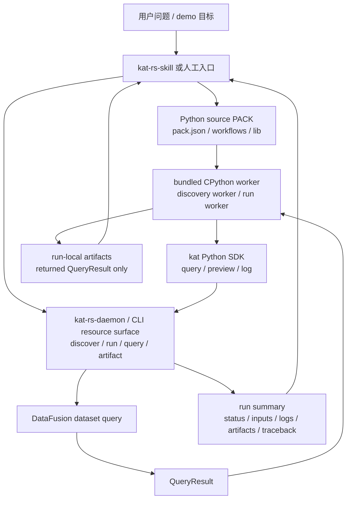

# kat-rs Python-first PACK 架构设计

## 1. 文档目的与结论

本文基于原 `kat-rs` 整合架构设计和 issue [#113](https://github.com/maokelong/kat-rs/issues/113)，把第一版 PACK runtime 的目标架构改写为 Python-first 方案。

原设计中的核心方向仍然保留：

- kat-rs 的基础价值是列式 trace/log 数据引擎。
- 大表扫描、join、聚合、物化和查询继续留在 Arrow / Parquet / DataFusion 路径。
- 关键路径、首帧、卡顿、IO、Binder、锁、内存等诊断策略属于 PACK，不写入 Rust core。
- run 产物必须可审查、可复现、可回放；报告推断必须基于机器产出的事实或 artifact。

本文改变的是第一版 PACK runtime 的形态：

```text
不优先实现 YAML flow engine、operator registry、复杂 manifest 或通用 pack expansion。
第一版先验证 Python source PACK + bundled CPython worker + 极小 kat SDK。
```

核心结论：

```text
PACK 是受信任的本地 Python 源码目录。
Workflow 是带 @workflow 装饰器的 Python 函数。
函数签名是 runtime-facing input contract。
装饰器只补充 CLI/UI 展示信息。
每次 run 启动新的 bundled CPython worker。
Python 只做编排、小结果判断和业务决策。
DataFusion 仍负责大表查询和列式执行。
workflow 通过 kat.query() 产生 QueryResult。
只有 workflow 返回的 QueryResult 会保存为 run-local artifact。
run summary 展示运行事实，不生成自然语言分析结论。
```

本文是新的第一版目标 SDD。`docs/superpowers/specs/2026-07-05-kat-rs-integrated-architecture-design.md` 中关于 evidence、列式数据边界、报告边界和 daemon/datasource 职责分层的原则仍可复用；其中 YAML flow、显式变量上下文、operator registry、复杂 pack expansion 和 execution snapshot schema 不再作为第一版实现目标。

## 2. 背景与问题

原整合设计把 PACK 作者层建模为 YAML flow：

```text
Business Pack YAML
  -> daemon pack expansion
  -> execution snapshot
  -> workflow/operator execution
  -> evidence
```

这个方向在架构上可审查，但第一版同时引入了多类新抽象：

- 自定义 YAML flow 语言。
- `run.inputs` / `run.outputs` 显式变量上下文。
- `if_empty` / `repeat_until` 控制原语。
- capability resource YAML。
- daemon-owned operator registry。
- execution snapshot / closure snapshot。
- flow output 与 evidence 映射。

这些抽象长期可能有价值，但 demo 阶段的风险很高：

- PACK 作者需要先学自研 DSL，迭代速度慢。
- Rust daemon 需要在很早阶段承担 workflow engine 复杂度。
- operator registry 容易再次承载业务策略。
- 复杂 snapshot schema 会先于真实 run 经验成型。
- 为了证明主链路，需要一次性实现太多基础设施。

#113 的判断是：第一版先验证更小的源码 PACK runtime。它接受 Python 作为受信任本地编排语言，但不让 Python 成为数据处理主路径。

## 3. 目标

第一版目标是验证：

1. PACK 可以用 Python 源码目录表达领域分析经验。
2. kat-rs 可以递归 discovery PACK 中的 workflow。
3. 用户不需要安装系统 Python，也不需要运行 `pip install`。
4. 每次 run 可以通过 bundled CPython worker 执行指定 workflow。
5. Workflow 可以通过接近 Click/Typer 的函数签名和装饰器声明输入。
6. Workflow 只能通过极小 `kat` SDK 访问 kat-rs 能力。
7. `kat.query()` 把 SQL 留给 DataFusion 执行，并返回惰性 `QueryResult`。
8. `QueryResult.preview()` 只读取少量行供 Python 判断。
9. `QueryResult.rows(max_rows)` 只用于窗口过滤后的有界事实快照，必须显式给上限。
10. 只有 workflow 返回的 `QueryResult` 被保存为 run-local artifact。
11. run summary 自动展示 artifact、schema、行数、预览入口、日志和失败 traceback。

第一版成功的标志不是“Python 能做任意分析”，而是：

```text
领域策略可以放进 PACK，
列式数据边界不被破坏，
run 产物可审查，
首个 OpenHarmony critical path demo 能以最少 runtime 机制跑通。
```

## 4. 非目标

第一版明确不做：

- 不实现 YAML flow engine。
- 不实现正式 operator registry。
- 不实现通用 pack expansion 引擎。
- 不实现 Python sandbox、权限系统或多租户隔离。
- 不支持运行时 `pip install`。
- 不承诺任意第三方 native wheel 可移植性。
- 不实现 PACK 上传、远端 registry、发布权限或版本策略。
- 不把 CPython runtime 随 PACK 上传。
- 不支持 QueryResult 之间组合、lazy dataframe 或自研 query planner。
- 不把 run-local artifacts 写入 dataset catalog。
- 不自动生成自然语言分析结论。
- 不做 macOS runtime 支持。
- 不让 Python 绕过 DataFusion 直接扫描大表。

## 5. 架构定位

kat-rs 仍定位为：

```text
trace columnar data engine + trusted Python source PACK runtime
```

整体数据流：

```text
trace / log files
  -> kat-rs-datasource format/domain decode
  -> Arrow / Parquet / DataFusion dataset
  -> Python source PACK discovery
  -> workflow selection and JSON-compatible inputs
  -> bundled CPython worker run
  -> kat.query(sql, **params)
  -> DataFusion query execution
  -> QueryResult handles
  -> workflow returns dict[str, QueryResult]
  -> run-local artifacts
  -> run summary / logs / traceback
  -> human or LLM report based on artifacts and run facts
```

第一版边界：

- Rust core 负责 datasource、dataset、DataFusion 查询、worker 生命周期、IPC、artifact 保存和 run summary。
- Python PACK 负责分析编排、SQL 选择、小结果判断和业务分支。
- DataFusion 负责大表执行。
- `kat` SDK 是 Python workflow 与 Rust runtime 之间的唯一协议面。
- 自然语言报告不在 worker 内生成。

## 6. 总体分层



各层职责：

| 层 | 主要职责 | 不承担 |
| --- | --- | --- |
| kat-rs-datasource | 输入读取、领域解码、Arrow/Parquet 物化、DataFusion dataset 注册 | 不理解 PACK、workflow、artifact 语义或报告策略 |
| Python source PACK | 组织领域 workflow、helper、SQL 字符串和小结果判断 | 不发布 runtime、不能要求用户安装 Python、不做大表扫描 |
| bundled CPython worker | 隔离 discovery/run 进程，导入 PACK，执行 workflow，走 IPC 调用 Rust 查询能力 | 不提供 sandbox，不安装依赖，不持久化跨 run 状态 |
| kat Python SDK | 暴露 `workflow`、`option`、`kat.query()`、`QueryResult.preview()`、`QueryResult.rows(max_rows)`、`kat.log()` | 不提供 dataframe、SQL builder、无界数据迭代、缓存管理或文件系统抽象 |
| kat-rs-daemon / CLI | PACK discovery、run 调度、worker 管理、查询执行、artifact 保存、summary 输出 | 不解释自然语言，不硬编码诊断策略 |
| run-local artifacts | 保存 workflow 返回的 QueryResult 结果表和元数据 | 不写入 dataset catalog，不承诺跨 run 复用 |
| run summary | 展示运行事实、artifact 摘要、日志和失败信息 | 不生成根因判断或自然语言结论 |
| kat-rs-skill / 人类报告 | 基于 artifact、summary、日志和预览写分析报告 | 不把未产出的判断伪装成机器事实 |

## 7. Python Source PACK 模型

### 7.1 PACK 目录

PACK 是一个领域分析经验包。第一版 PACK 是本地源码目录：

```text
openharmony.kernel_perf/
  pack.json
  workflows/
    thread/
      window_critical_path.py
    sched/
      wait_overview.py
  lib/
    sql_fragments.py
    markers.py
```

`pack.json` 可选，只用于覆盖包级元信息：

```json
{
  "title": "OpenHarmony kernel performance",
  "description": "Trusted local workflows for OpenHarmony kernel trace analysis."
}
```

第一版规则：

- PACK name 默认从目录名推断。
- `pack.json` 不要求 `version`。
- PACK root 会加入 Python import path。
- workflow 可以 import 同 PACK 内 helper 模块。
- PACK 不携带 CPython runtime。
- PACK 不声明外部 Python 依赖安装步骤。
- PACK 是受信任本地源码，不是远端不可信插件。

### 7.2 Workflow

Workflow 是 PACK 中一个可运行分析入口。KAT 默认递归扫描 PACK 目录下的 `**/*.py`，发现带 `@workflow` 的函数。

约定：

- workflow name 默认由 Python 文件相对路径推断，去掉 `.py` 并把路径分隔符转为 `.`。
- 第一版每个 Python 文件最多一个 workflow。
- 重复 workflow name 直接 discovery 失败。
- 一文件多个 workflow 直接 discovery 失败。
- Python 模块顶层只做 import、常量定义和 workflow 装饰器注册。
- 模块顶层不得做实际分析、IO、耗时计算或依赖运行时 dataset。
- 顶层副作用第一版通过约定、timeout、日志和 review 管控，不通过 sandbox 强制隔离。

示例：

```python
from kat import workflow, option


@workflow(title="Thread window critical path")
@option("--process-name-pattern", help="Process name regex", required=True)
@option("--start-marker-pattern", help="Start marker regex", required=True)
@option("--end-marker-pattern", help="End marker regex", required=True)
def run(
    kat,
    process_name_pattern: str,
    start_marker_pattern: str,
    end_marker_pattern: str,
    require_main_thread: bool = True,
    max_iterations: int = 8,
):
    segments = kat.query(
        """
        select *
        from callstack
        where name regexp :start_marker_pattern
        """,
        start_marker_pattern=start_marker_pattern,
    )
    return {"critical_path_segments": segments}
```

### 7.3 Workflow 输入合同

函数签名是实际执行合同：

- 第一个 runtime 参数显式命名为 `kat`。
- 其余参数是 workflow input。
- runtime-facing input 必须 JSON-compatible。
- 第一版支持 `str`、`int`、`float`、`bool` 和可为 JSON 表达的简单默认值。
- 复杂 Python 对象只允许在 workflow 内部 helper 调用之间传递，不进入 runtime-facing input。

装饰器只补充展示信息：

- flag 名。
- help。
- default。
- required。
- choices。
- 单位。

Discovery 必须校验：

- 装饰器声明的 default 与函数签名默认值一致。
- 装饰器声明的 required 与函数签名必填性一致。
- 装饰器引用的参数名存在。
- 函数签名中除 `kat` 外的参数能转换成 JSON-compatible input contract。

合同不一致时，整个 PACK discovery 失败，不做部分成功。

## 8. `kat` Python SDK

第一版 SDK 极小化，避免把 Python 变成第二套 runtime。

### 8.1 `kat.query(sql, **params) -> QueryResult`

语义：

- 使用手写 DataFusion SQL。
- 参数绑定使用 `:param_name` 命名占位符。
- SQL 由 Rust runtime 交给 DataFusion 执行。
- `kat.query()` 返回 `QueryResult` handle。
- `kat.query()` 不自动保存 artifact。
- `kat.query()` 不自动 preview。
- `kat.query()` 不自动添加 `LIMIT`。
- `kat.query()` 不提供 SQL builder。
- 第一版 `QueryResult` 不支持互相组合。

设计理由：

- SQL CTE 足以表达首版中间查询组合。
- 大表计算保留在 DataFusion。
- Python 只拿 handle、小 preview 和显式上限内的事实行做判断。
- Artifact 保存只由 workflow 返回值触发，避免隐式临时表泛滥。

### 8.2 `QueryResult.preview(limit=20)`

语义：

- 读取少量行给 Python 判断或日志使用。
- `limit` 可省略，使用默认小上限。
- runtime 必须设置硬上限；传入更大值时直接返回 preview 参数错误。
- preview 结果只用于控制判断、日志和调试。
- preview 不是 artifact。
- preview 不进入 dataset catalog。

第一版推荐 hard cap 为实现内常量，不暴露为用户配置项；该值属于防护边界，不属于业务策略。

### 8.3 `QueryResult.rows(max_rows)`

语义：

- 读取窗口过滤后的有界事实行给 Python 算法使用。
- 调用方必须显式传入 `max_rows`。
- runtime 必须同时设置实现级 hard cap；超过上限直接返回参数错误或 bounded rows 错误。
- rows 结果只用于当前 workflow 内的策略探索和小规模数据结构构建。
- rows 不是 artifact。
- rows 不进入 dataset catalog。
- rows 不提供无界迭代器、RecordBatch、DataFrame 或 lazy table。

设计理由：

- critical path 这类策略需要对窗口内状态片段、wakeup 边和少量 callstack 事实做递归探索。
- 这些探索不适合全部写成一串 SQL，也不应该让 Python 直接扫描全 trace。
- bounded rows 把边界固定在“先由 SQL/DataFusion 过滤，再把小事实快照交给 Python”。

### 8.4 workflow 返回值

Workflow 返回值是唯一 artifact 声明面：

```text
dict[str, QueryResult]
```

规则：

- KAT 将返回字典里的每个 `QueryResult` 保存为 run-local artifact。
- artifact 名称来自 dict key。
- dict 顺序可作为展示顺序。
- 返回 `None` 或 `{}` 表示没有显式输出 artifact。
- 不支持 message、metrics、scalar 作为返回值。
- 如果需要 metrics，应通过 SQL 产出一行表，并作为 `QueryResult` 返回。
- 返回非 `QueryResult` 值是 runtime contract failure。
- artifact 名称冲突或非法字符是 runtime contract failure。

### 8.5 `kat.log(message, **fields)`

语义：

- 记录结构化 run log。
- `message` 是短文本。
- `fields` 必须 JSON-compatible。
- `print()` 允许，但 stdout/stderr 捕获到 run log，不作为协议输出。
- log 不自动成为 artifact 或 evidence。

## 9. Bundled CPython Worker

### 9.1 Runtime 决策

第一版 Python runtime 决策：

- 使用 bundled CPython，不依赖系统 Python。
- Python worker 是子进程，不 embedding CPython。
- 不抽象多 Python runtime provider。
- 不做 sandbox。
- 不运行 `pip install`。
- 第一版目标平台收敛为 Linux x86_64 与 Windows x86_64。
- 首个 prototype 可以先用 Linux 验证 worker 机制；首版完成验收必须补齐 Windows worker smoke test。
- CPython runtime 随 kat-rs 发布包一起发布，不随 PACK 上传。

Linux prototype 已证明可行：

- `astral-sh/python-build-standalone` 的 `install_only_stripped` CPython 可启动。
- 解包后 runtime 约 103MB。
- 移动到假 KAT 包目录后仍可启动。
- `env -i` 下可运行。
- stdlib import 和 JSON stdin/stdout worker demo 可跑通。

### 9.2 推荐发布包结构

Linux 推荐包结构：

```text
kat/
  bin/
    kat
  runtime/
    python/
      bin/
        python3
      lib/
        python3.13/
    worker/
      kat_worker.py
      kat_sdk/
        __init__.py
      vendor/
```

Windows 推荐保持同构结构：

```text
kat/
  bin/
    kat.exe
  runtime/
    python/
      python.exe
      Lib/
      DLLs/
    worker/
      kat_worker.py
      kat_sdk/
        __init__.py
      vendor/
```

Worker 启动建议：

- 忽略用户 Python 环境变量。
- Linux 使用类似 `python3 -E -s kat_worker.py`。
- Windows 使用 bundled `python.exe` 并显式传入 worker 路径。
- 不设置 `PYTHONHOME`。
- PACK root 与 SDK path 由 worker 显式管理。
- worker stdin/stdout 使用结构化 IPC，stderr 捕获到 run log。

### 9.3 Discovery worker 与 run worker

Discovery 与 run 使用不同 worker 生命周期：

- Discovery worker 只导入 PACK、注册 workflow、输出 workflow contracts。
- Run worker 执行指定 workflow。
- Discovery import 失败、注册失败或参数合同不一致时，整个 PACK discovery 失败。
- 每次 workflow run 启动新的 Python worker。
- 第一版不复用 warm worker。
- 第一版不保留跨 run Python 进程状态。

这样牺牲一点启动成本，换取更清楚的状态边界和失败隔离。

## 10. Discovery 流程

Discovery 输入：

```text
pack root path
```

Discovery 输出：

```text
pack name
pack metadata
workflow list
workflow input contracts
workflow display metadata
discovery diagnostics
```

流程：

1. Rust runtime 定位 PACK root。
2. 读取可选 `pack.json`，得到包级标题和描述。
3. 启动 discovery worker。
4. worker 把 PACK root 加入 import path。
5. worker 递归扫描 `**/*.py`。
6. worker 导入每个 Python 文件。
7. `@workflow` 装饰器注册候选 workflow。
8. 校验一文件最多一个 workflow。
9. 根据相对路径推断 workflow name。
10. 校验 workflow name 唯一。
11. 校验函数签名和装饰器合同一致。
12. 输出 workflow contract 给 Rust runtime。

失败策略：

- 任一文件 import 失败，整个 PACK discovery 失败。
- 任一 workflow contract 不一致，整个 PACK discovery 失败。
- 失败结果包含可定位 traceback、文件路径和 workflow name。
- 不做部分成功，避免 UI 或 skill 看到不完整 PACK。

## 11. Run 流程

Run 输入：

```text
dataset ref
pack ref
workflow name
inputs
```

Run 输出：

```text
run id
status
input summary
logs
artifact manifest
artifact previews
traceback when failed
```

流程：

1. Rust runtime 根据 `pack ref` 执行或复用 discovery 结果。
2. 校验 `workflow name` 存在。
3. 根据 workflow input contract 校验 JSON inputs。
4. 填充函数签名默认值。
5. 启动新的 run worker。
6. worker 导入 PACK 并定位 workflow。
7. runtime 把 `kat` SDK 绑定到本次 run IPC channel。
8. workflow 调用 `kat.query(sql, **params)`。
9. Rust runtime 参数绑定后交给 DataFusion 执行。
10. runtime 返回 `QueryResult` handle。
11. workflow 可调用 `preview()` 读取小结果。
12. workflow 返回 `dict[str, QueryResult]`。
13. runtime 将返回的 QueryResult 保存为 run-local artifacts。
14. runtime 写入 run summary。

失败状态：

- `DISCOVERY_FAILED`
- `INPUT_CONTRACT_FAILED`
- `WORKER_START_FAILED`
- `WORKFLOW_IMPORT_FAILED`
- `WORKFLOW_RUNTIME_FAILED`
- `QUERY_FAILED`
- `RETURN_CONTRACT_FAILED`
- `ARTIFACT_SAVE_FAILED`
- `SUCCEEDED`

失败 run 保留，用于调试 traceback、日志和输入参数。

## 12. QueryResult 与 Artifact 生命周期

### 12.1 QueryResult

`QueryResult` 是 Python 侧轻量 handle，不是完整数据表。

它至少绑定：

- query id。
- SQL 文本。
- 参数绑定摘要。
- dataset ref。
- logical schema。
- execution status。

`QueryResult` 可以：

- preview 小结果。
- 被 workflow 返回。

`QueryResult` 不可以：

- 在 Python 中迭代全量结果。
- 与另一个 QueryResult 做 Python 侧 join。
- 被隐式保存为 artifact。
- 跨 run 复用。

### 12.2 Run-local artifact

Artifact 是本次 run 的临时输出表。

保存规则：

- 只有 workflow 返回字典中的 QueryResult 保存为 artifact。
- artifact 名称来自返回字典 key。
- artifact 保存在 run-local 目录。
- artifact 可以记录 schema、row count 和 preview metadata。
- artifact 第一版不写入 dataset catalog。
- 删除 run 即删除 run artifacts。
- 失败 run 中已经成功保存的 artifact 是否保留由 step 顺序决定；第一版推荐 run 完成返回合同校验后再集中保存，避免部分 artifact 进入成功输出面。

推荐目录形态：

```text
runs/
  <run_id>/
    run.json
    logs.jsonl
    summary.json
    artifacts/
      critical_path_segments.parquet
      critical_path_segments.meta.json
    traceback.txt
```

`runs/` 第一版是本地运行产物目录，不是 dataset catalog 的一部分。

## 13. Run Summary 与报告边界

Run summary 自动展示运行事实：

- pack name。
- workflow name。
- status。
- input 参数摘要。
- artifact 名称。
- artifact row count。
- artifact schema。
- artifact preview 入口。
- run logs。
- 失败 traceback。

Run summary 不生成：

- 自然语言根因判断。
- 诊断结论。
- “主要瓶颈是 X” 之类 inference。
- LLM 报告正文。

报告可以由人或 kat-rs-skill 编写，但必须基于：

- artifact 表。
- preview。
- run summary。
- logs。
- traceback。
- 后续显式 evidence 记录。

报告模型仍遵守：

- Facts 直接来自机器产物。
- Inferences 必须引用 artifact 或 evidence。
- Uncertainty 明确说明数据缺口、查询失败或 workflow 未覆盖路径。
- Next steps 是后续可提交的新 workflow run 或 pack 修改。

## 14. 与原 YAML-first 设计的关系

原设计中以下原则保留：

- datasource 不理解 PACK。
- 大表执行留在 DataFusion。
- PACK 表达业务诊断策略。
- Rust core 不硬编码 critical path 等消费者语义。
- 报告推断必须有机器产物支撑。
- run-local 产物默认不写入 dataset catalog。
- CLI 不维护与 REST/OpenAPI 平行的业务契约。

以下内容不进入第一版：

- YAML flow engine。
- `run.inputs` / `run.outputs` 显式变量上下文。
- `if_empty` / `repeat_until` 控制原语。
- capability resource YAML。
- daemon operator registry。
- pack expansion 生成 execution snapshot。
- flow output 与 evidence 的统一映射协议。

替代关系：

| 原 YAML-first 概念 | Python-first 第一版替代 |
| --- | --- |
| Business Pack YAML | Python source PACK directory |
| analysis entry flow | `@workflow` Python function |
| `inputs.required` / `inputs.defaults` | Python 函数签名与默认值 |
| decorator-like metadata 缺失 | `@option` 补充 CLI/UI 展示信息 |
| run step | Python 代码中的顺序编排 |
| `if_empty` / `repeat_until` | Python `if` / `for` / `while`，但大表判断基于 bounded preview 或 SQL 结果 |
| query resource YAML | 手写 SQL 字符串或 pack-local helper |
| summaries resource | 返回一行 QueryResult 或后续 evidence workflow |
| execution snapshot | source closure metadata + run summary + query/artifact manifest |
| flow output | returned `dict[str, QueryResult]` |
| evidence first | artifact first，evidence 后续从 artifact 显式生成 |

这个替代不是否定长期 typed plan 的价值，而是把首版验证切片收敛到更小、更容易 demo、更贴近 PACK 作者习惯的执行面。

## 15. 安全与信任边界

第一版安全模型非常明确：

```text
Python PACK 是 trusted local code。
```

因此：

- 不运行来自不可信来源的 PACK。
- 不提供 sandbox 隔离。
- 不提供权限系统。
- 不承诺阻止 PACK 访问本机文件系统或网络。
- 不把第一版 Python PACK 暴露为远程多用户服务。
- 不做远端 PACK registry 或上传执行。

仍需要做的基础防护：

- Worker 使用子进程，避免 Python 崩溃直接破坏 Rust 进程。
- Worker 启动时忽略用户 Python 环境变量。
- Worker stdout/stderr 捕获为 run log。
- Preview 有硬上限。
- Discovery 和 run 有超时。
- IPC 消息有大小上限。
- SQL 参数必须绑定，不通过字符串拼接注入 runtime 参数。
- Artifact 名称校验，避免路径穿越。
- PACK root canonicalize 后再加入 import path。

## 16. 性能边界

第一版性能原则：

- 大表操作必须通过 SQL/DataFusion。
- Python 不接收全量 RecordBatch。
- Preview 只读取少量行。
- Rows 只读取显式上限内的窗口事实行。
- QueryResult 不在 Python 内存中保存全量结果。
- 每次 run 新建 worker，优先保证状态隔离。

可接受成本：

- CPython 启动带来的秒级以内开销。
- Discovery import 的固定成本。
- run-local artifact 写入带来的额外 IO。

不可接受路径：

- Python 循环逐行处理大表。
- Python 把大结果转成 list/dict。
- `preview()` 作为事实输出通道。
- workflow 用本地文件缓存跨 run 共享中间状态。
- PACK 自己管理长期 artifact 生命周期。

## 17. 错误处理与诊断

错误分为结构性错误和运行时错误。

结构性错误：

- PACK root 不存在。
- `pack.json` 不是合法 JSON。
- Python 文件 import 失败。
- 重复 workflow name。
- 一文件多个 workflow。
- 装饰器参数与函数签名不一致。
- input JSON 与函数签名不兼容。
- 返回值不是 `dict[str, QueryResult]`。
- artifact 名称非法。

运行时错误：

- worker 启动失败。
- workflow 抛出异常。
- SQL 解析或执行失败。
- preview 超过硬上限。
- IPC 消息超限或协议错误。
- artifact 保存失败。

诊断要求：

- Discovery 失败必须能定位到文件和 traceback。
- Run 失败必须保留 traceback、stdout/stderr、结构化 logs 和 input 摘要。
- Query 失败必须包含 SQL query id、错误摘要和参数名，不在默认摘要里泄漏敏感大字段。
- Artifact 保存失败必须区分 schema/IO/命名错误。

## 18. 首个可验证切片

首个切片只验证 Python-first 主链路：

```text
已有 dataset
  -> 本地 Python source PACK
  -> recursive discovery **/*.py
  -> workflow contract 输出
  -> bundled CPython run worker
  -> workflow 调用 kat.query()
  -> DataFusion 执行 SQL
  -> QueryResult.preview() 小结果判断
  -> workflow 返回 dict[str, QueryResult]
  -> KAT 保存 run-local artifacts
  -> run summary 展示 artifact/schema/row count/preview/logs
```

建议 demo PACK：

```text
packs/
  openharmony.kernel_perf/
    pack.json
    workflows/
      thread/
        window_critical_path.py
    lib/
      sql_fragments.py
```

建议 workflow：

```text
thread.window_critical_path
```

建议输入：

- `process_name_pattern: str`
- `start_marker_pattern: str`
- `end_marker_pattern: str`
- `require_main_thread: bool = True`
- `max_iterations: int = 8`

建议输出 artifacts：

- `target_window`
- `path_steps`
- `critical_path_segments`
- `ranked_tasks`

该切片至少验证：

- bundled CPython 不依赖系统 Python。
- discovery 能递归发现 workflow。
- workflow name 从路径推断。
- 重复 workflow name 会失败。
- 一文件多个 workflow 会失败。
- 函数签名与装饰器合同能被 discovery 输出。
- 每次 run 启动新的 worker。
- worker 能通过 SDK 调用 Rust query 能力。
- `kat.query()` 返回 QueryResult。
- `preview(limit)` 受硬上限保护。
- 返回 `dict[str, QueryResult]` 后保存 run-local artifacts。
- run summary 能展示 artifacts、schema、row count 和 preview 入口。
- 失败 run 保留 traceback 和 logs。
- Python 不处理全量大表。

## 19. 验收标准

架构验收：

- 文档清楚说明 Python PACK 是 trusted local code，不是 sandbox 插件平台。
- 文档清楚说明 Python 只做编排，小结果判断和业务决策。
- 文档清楚说明 DataFusion 仍是大表执行路径。
- 文档清楚说明第一版不做 YAML flow engine、operator registry 或 PACK 上传。
- 文档清楚说明 artifact 生命周期只在 run-local 内可信。

运行验收：

- 能从 PACK 目录递归 discovery `**/*.py` 中的 workflow。
- workflow name 从相对路径推断。
- 重复 workflow name 和一文件多个 workflow 报错。
- workflow 函数签名、type hint 与装饰器参数合同可被 discovery 输出。
- discovery import 失败时整个 PACK discovery 失败，并输出可定位 traceback。
- 每次 run 启动新的 bundled CPython worker。
- worker 能通过最小 IPC 调用 KAT query 能力。
- `kat.query(sql, **params)` 返回 QueryResult。
- `QueryResult.preview(limit)` 有硬上限。
- workflow 返回 `dict[str, QueryResult]` 后，KAT 自动保存 run-local artifacts。
- run summary 展示 artifact、schema、row count 和 preview 入口。
- 失败 run 保留 traceback 和日志。
- Linux x86_64 使用 bundled CPython 启动 worker，不依赖系统 Python。
- Windows x86_64 使用 bundled CPython 启动 worker，不依赖系统 Python。

非回归验收：

- datasource 层不引入 PACK 或 Python 概念。
- DataFusion query API 不为了 Python PACK 退化为 JSON blob 主路径。
- Python SDK 不提供无界数据迭代接口。
- run-local artifact 不写入 dataset catalog。
- Rust core 不新增 critical path 专用 operator。

## 20. 关键不变量

1. PACK 是受信任本地 Python 源码目录。
2. Python-first 是第一版 PACK runtime 主路径，不是 YAML flow engine 的辅助实现。
3. 用户不需要系统 Python，也不需要 `pip install`。
4. CPython runtime 随 kat-rs 发布，不随 PACK 上传。
5. 每次 run 启动新的 worker，不依赖跨 run Python 状态。
6. Discovery worker 与 run worker 分离。
7. 函数签名是 workflow runtime input contract。
8. 装饰器只补充 CLI/UI metadata。
9. `kat` SDK 是 Python 与 Rust runtime 的唯一协议面。
10. `kat.query()` 不自动保存 artifact。
11. `preview()` 只读取小结果，不作为输出协议。
12. 只有 workflow 返回的 QueryResult 保存为 run-local artifact。
13. Artifact 第一版不写入 dataset catalog。
14. Run summary 不生成自然语言分析结论。
15. Python 不做大表扫描、join、聚合或长期缓存管理。
16. Rust core 不硬编码领域诊断策略。
17. 报告 inference 必须引用 run artifact、summary 或后续 evidence。

## 21. 后续单独设计的问题

以下问题不进入首个切片，后续需要单独 SDD：

- REST/OpenAPI 中 PACK discovery 与 run 的资源路径。
- run-local artifact 的具体目录、文件名和 metadata schema。
- QueryResult IPC 协议与 query id 生命周期。
- Worker 超时、取消和进程清理策略。
- Windows bundled CPython 具体打包结构与发布脚本。
- PACK upload 前的 source archive 格式与校验策略。
- trusted PACK 与未来不可信 PACK 的边界升级路径。
- artifact 到 evidence 的显式转换协议。
- run summary 的分页、preview 截断和敏感字段展示策略。
- 多 workflow 之间复用 helper 的 review 规范。
