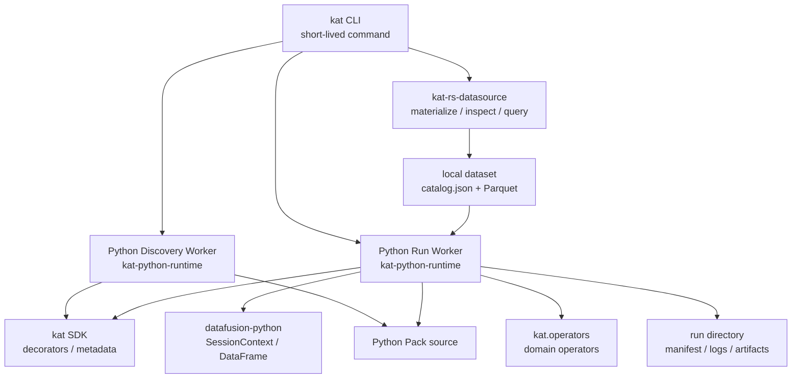

# kat-rs 短命 CLI 与 Python Pack Runtime 重写设计

## 1. 文档目的与结论

本文整理 issue [#113](https://github.com/maokelong/kat-rs/issues/113) 后续架构讨论中已经收敛的 kat-rs 新运行模型。它取代旧的 daemon / REST / JSON-line IPC / `QueryResult` Pack runtime 方向，但保留 `kat-rs-datasource` 作为可验证的数据事实底座。

核心结论：

```text
kat-rs 主运行模型是短命 CLI。
Pack runtime 直接重写，不迁移旧 daemon/REST/IPC 实现。
Python Run Worker 持有 DataFusion SessionContext。
Pack 作者直接面向 kat-python-sdk 提供的 `kat` API 与 `kat.operators`。
datafusion-python 是数据引擎依赖，DataFrame 是 Pack 的事实载荷与 artifact 数据合同。
workflow 返回 dict[str, DataFrame]，runtime 自动物化 run-local artifacts。
```

整体形态：

```text
trace / log
  -> kat dataset materialize
  -> local Parquet dataset + catalog.json
  -> kat pack inspect / run
  -> bundled CPython + kat-python-runtime + kat-python-sdk
  -> datafusion-python SessionContext
  -> Pack workflow
  -> run-local Parquet artifacts + run summary
```

## 2. 背景

旧设计把 kat-rs 做成只监听本机回环地址的常驻 REST server：server 负责 datasource registry、DataFusion 查询、Pack runner IPC、artifact 保存和 OpenAPI 暴露。Python Pack 通过 JSON-line IPC 向 Rust 请求 query，Rust 侧维护 `QueryRegistry`，Python 侧拿到 `QueryResult` handle。

这个方向在早期验证中暴露出几个结构性问题：

- 常驻 server 迫使每个能力都回答 REST、registry、生命周期、缓存和兼容性问题。
- JSON-line IPC 把 DataFusion DataFrame 降级成 query handle 和 JSON rows，破坏列式数据路径。
- `QueryResult` 成为自研中间层，和 DataFusion 官方 Python 绑定的能力重叠。
- Rust daemon 容易再次膨胀成中央 runtime，承载 Pack 领域逻辑和流程状态。

新设计承认 Python Pack 是受信任本地源码，使用 `datafusion-python` 直接在 Python worker 进程内持有 `SessionContext`。Rust CLI 只做命令入口、dataset locator 解析、子进程启动和 summary 收尾。

## 3. 目标

1. 建立短命 CLI 主运行模型，删除常驻 daemon/server 主路径。
2. 让 Pack runtime 围绕 `kat-python-sdk` 与 `kat-python-runtime` 直接重写，不保留旧 IPC 兼容层。
3. 让 Python Run Worker 在进程内创建 DataFusion session 并注册 dataset。
4. 让 Pack 作者只依赖 `kat` 与 `kat.operators` 这两个 authoring surface。
5. 让 DataFusion DataFrame 成为事实载荷与 artifact 数据合同；Pack 内部可以用显式类型表达调度、计算状态和结果组合，但不得用它们替代正式 DataFrame 输出。
6. 让 workflow 返回值自动成为 run-local artifact，避免 Pack 手写输出路径。
7. 让 `pack list` / `pack inspect` 通过轻量 Python discovery worker 得到真实 Python metadata。
8. 保留 `kat-rs-datasource` 的输入解码、dataset materialize 和 catalog 能力。

## 4. 非目标

第一版明确不做：

- 不迁移旧 `kat-rs-daemon` Pack runtime。
- 不保留 `serve` / `stop` / `openapi` / `/v1/*` 作为主交付面。
- 不保留 JSON-line query IPC、`QueryRegistry` 或 `QueryResult` 数据合同。
- 不实现 Python sandbox、权限系统、多租户隔离或远程执行。
- 不支持运行时 `pip install`。
- 不承诺任意第三方 native wheel 可移植性。
- 不实现动态第三方算子加载或 operator registry。
- 不把 run artifact 写入 dataset catalog 或 dataset `derived/`。
- 不自动生成自然语言分析结论。
- 不在第一版做复杂 AST 依赖方向执法。

## 5. 总体架构



分层职责：

| 层 | 职责 | 不承担 |
| --- | --- | --- |
| `kat-rs-cli` | 短命命令入口、dataset locator 解析、启动 Python worker、展示 summary | 不持有常驻状态，不提供 REST server |
| `kat-rs-datasource` | 输入解码、Arrow/Parquet 物化、catalog 数据结构、dataset 基础校验 | 不理解 Pack、worker、artifact 或分析策略 |
| `kat-python-sdk` | 提供 public `kat` authoring API 与 `kat.operators` facade | 不包含 worker、dataset registration 或 artifact materialization |
| `kat-python-runtime` | 提供 CLI 私有使用的 discovery/run worker、dataset registration、artifact materialization 和 manifest 生成 | 不作为 Pack 作者 import surface |
| `kat-rs-python-native` | 提供 Rust/PyO3 native operator extension，被 `kat.operators` 封装后暴露 | 不承载 Python worker 或 SDK 包结构 |
| `datafusion-python` | 提供 `SessionContext`、SQL、DataFrame、Parquet 注册与写出能力 | 不承载 kat-rs 领域语义 |
| Python Pack | 表达领域 workflow、fact、compute 和业务判断 | 不直接管理 runtime 输出路径，不绕过 DataFusion 扫描大表 |
| Run directory | 保存一次 Pack Run 的正式输出、日志和 manifest | 不作为 dataset catalog 的一部分 |

## 6. 进程模型

kat-rs 不再有主路径常驻进程。每条命令启动、完成、退出。

### 6.1 Pack Discovery

`kat pack list` 与 `kat pack inspect` 启动短命 Python Discovery Worker。

```text
kat pack inspect <pack-root>
  -> spawn bundled CPython
  -> python -m kat_runtime.worker.discovery
  -> import kat SDK
  -> import Pack modules
  -> collect @workflow / @fact / @compute metadata
  -> inspect.signature(...)
  -> output JSON manifest
  -> exit
```

Discovery 不创建 DataFusion session，不打开 dataset，不执行 workflow。

Pack 顶层模块必须保持纯净：只允许 import、常量定义和装饰器注册；禁止 import-time IO、查询、写文件、线程启动或耗时初始化。这个约束是 discovery 性能和无副作用语义的基础。

### 6.2 Pack Run

`kat pack run` 启动短命 Python Run Worker。

```text
kat pack run <pack-root> <workflow> --dataset <dataset>
  Rust CLI:
    resolve dataset locator -> absolute dataset path
    create run directory
    spawn bundled CPython

  Python Run Worker:
    create datafusion SessionContext
    read dataset catalog.json
    register Parquet tables into SessionContext
    import Pack modules
    execute selected workflow
    materialize returned DataFrames
    write manifest / logs
    exit

  Rust CLI:
    read run manifest
    print run summary
    exit
```

Rust 不把 `SessionContext` 传给 Python，也不再通过 IPC 执行 query。DataFusion session 是 Python Run Worker 的进程内对象。

### 6.3 Run Worker 执行合同

`kat_runtime.worker.run` 是一次 Pack Run 的 Python 侧 orchestrator。它不实现业务分析，也不解释 DSL，只负责搭建运行环境、加载普通 Python workflow 函数、调用它并收尾产物。

Run request 至少包含：

```text
pack_root      # Pack 源码目录
workflow_name  # discovery manifest 中的 workflow 名称
dataset_path   # Rust CLI 已解析出的本地 dataset 目录
run_dir        # 本次 run 的输出目录
inputs         # JSON-compatible workflow 参数
```

Python 侧执行顺序：

```text
kat_runtime.worker.run
  1. 读取 run request，初始化 run manifest 和日志收集器。
  2. 创建 datafusion.SessionContext。
  3. 读取 dataset catalog.json，注册 Parquet 表到 SessionContext。
  4. 导入 Pack 源码，按 @workflow metadata 找到 workflow 函数。
  5. 构造 kat.Kat(ctx, run_context)。
  6. 调用 workflow_fn(kat, **inputs)。
  7. 校验返回值是 dict[str, DataFrame]。
  8. 将返回的 DataFrame 统一物化为 run artifacts。
  9. 写 manifest、logs、artifact metadata。
  10. 按成功或失败状态退出。
```

伪代码：

```python
from datafusion import SessionContext
from kat import Kat
from kat_runtime.artifacts import materialize_artifacts
from kat_runtime.dataset import register_dataset
from kat_runtime.pack_loader import load_workflow

ctx = SessionContext()
register_dataset(ctx, request.dataset_path)

kat = Kat(ctx=ctx, run_dir=request.run_dir, logger=run_logger)
workflow_fn = load_workflow(request.pack_root, request.workflow_name)

result = workflow_fn(kat, **request.inputs)
artifacts = materialize_artifacts(result, request.run_dir)
```

错误由 `kat_runtime.worker.run` 统一收口：

| 失败点 | 失败类型 |
| --- | --- |
| Pack import 失败 | load error |
| workflow 不存在 | workflow selection error |
| 参数与函数签名不匹配 | input contract error |
| workflow 抛异常 | failed run with traceback |
| 返回值不是 `dict[str, DataFrame]` | return contract error |
| artifact 写出失败 | materialization error |

所有失败都应写入 run manifest 和 traceback/logs，供 Rust CLI 展示 summary。失败 run 可以保留用于调试。

## 7. 组件设计

### 7.1 `kat-rs-cli`

第一版 CLI command surface：

```text
kat version

kat dataset materialize ...
kat dataset inspect <dataset>
kat dataset query <dataset> --sql ...

kat pack list <pack-root> [--json]
kat pack inspect <pack-root> [--json]
kat pack run <pack-root> <workflow> --dataset <dataset> --param ...
```

删除主路径：

```text
kat serve
kat stop
kat openapi
/v1/*
```

`dataset query` 是调试和验证工具，不是分析主产品面。正式分析入口是 `pack run`。

### 7.2 `kat-rs-datasource`

保留为数据事实底座。

职责：

- 支持 `.htrace`、Langfuse legacy 等输入解码。
- 写出本地 Parquet dataset。
- 管理最小 `catalog.json` 数据结构。
- 提供 dataset inspect / materialize 所需库能力。

边界：

- 不引入 Pack、Python、worker、run artifact。
- 不把 run artifact 写入 dataset catalog。
- 不维护 server datasource registry。

### 7.3 `kat-python-sdk`

`kat-python-sdk` 是 Pack 作者可见的 Python SDK 包。它的 distribution 名称用于仓库和打包管理，Pack 作者的 import 名仍然是 `kat`。

推荐目录结构：

```text
python/kat-python-sdk/
  pyproject.toml
  kat/
    __init__.py
    decorators.py
    context.py
    operators/
      __init__.py
```

公开入口：

```python
from kat import workflow, fact, compute
from kat.operators import memory_lifecycle
```

边界：

- 包含 Pack authoring surface：`Kat`、`workflow`、`fact`、`compute`、`kat.operators`。
- 不包含 discovery/run worker。
- 不包含 dataset registration、artifact materialization 或 run manifest 生成。
- 可以通过 `kat.operators` 封装 native operator，但 Pack 作者不直接 import native module。

### 7.4 `kat-python-runtime`

`kat-python-runtime` 是 CLI 私有使用的 Python Pack 运行框架。它依赖 `kat-python-sdk` 和 `datafusion-python`，负责 discovery、run、dataset registration、artifact materialization 和 manifest 写出。

推荐目录结构：

```text
python/kat-python-runtime/
  pyproject.toml
  kat_runtime/
    __init__.py
    worker/
      discovery.py
      run.py
    dataset.py
    pack_loader.py
    contracts.py
    artifacts.py
    manifest.py
```

CLI 私有入口：

```text
python -m kat_runtime.worker.discovery
python -m kat_runtime.worker.run
```

边界：

- Pack 作者不 import `kat_runtime`。
- `kat_runtime` 可以 import `kat` SDK 来读取 decorator metadata 和构造 `Kat`。
- `kat_runtime` 拥有 worker 入口、dataset catalog 注册、workflow 加载、contract 校验、artifact 写出和 run manifest。
- `kat_runtime` 不定义 Pack authoring API。

### 7.5 `kat-rs-python-native`

`kat-rs-python-native` 是 Rust/PyO3 native extension crate，只承载 Rust 实现的高价值领域算子。

推荐目录结构：

```text
crates/kat-rs-python-native/
  Cargo.toml
  src/
    lib.rs
```

`kat._native` 是 PyO3 扩展的私有底层模块，公开算子统一通过 `kat.operators` 导出。这样算子可以由 Python 或 Rust 实现，Pack 作者不需要关心实现语言；同时 Rust native 代码不会和 Python worker/runtime 代码混在同一个目录里。

Python 包与 native extension 的依赖方向：

```text
Pack code
  -> kat-python-sdk import package `kat`

kat-python-runtime
  -> kat-python-sdk
  -> datafusion-python

kat-python-sdk `kat.operators`
  -> kat._native  # packaged from kat-rs-python-native when native operators exist

kat-rs-cli
  -> bundled CPython
  -> python -m kat_runtime.worker.discovery / run
```

禁止反向依赖：`kat-python-sdk` 不 import `kat_runtime`，Pack code 不 import `kat_runtime`，`kat-rs-python-native` 不承载 Python worker 或 runtime helper。

## 8. Python Authoring API

### 8.1 `Kat`

`Kat` 是 Pack workflow 接收的运行上下文。

```python
@workflow(title="Critical path", description="Extract thread critical path.")
def critical_path(kat, root_itid: int) -> dict[str, DataFrame]:
    states = kat.sql(
        "select * from thread_state where itid = :root_itid",
        root_itid=root_itid,
    )
    return {"states": states}
```

第一版能力：

```text
kat.sql(sql, **params) -> datafusion.DataFrame
kat.log(level, message, **fields) -> None
kat.ctx -> datafusion.SessionContext
```

`kat.sql()` 是薄包装，主要提供参数绑定、日志审计和未来扩展切入点。返回值保持 DataFusion DataFrame，不引入 `QueryResult` 中间层。

`kat.ctx` 是高级逃生口。它暴露底层 `SessionContext`，但 Pack 的日常入口仍应是 `kat.sql()`。

### 8.2 装饰器

第一版强制使用三个 capability marker：

```python
@workflow(title="...", description="...")
def fn(kat, **params) -> dict[str, DataFrame]: ...

@fact(title="...", description="...")
def fn(kat, **params) -> DataFrame: ...

@compute(title="...", description="...")
def fn(df: DataFrame, **params) -> DataFrame: ...

# 需要逐层取事实的复杂计算也可以使用 Pack 私有合同：
@compute(title="...", description="...")
def fn(facts: FactProvider, **params) -> ComputeResult: ...
```

`FactProvider` 和 `ComputeResult` 是 Pack 私有的显式类型示例，不是新增 SDK 类型。`FactProvider` 的回调绑定已标注的 fact；`ComputeResult` 只组合一个或多个 DataFrame，最终仍由 workflow 转成 `dict[str, DataFrame]`。

语义：

| Marker | 角色 | 推荐依赖方向 |
| --- | --- | --- |
| `@workflow` | Pack 公共分析入口与调度层 | 绑定并调度 fact 和 compute，返回正式 artifacts；不执行 SQL，不维护领域算法循环 |
| `@fact` | 数据事实访问与规范化入口 | 调用 `kat.sql()` 和必要 operators，解码来源 schema，返回原始或规范化 DataFrame；不做领域判断 |
| `@compute` | 事实之上的领域计算 | 直接接收事实 DataFrame，或通过显式 FactProvider 按需读取事实；维护分支、循环、图遍历和 run-local 状态；不接收 `kat`，不执行 SQL，不知道 dataset schema |

职责按“谁拥有知识”划分：fact 拥有事实来源知识，compute 拥有事实之上的算法和数据结构，workflow 只负责编排两者。逐层查询不意味着 workflow 维护循环；复杂 compute 可以通过 FactProvider 请求下一层事实，SQL 仍只存在于 fact 中。

Compute 可以在一次调用内维护 frontier、visited set、缓存或其他可丢弃状态，但这些状态不得跨 run 持久化。简单 compute 仍优先保持 DataFrame 输入、DataFrame 输出；只有一个算法确实需要按需事实和多个关联结果时，才引入最小的 Pack 私有合同。

无论内部使用哪种 compute 形式，runtime 合同不变：workflow 必须返回 `dict[str, DataFrame]`，只有这些 DataFrame 会被物化为正式 artifacts。

第一版强制装饰器和 inspect 可见性，但不做复杂 AST 依赖方向执法。依赖方向先通过目录结构、review 和后续 lint 收紧。

## 9. DataFusion 关系

`datafusion-python` 是运行时数据引擎依赖，不是 Pack 作者的主 authoring API。

关系如下：

```text
Pack 作者直接面向：
  kat SDK + kat.operators

Pack 数据对象实际类型来自：
  datafusion-python DataFrame / SessionContext
```

这意味着：

- Pack 作者日常不需要 `from datafusion import SessionContext`。
- `kat.sql()` 返回 DataFusion DataFrame。
- `kat.ctx` 可以暴露 `SessionContext` 作为逃生口。
- DataFrame 的 `register_view()`、`write_parquet()` 等能力可被 runtime 或高级 Pack 代码使用。
- Pack 内部可以用 dataclass、Protocol 等普通 Python 类型表达 workflow 调度参数、compute 遍历状态和多个 DataFrame 的结果组合；事实载荷和正式 artifact 仍使用 DataFrame。

kat-rs 不重包 DataFusion 全部 API，也不自研 DataFrame。

## 10. Dataset 与 Registration

Rust CLI 只负责把用户输入解析成 Dataset Locator，并解析到本地 dataset 目录。

Python Run Worker 负责 Dataset Registration：

```text
read catalog.json
validate table names and relative paths
ctx.register_parquet(table_name, parquet_path)
```

这样做的理由：

- DataFusion session 是 Python worker 进程内对象，Rust 无法跨进程传递。
- 通过 PyO3 暴露 `register_dataset(ctx, path)` 会提前绑定 Rust DataFusion 与 `datafusion-python` 的内部类型和版本。
- 第一版 catalog 很薄，Python 侧重复少量校验比跨边界抽象更简单。

第一版 catalog 只应保持必要字段，避免承载 run history、artifact、schema 历史统计或 Pack manifest。

## 11. Artifact 与 Run Summary

workflow 返回值声明正式输出：

```python
return {
    "path_nodes": nodes_df,
    "path_edges": edges_df,
}
```

Python Run Worker 负责统一物化：

```text
runs/<run_id>/
  manifest.json
  logs.jsonl
  artifacts/
    path_nodes.parquet
    path_edges.parquet
```

规则：

- 返回值必须是 `dict[str, DataFrame]`。
- dict key 是 artifact name。
- runtime 负责路径安全、覆盖策略、schema/row count/preview metadata。
- Pack 作者不手写正式 artifact 路径。
- Pack 内部临时结果可使用 `ctx.register_view()`，run 结束即消失。
- 手工写文件不进入 run summary，除非后续明确纳入 artifact 机制。

Run summary 只展示运行事实，不生成自然语言根因结论。

## 12. Pack 组织

推荐目录结构：

```text
packs/device/
  workflows/
    frame_drop.py
    cold_start.py
  facts/
    sched.py
    surface.py
  compute/
    critical_path.py
    classify.py
```

约束：

- Pack 顶层模块保持纯净。
- `workflows/` 放公共分析入口。
- `facts/` 放事实访问与来源 schema 规范化。
- `compute/` 放事实之上的领域算法、run-local 数据结构和 DataFrame 结果构造。
- 第一版不支持跨 Pack import。
- 第一版不把目录结构本身当作唯一语义来源，语义以装饰器为准。

`kat pack inspect` 输出 Workflows、Facts、Compute 的 title、description、signature 和必要依赖信息，让人和 AI 可以先看能力清单，再读源码。

## 13. 直接重写策略

本设计采用直接重写，不迁移旧 runtime。

旧实现只作为参考：

- 可以参考 datasource 行为和测试意图。
- 可以参考已有 critical-path 领域算法。
- 不把 daemon、REST、JSON-line IPC、`QueryResult` 当作兼容目标。

新实现必须围绕：

- Short-lived CLI。
- `kat-python-sdk` 与 `kat-python-runtime`。
- Python worker 持有 DataFusion session。
- DataFrame Contract。
- Run-local artifacts。

## 14. 风险与缓解

### 14.1 Python discovery 冷启动

风险：`pack list/inspect` 每次启动 CPython 并 import Pack，存在冷启动成本。

缓解：

- Discovery 不打开 dataset，不创建 DataFusion session。
- 强制 Pack 顶层纯净。
- 慢到成为真实问题后，再考虑 manifest cache 或 warm discovery worker。

### 14.2 datafusion-python 与 Rust DataFusion 版本

风险：`kat-rs-datasource` 使用 Rust DataFusion，`kat-python-runtime` 依赖 `datafusion-python`，两边版本可能不同。

缓解：

- 进程边界上只交换 Parquet dataset 和 catalog，不交换 Rust DataFusion 内部类型。
- 第一版不做 PyO3 `SessionContext` 类型互传。
- 数据合同落在 Parquet、catalog 和 DataFrame 行为上，而不是 Rust/Python 内部对象一致性上。

### 14.3 Pack 依赖方向腐化

风险：第一版不做复杂 AST 执法，Pack 可能出现反向依赖或隐式公共能力。

缓解：

- 强制 `@workflow` / `@fact` / `@compute` 标注。
- review 检查 workflow 只调度、fact 只拥有事实来源、compute 只拥有事实之上的计算。
- `kat pack inspect` 让能力清单可见。
- review 阶段检查依赖方向。
- 后续基于真实腐化点补 lint。

### 14.4 Artifact 语义膨胀

风险：Pack 作者绕过返回值机制手写文件，run summary 与实际输出脱节。

缓解：

- 第一版只承认 workflow 返回 DataFrame 物化出的 Run Artifact。
- 手写文件不进入 summary。
- 需要扩展 artifact 类型时，通过新的 runtime 机制进入，而不是放任路径约定扩散。

## 15. 验收标准

设计验收：

- 文档明确短命 CLI 是主运行模型。
- 文档明确旧 daemon/REST/IPC/`QueryResult` 不迁移。
- 文档明确 `kat-rs-datasource` 只作为数据事实底座保留。
- 文档明确 `kat-python-sdk`、`kat-python-runtime` 与 `kat-rs-python-native` 的边界。
- 文档明确 `datafusion-python` 与 kat SDK 的关系。
- 文档明确 workflow、fact、compute 按调度、事实来源、领域计算划分职责。
- 文档明确 discovery worker 与 run worker 的进程差异。
- 文档明确 workflow 返回 `dict[str, DataFrame]` 自动物化 artifact。

后续实现验收应另起计划文档，不在本文展开。

## 16. 相关记录

- [Issue #113](https://github.com/maokelong/kat-rs/issues/113)
