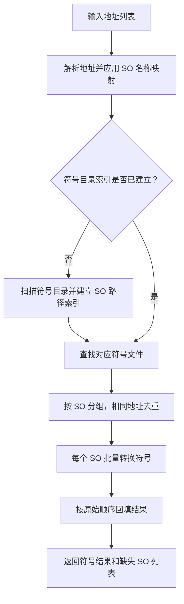

# Native Hook 符号化设计

关联 Issue：[#152](https://github.com/maokelong/kat-rs/issues/152)

## 背景与目标

Native Hook trace 中的调用帧可能只包含 `/system/lib/ndk/libffrt.so+0x74825` 一类模块相对虚拟地址。本切片使用本地未裁剪 ELF 把地址转换为稳定、可读的函数符号。另附一个 trace_streamer SQLite 到 Excel 的临时验证适配器，用于证明“真实 trace 地址 → 符号”链路可用。

## 架构归属与决策关系

1. Rust 符号化接口只消费 `MODULE+0xHEX` 字符串、本地 ELF 和显式名称映射，不读取 KAT Dataset，也不创建、命名或规范化 Trace facts。因此它不改变 ADR 0024 规定的 Hitrace Datasource facts 所有权。
2. 地址到 ELF 函数、源码位置和内联信息的转换属于二进制元数据解析，不定义跨 PACK 的 Trace 分析语义。crate 的公开 Rust 接口只供仓库内 Rust 调用方复用，不是 KAT Skill、PACK Authoring API 或 `kat.trace` 公共 Interface，因而不是 ADR 0049 所述分析能力晋升。若以后把符号化结果提升为 Dataset facts、`kat.trace` 能力或面向 PACK 的公共接口，需要重新按对应 ADR 评审所有权和晋升条件。
3. `kat-native-hook-symbolize` 只适配当前验证使用的 TraceStreamer SQLite。它不是 Datasource、Data Import、KAT 用户入口或长期数据产品，不承诺跨 TraceStreamer 版本的数据库兼容性，也不承诺 Excel 列和分页命名的长期兼容性；正式 Hitrace Native Hook facts 可直接支撑验证后，应删除该适配器而不是把过渡 Schema 固化为新的事实入口。
4. 2026-06-17 Native Hook 分层设计排除符号化和 TraceStreamer derived tables，是对当时 Datasource 接入切片的边界。本切片是相邻的后续验证切片：不修改 `domains/native_hook`、Arrow sink 或 direct/raw tables，只在 Data Import 之外读取外部 TraceStreamer 验证数据库，因此保持原有分层决定。
5. ADR 0050 约束 Trace 分析的 Perfetto 领域语义；本切片不实现调度分析或新的 Trace 关系。这里使用 TraceStreamer 仅代表临时输入格式，不把其 derived Schema 定义为 KAT 语义基线。

## 不做什么

1. 不负责真机 trace 采集或计算器自动化；这些能力由独立的采集 PR 交付。
2. 不提供 C/C++ FFI，也不保留 PoC 的 JSONL/单 ELF 命令面。
3. 不实现全局单例或跨进程持久化缓存；需要复用时由调用方显式持有 `SymbolResolver`。
4. 不跟随目录符号链接或 junction，不承担历史运行目录的迁移和恢复。
5. 不创建 KAT Dataset facts，不发布 `kat.trace` 分析能力，也不把 SQLite/Excel 验证适配器作为 KAT 公共产品面。

## 符号化契约

公开 Rust 接口：

```rust
pub struct ModuleAddress {
    pub module: String,
    pub address: u64,
}

pub struct MissingModule {
    pub module_path: String,
    pub occurrence_count: usize,
}

pub struct SymbolizationResult {
    pub symbols: Vec<String>,
    pub missing_modules: Vec<MissingModule>,
}

pub struct SymbolResolver { /* private fields */ }

impl SymbolResolver {
    pub fn new(symbol_dir: impl Into<PathBuf>) -> Self;

    pub fn get_symbols(
        &mut self,
        addr_list: &[String],
        module_name_map: &HashMap<String, String>,
        include_source_location: bool,
    ) -> anyhow::Result<SymbolizationResult>;
}

pub fn get_symbols(
    addr_list: &[String],
    symbol_dir: &Path,
    module_name_map: &HashMap<String, String>,
    include_source_location: bool,
) -> anyhow::Result<SymbolizationResult>;

pub fn parse_module_address(input: &str) -> anyhow::Result<ModuleAddress>;
```

`parse_module_address` 解析并规范化 `MODULE+0xHEX` 查询；`ModuleAddress` 保存规范化模块路径和模块相对虚拟地址。`MissingModule` 保存输入中的模块路径及其在合法查询中的出现次数。

`SymbolResolver` 首次遇到合法查询时递归建立一次 SO basename 到完整路径列表的索引，后续调用复用该索引、模块命中/缺失结果以及 `Symbolizer`。实例生命周期内符号目录视为稳定；目录更新后调用方应创建新实例。兼容函数 `get_symbols` 每次创建临时实例，适合单次调用。

空输入直接返回两个空列表；全部输入均不合法时原样返回，二者都不扫描或校验 `symbol_dir`。存在合法查询时要求根目录存在、是目录且可打开；不可访问的子项告警后跳过。`symbols` 与输入等长且顺序一致；`missing_modules` 按规范化模块路径排序，记录本地没有匹配 SO 的路径和出现次数。

合法查询去除首尾空白后必须满足：非空模块路径以 `.so` 或 `.so.N...` 结尾，随后是 `+0xHEX`。解析失败、模块缺失或地址无符号时输出原始字符串。

`module_name_map` 的方向为“trace 中的 SO 名称或路径 → 符号目录中的 SO 名称或路径”。完整设备路径键优先于 basename 键；映射后的目标继续按完整路径后缀、basename 的顺序匹配符号文件。多个候选按规范化完整路径字典序选择第一个并告警。

地址固定按 `blazesym::symbolize::Input::VirtOffset` 解析。成功结果为 `function_name+0xoffset`；开启源码位置时为：

```text
outer+0x27 (/full/path/outer.cpp:50) => middle_inline (/full/path/middle.h:80) => inner_inline (/full/path/inner.h:21)
```

内联链按外到内展开，只有主符号带偏移，不输出列号。缺少 DWARF 时退化为基本符号；demangle 失败时保留原始符号名。同一 ELF 和地址在单次调用内去重。

## `get_symbols` 处理流程



目录索引在 `SymbolResolver::get_symbols` 首次遇到合法地址时建立，而不是在创建 `SymbolResolver` 时建立。相同 SO 的地址会集中批量转换，相同地址在单次调用内只解析一次。

## SQLite 与 Excel 验证适配器

该适配器只支持当前验证数据库中使用的 `native_hook_frame` 和 `data_dict` 表，以及查询涉及的 `id`、`callchain_id`、`depth`、`symbol_id`、`file_id`、`vaddr`、`data` 列。输入缺少这些表或列时直接返回 SQLite 错误；不提供 TraceStreamer schema 版本探测、迁移或兼容层。

Rust CLI：

```text
kat-native-hook-symbolize <trace.db> --symbol-dir <目录> --output <symbols.xlsx> [--module-map <FROM=TO>]... [--include-source-location]
```

使用 `rusqlite` 读取、`rust_xlsxwriter` 写入，输出文件存在时覆盖。查询保留全部 `native_hook_frame`，按 `callchain_id`、`depth`、`id` 升序。

`input_value` 优先取 `symbol_id -> data_dict.data`；缺失时用 `file_id -> data_dict.data` 与 `vaddr` 拼成 `模块+0x地址`；两者均不可用时为空。`resolved_or_original` 在符号化成功时保存函数符号，失败时保留 `input_value`。`symbols` 工作表列为：

1. `callchain_id`
2. `depth`
3. `input_value`
4. `resolved_or_original`

`callchain_id` 以十进制文本写入，避免 SQLite `i64` 标识符转换为 Excel 双精度数值时丢失精度。首行冻结并启用筛选。超过 1,048,575 条数据行时依次拆分为 `symbols_1`、`symbols_2`。另建 `missing_modules` 工作表汇总本地未匹配 SO；SO 已找到但地址无符号时不进入该表。合法空帧表生成仅含表头的工作簿并告警。

## 验收与验证

1. 自动化测试覆盖严格语法、原样回退、缺失模块汇总、名称映射、根目录错误、延迟索引、跨调用复用和文件符号链接。
2. 自动化测试覆盖数据库取值优先级、稳定排序、空表、Excel 分页命名和 64 位 `callchain_id` 精确导出。
3. 多候选 SO 的确定性选择、不可访问子项告警和实际跨页工作簿作为人工边界检查，不声明为当前自动化覆盖。
4. 使用实际 trace SQLite 和 `D:\zxlDown\images\laster` 生成 Excel 并抽查符号结果。
5. 提交前运行：

```text
cargo fmt --all -- --check
cargo test -p kat-rs-native-hook-symbolize
cargo clippy -p kat-rs-native-hook-symbolize --all-targets -- -D warnings
git diff --check
```

## 最小交付切片

1. 收敛 Rust 符号化接口及测试。
2. 增加临时 SQLite 到 Excel 验证适配器及测试。
3. 给出实际符号目录和 trace 数据的验证证据。
