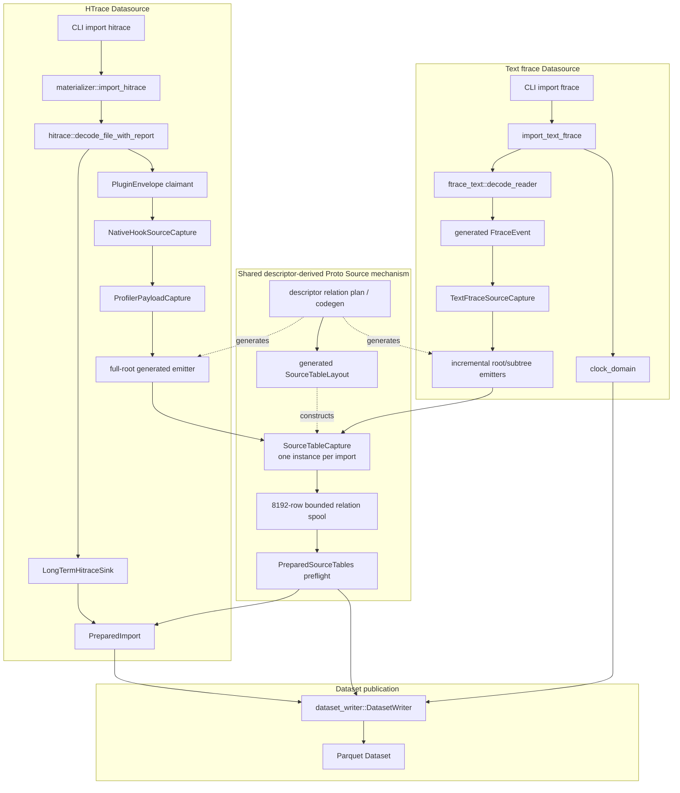

# 文本 ftrace → Proto 兼容矩阵

本矩阵是 Issue #217 首批 25 类事件的 review 边界。表中“缺席”均指来源没有该事实，禁止用零值或空字符串代替。

## 实现约束

文本解析器逐行构造 generated `FtraceEvent`，不得定义或写入第二套事件 Arrow/Parquet Schema。事件按来源顺序直接提交给 `TextFtraceSourceCapture`；其内部复用 Hitrace Proto relation capture，以 8,192 行上限分批暂存。只有完整解析和 capture 成功后才开始发布最终 Dataset。

构建期 protobuf Source compiler 只接受 descriptor root 和需要增量追加的 repeated-message field path；它从统一 relation plan 推导 typed subtree appender，不得识别 text ftrace、具体 Proto FQN、relation 表名或 Rust 消息类型。文本 capture 位于 `text_ftrace_source_capture`，只管理 root/CPU/event repeated index；profiler capture 只管理 envelope、provenance 和 admission。

## 架构与调用链路

HTrace decoder 同时驱动 `LongTermHitraceSink` 与 `PluginEnvelope` claimant：前者保留 clock、规范化 `sched_switch` 和完整性校验，后者经 profiler capture 写入 descriptor-derived Source tables。文本链路不进入 envelope、provenance 或 HTrace admission，只从 CPU、时间戳、emitter 与 payload 构造 canonical Proto；无 envelope 的 root parent 为 NULL。

两条链路共用 descriptor relation plan、生成器、`SourceTableLayout`、`SourceTableCapture`、row ID、parent/repeated join、enum origin、bounded spool、preflight 与 Dataset writer，但不调用同一组 emitter：HTrace 使用 full-root emitter，文本 ftrace 使用 incremental root/subtree emitters。`SourceTableLayout` 是每个 capture 实例的构造输入，不是逐事件运行时节点；HTrace 最终由 `PreparedImport` 合并 legacy normalized tables 与 `PreparedSourceTables`，文本则把 `clock_domain` 与 `PreparedSourceTables` 直接交给同一 Dataset writer。

每个已支持事件的 payload parser 直接返回对应 generated oneof variant，不使用位置型 scalar 搬运协议。已知字段不兼容时，失败 JSON 和 operation log 均提供 `event`、`field`、`line`、`reason`；严格策略下成功 JSON 显式返回空 `compatibility_issues`。

## 公共层级

| 来源事实 | Proto 目标 | 规则 |
| --- | --- | --- |
| 一个文本文件 | `TracePluginResult` | 恰好一个根；无 profiler envelope，根 parent 为 NULL |
| `--clock-domain` | `TracePluginConfig.clock` | `boottime→boot`、`monotonic→mono`、`ftrace_global→global` |
| CPU | `FtraceCpuDetailMsg.cpu` | 每个实际 CPU 一个 detail |
| overwrite | `FtraceCpuDetailMsg.overwrite` | 文本无此事实，保持 optional 缺席 |
| 时间戳 | `FtraceEvent.timestamp` | 十进制定点转纳秒；超过 9 位的非零精度、范围溢出均失败 |
| emitter TGID | `FtraceEvent.tgid` | `-------` 为 optional 缺席，否则严格 `int32` |
| emitter comm/PID | `FtraceEvent.comm` / `common_fields.pid` | 从右侧锚定 PID；空名称或越界失败 |
| common type/flags/preempt | optional common fields | 文本压缩 flags 不足以无损恢复，保持缺席 |

## 事件逐字段矩阵

除特别注明为 optional 缺席的目标外，每个 source token 都必须出现且只能出现一次。十进制 `int32/uint32/int64/uint64` 和十六进制 `uint32/uint64` 均执行完整消费与范围检查；缺字段、非法字符、负数写入无符号字段或溢出都以对应 source token 为 `field` 失败。

| 文本事件 | source token / grammar | Proto 目标 | 解析与转换 | Presence / 拒绝条件 |
| --- | --- | --- | --- | --- |
| `sched_switch` | `prev_comm` | `sched_switch_format.prev_comm` | 原字符串 | 必须非空 |
|  | `prev_pid` / `prev_prio` | `.prev_pid` / `.prev_prio` | 十进制 `int32` | 必须存在 |
|  | `prev_state` | `.prev_state` | 单值 `R,S,D,T,t,X,Z,P,I` 分别映射 `0,1,2,4,8,16,32,64,128`；尾随 `+` 忽略 | 多字符或未知字符失败 |
|  | `next_comm` | `.next_comm` | 原字符串 | 必须非空 |
|  | `next_pid` / `next_prio` | `.next_pid` / `.next_prio` | 十进制 `int32` | 必须存在 |
| `sched_wakeup` | `comm` / `pid` / `prio` / `target_cpu` | `.comm` / `.pid` / `.prio` / `.target_cpu` | comm 原样；其余十进制 `int32` | 全部必须存在；`.success` 保持缺席 |
| `sched_wakeup_new` | `comm` / `pid` / `prio` / `target_cpu` | `.comm` / `.pid` / `.prio` / `.target_cpu` | 与 wakeup 相同 | 全部必须存在；`.success` 保持缺席 |
| `tracing_mark_write` | 整段 payload | `print_format.buf` | 原样保留，包括尾空格 | 可以为空；`.ip` 保持缺席 |
| `binder_transaction` | `transaction` | `.debug_id` | 十进制 `int32` | 必须存在 |
|  | `dest_node` / `dest_proc` / `dest_thread` | `.target_node` / `.to_proc` / `.to_thread` | 十进制 `int32` | 必须存在 |
|  | `reply` | `.reply` | 十进制 `int32` | 必须存在 |
|  | `flags` / `code` | `.flags` / `.code` | `0x` 十六进制 `uint32` | 必须带前缀且范围合法 |
| `binder_transaction_received` | `transaction` | `.debug_id` | 十进制 `int32` | 必须存在 |
| `block_bio_remap` | `major,minor` | `.dev` | 两个十进制 `uint32`，分别提升为 `u64` 后编码为 `(major << 20) \| minor` | 分隔符、数值或范围非法失败 |
|  | `sector` / `nr_sector` | `.sector` / `.nr_sector` | 分别为十进制 `uint64` / `uint32` | 必须存在 |
|  | `rwbs` | `.rwbs` | 原字符串 | 必须存在 |
|  | `old_major,old_minor` | `.old_dev` | 与 `.dev` 相同的设备编码 | 分隔符、数值或范围非法失败 |
|  | `old_sector` | `.old_sector` | 十进制 `uint64` | 必须存在 |
| `block_rq_complete` | `major,minor` | `.dev` | 设备编码 `(major << 20) \| minor` | 分隔符、数值或范围非法失败 |
|  | `sector` / `nr_sector` / `error` | `.sector` / `.nr_sector` / `.error` | 分别为 `uint64` / `uint32` / `int32` | 必须存在 |
|  | `rwbs` / `cmd` | `.rwbs` / `.cmd` | 原字符串 | token 必须存在，cmd 可为空 |
| `block_rq_insert` | `major,minor` | `.dev` | 设备编码 `(major << 20) \| minor`，不是文本直写 | 分隔符、数值或范围非法失败 |
|  | `sector` / `nr_sector` / `bytes` | `.sector` / `.nr_sector` / `.bytes` | 分别为十进制 `uint64` / `uint32` / `uint32` | 必须存在 |
|  | `rwbs` / `comm` / `cmd` | `.rwbs` / `.comm` / `.cmd` | 原字符串 | token 必须存在 |
| `block_rq_issue` | 与 insert 相同 | 对应 `.dev/.sector/.nr_sector/.bytes/.rwbs/.comm/.cmd` | 与 insert 相同 | 与 insert 相同 |
| `cpu_idle` | `state` / `cpu_id` | `.state` / `.cpu_id` | 十进制 `uint32` | 必须存在 |
| `ipi_entry` | 括号内 reason | `.reason` | 去除外围括号后原样 | 括号不完整失败 |
| `ipi_exit` | 括号内 reason | `.reason` | 与 entry 相同 | 括号不完整失败 |
| `ipi_raise` | `target_mask` | `.target_mask` | 原 mask 字符串 | 必须存在；数值 `.target_cpus` 缺席 |
|  | 括号内 reason | `.reason` | 去除外围括号后原样 | 括号不完整失败 |
| `ipi_send_cpu` | `cpu` | `.target_cpu` | 十进制 `uint32` | 必须存在 |
|  | `callsite` / `callback` | `.callsite` / `.callback` | 原字符串 | 必须存在 |
| `irq_handler_entry` | `irq` | `.irq` | 十进制 `int32` | 必须存在 |
|  | `name` | `.name` | 原字符串 | 必须存在 |
| `irq_handler_exit` | `irq` | `.irq` | 十进制 `int32` | 必须存在 |
|  | `ret` 符号 | `.ret_symbol` | 原字符串 | 必须存在；数值 `.ret` 缺席 |
| `mm_vmscan_kswapd_sleep` | `nid` | `.nid` | 十进制 `int32` | 必须存在 |
| `mm_vmscan_kswapd_wake` | `nid` / `order` | `.nid` / `.order` | 十进制 `int32` | 必须存在；来源没有 `.zid`，保持缺席 |
| `rss_stat` | `mm_id` / `curr` | `.mm_id` / `.curr` | 十进制 `uint32` | 必须存在 |
|  | `member` 符号 | `.member_name` | 原字符串 | 必须存在；数值 `.member` 缺席 |
|  | `size` 有符号值 | `.signed_size` | 十进制 `int64` | 必须存在；无符号 `.size` 缺席 |
| `softirq_entry` | `vec` / `action` | `.vec` / `.action` | vec 十进制 `uint32`；action 原字符串 | 两者必须存在 |
| `softirq_exit` | `vec` / `action` | `.vec` / `.action` | 与 entry 相同 | 两者必须存在 |
| `softirq_raise` | `vec` / `action` | `.vec` / `.action` | 与 entry 相同 | 两者必须存在 |
| `workqueue_execute_end` | `work` | `.work` | 可选 `0x` 前缀的十六进制 `uint64` | 必须存在 |
|  | `function` 符号 | `.function_symbol` | 原字符串 | 必须存在 |
| `workqueue_execute_start` | `work` | `.work` | 可选 `0x` 前缀的十六进制 `uint64` | 必须存在 |
|  | `function` 符号 | `.function_symbol` | 原字符串 | 必须存在；数值 `.function` 缺席 |

未知事件只汇总名称、数量和首次行号。以上已知事件的缺字段、非法数字、范围溢出、分隔符错误或多余不可解释内容均使完整 Import 失败。

## 真实设备待确认差异

2026-08-19 在真实 OpenHarmony 设备的同一 tracefs ring buffer 会话中，以文本快照和 ftrace-plugin `.htrace` 做重叠对照，确认 payload 映射未发现差异，但公共字段存在以下生产者差异：

| 字段 | 文本 ftrace | 真实 htrace | 当前处理 |
| --- | --- | --- | --- |
| `FtraceEvent.tgid` | 可得到实际 TGID，例如 PID 838 对应 TGID 558 | 同一事件为显式 `0` | 暂不把 `0` 自动改写为 NULL；这是设备 ftrace-plugin 的生产结果，不是 KAT 解码或 Parquet 默认值 |
| `FtraceEvent.comm` | 可得到 emitter 名称，例如 `<idle>` | 普通线程可得到名称；PID 0 等事件缺席并解码为空字符串 | 保留来源原值；非 optional Proto 字符串无法区分“生产者未编码”和真实空字符串 |
| `FtraceEvent.timestamp` | tracefs 文本仅显示 6 位小数 | htrace 保留纳秒值 | 字段语义一致，但文本来源只有微秒精度；跨来源比较按微秒精度对齐，不改写 htrace 原值 |

同次会话的文本快照包含 8,756 条事件，htrace 包含 12,164 条事件；忽略上述来源字段并按文本时间精度对齐后，8,748 条完全匹配。另有 5 条文本边界事件未进入 htrace，其余 3 条只受快照/纳秒对齐边界影响。该计数用于证明当前采集方式不是原子双写：不得把 tracefs 中途快照与插件结束读取的全集差异判定为转换器丢行。若要求严格一一对应，需要设备插件在消费 `/trace_pipe_raw` 时同步 tee 原始数据。

以上差异必须在 Issue #217 的交付 PR 中列为“真实设备已复现、待 htrace 负责人确认”的已知事项；在负责人确认前，不新增启发式归一化规则。

进一步检查实际 `.htrace` wire：12,164 条事件中，7,894 条没有 `tgid`/`comm` 标签（对应 PID 0 等事件），4,270 条显式编码 `tgid=0`，并编码了可查到的 `comm`；没有发现非零 TGID。设备结束采集后，tracefs `saved_tgids` 中仍可查到 `838 558`、`6439 795`，`saved_cmdlines` 也可查到对应线程名。上游插件解析器先以 `0` 初始化 TGID，仅在内部 `tgidDict_` 命中时覆盖，因此问题边界已定位到设备 ftrace-plugin 未把 `saved_tgids` 映射带入事件，而不是文本转换、KAT Proto 解码或 Parquet 写入。具体是设备版本实现差异、读取时序还是字典填充缺陷，留给 htrace/ftrace-plugin 负责人结合该设备构建版本确认。

`comm` 的进一步 wire 检查显示：7,894 条未编码 `comm` 的事件全部为 PID 0，属于 idle 表示差异；但另有 43 条非零 PID 事件显式编码空字符串，涉及 PID 8476、8497、8541—8547。文本快照和采集后的 `saved_cmdlines` 均能得到这些线程名（如 `sh`、`OS_FFRT_2_1`、`usage_report`），因此这 43 条也是设备 ftrace-plugin 字典填充/读取问题，而不只是 PID 0 的展示差异。该问题与 TGID 异常处于同一上游责任边界，PR 中合并说明，不在 KAT 中猜测回填。
